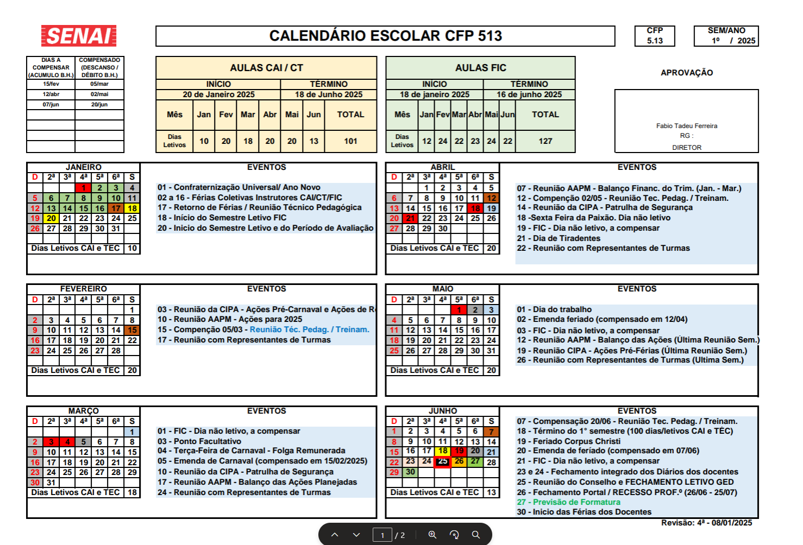
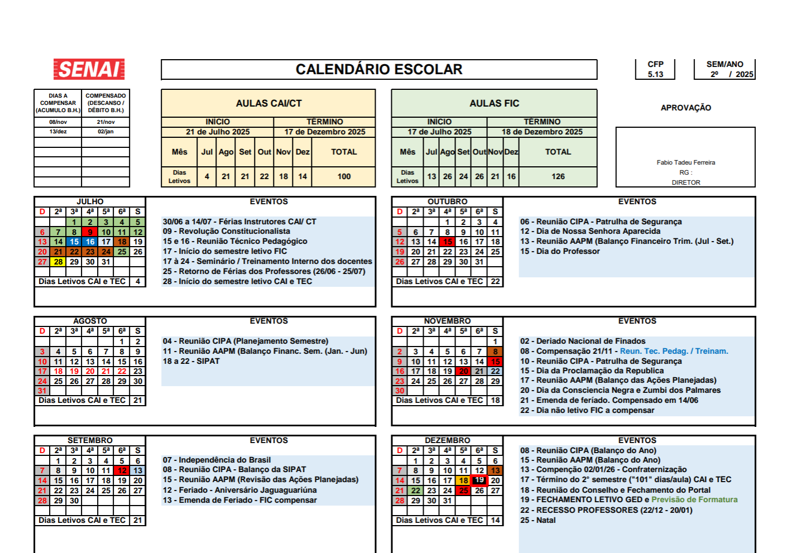

# Repositório com materiais de aulas (códigos, exercícios, desafios, atividades)
## [Manual do Aluno](./assets/ManualdoAluno2025_V.1.pdf)
## Acesso ao [Meu SENAI](https://nam02.safelinks.protection.outlook.com/?url=https%3A%2F%2Fu29462254.ct.sendgrid.net%2Fls%2Fclick%3Fupn%3Du001.RPDTrgqDSBLXg80SgzUK5slSws5-2F-2FP-2Fnthv-2Bo1u60j8PFQUDV8ZL5hnoMRpSFnih_LLG_QEkP7eIhC7tZMuIKyI2fu2a3NDaHKipkgwnc0ac5ZRnHNHQVitKc3UAEp-2Br5u5kCSWJ6sTUhX3-2BcnGpym-2F3BMtv1JlzIjTDsWIhO7TtFb-2B8mqgFWiWm534qoB5zGRDIPQJk3Aw2xMe1mo-2BeSOPHpRGsb7y-2B-2BrLuu9TajQ7wUSw-2Fy-2BrRA-2BT6VC9Dx4n5niDBthVkMnCTqydYNfMHwWYjq3chako8lBdOl8iN57qCqvdU-3D&data=05%7C02%7Cwellington.martins%40sp.senai.br%7Ca8c51da39eae4c5ad5a408dc713150de%7C4148a6de0dd14d04a4c578e374e4f6d6%7C0%7C0%7C638509703860342015%7CUnknown%7CTWFpbGZsb3d8eyJWIjoiMC4wLjAwMDAiLCJQIjoiV2luMzIiLCJBTiI6Ik1haWwiLCJXVCI6Mn0%3D%7C0%7C%7C%7C&sdata=y9QIizfd8CjXaK4mctUXlpMPRLvJJr34LfVXH3wKEFQ%3D&reserved=0)
## Cursos
- TC - TÉCNICOS
    - **[Técnico em Desenvolvimento de Sistemas (1200 horas)](./ds/README.md)**
- FIC - FORMAÇÃO INICIAL E CONTINUADA
    - Excel Básico, Avançado
    - Power BI
    - Computação em Nuvem
    - Programação de Computadores
    - Hardware, Redes, Iot

## OBS
Os códigos fonte, exemplos e materiais didáticos serão adicionados a este repositório ao longo do ano de 2025, consulte também os repositórios senai2024, senai2023 e senai2022 pois estão repletos de materiais dos anos passados.

## Biblioteca SENAI
- [Conecta SENAI](https://www.conectasenai.com.br/login/)
- [Passo a passo para acessar o conecta SENAI](./assets/conecta-passo-a-passo.pdf)

## Calendário

## Competências Transversais - Cursos Autoinstitucionais
- Acessar o portal EAD https://ead.sp.senai.br
- Tutorial de como acessar o Portal EAD a primeira vez https://ead.sp.senai.br/tutorial/comoacessar/
- Verificar se está matriculado em algum curso e completar todos os que estiver matriculado
- Para fezer mais cursos acesse o portal de cursos do **[SENAI JAGUARIÚNA](https://sp.senai.br/cursos?unidade=513)** para se matricular-se

## Banco de talentos
- Se você é:
    - aluno do SENAI em faze final de formação
    - aluno de graduação ou já se formou em qualquer instituição de ensino.
    - possui conhecimentos ou habilidades e deseja trabalhar no SENAI.
- [Banco de Talentos](https://sesisenaisp.jobs.recrut.ai/)
- [Banco de Talentos PCD](https://sesisenaisp.jobs.recrut.ai/job/LKJV4W)

## GitHub dos outros professores do SENAI Jaguariúna
- [Lucas Paiva](https://github.com/lucasPaiva00)
- [Luis Fernando](https://github.com/luisfernandospoljaric)
- [Reenye](https://github.com/ReenyeLima)
- [Robson](https://github.com/robsonbsouzaa)

# [Itinerário da área de TI](https://view.genial.ly/653809a786dac80010d6f675/interactive-content-itinerario-da-area-de-tecnologia-da-informacao)
# [Envie seu currículo](https://forms.gle/LFYviKyoqLpeJRcX9)

## Algumas IAs
|Link|Decrição|
|-|-|
|https://ideogram.ai/|Gerador de imagens|
|https://www.blackbox.ai/|Especialista em códigos, programação|
|https://openai.com/chatgpt/|Famoso chat GPT, ia generativa geral|

## Faculdades SENAI
- Faculdade de Tecnologia SENAI Anchieta
- Faculdade de Tecnologia SENAI Roberto Mange
- [Faculdade SENAI - Campus Escola SENAI Paulo Antonio Skaf](https://sp.senai.br/cursos/graduacao/0?unidade=134)