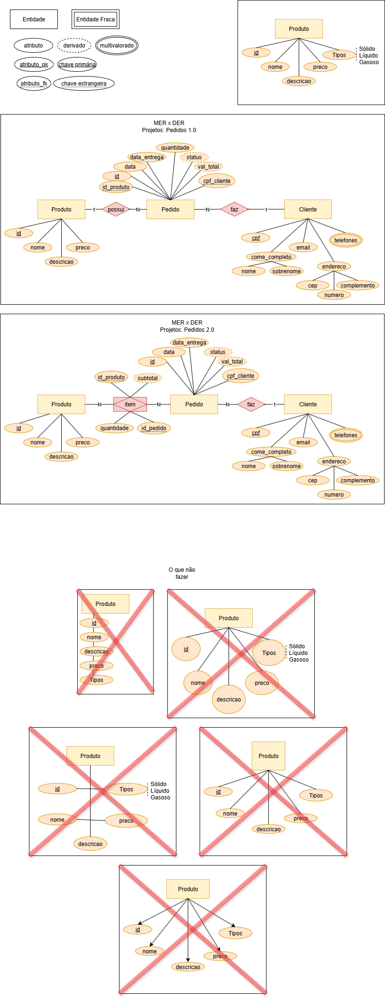

# Aula01

## SGBD (Sistema Gerenciador de Banco de Dados)
- MySQL (MariaDB)

## XAMPP
É uma IDE (Ambiente Integrado de Desenvolvimento) composta por diversas tecnologias

## MER (Modelo Entidade Relacionamento) DER (Diagrama Entidade Relacionamento)
Ferramentas para modelar bancos de dados.
- 

## Atividades
A partir de uma empresa do mundo real, analise o negócio e modele um dos bancos de dados desta empresa.