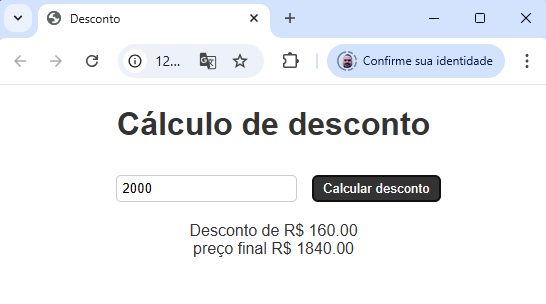
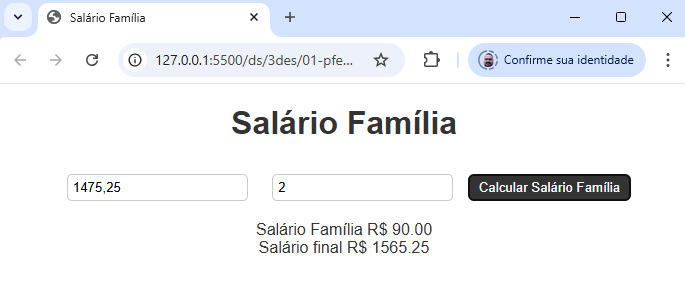

# Aula01
- Manual do aluno
- Preparação do ambiente
    - VsCode
    - XAMPP
    - Node.js
    - Insomnia
- Revisão de JavaScript / HTML
- UI (User Interface) Web / Front-end
    - HTML
    - CSS
    - JavaScript

## Demonstração
- 1 Desenvolva uma UI(interface) Web que leia o preço de um produto e se o preço for maior do que 1000 reais aplique um desconto de 8%. Mostre o preço final.
    - exp1.html
```html
<!DOCTYPE html>
<html lang="en">
<head>
    <meta charset="UTF-8">
    <meta name="viewport" content="width=device-width, initial-scale=1.0">
    <title>Desconto</title>
</head>
<style>
    body {
        font-family: Arial, sans-serif;
        text-align: center;
    }
    h1 {
        color: #333;
    }
    input {
        padding: 5px;
        margin: 10px;
        border: 1px solid #ccc;
        border-radius: 5px;
    }
    button {
        padding: 5px 10px;
        border: 1px solid #ccc;
        border-radius: 5px;
        background-color: #333;
        color: #fff;
        cursor: pointer;
    }
    button:hover {
        background-color: #444;
    }
    p {
        margin: 10px;
        color: #333;
    }
</style>
<body>
    <h1>Cálculo de desconto</h1>
    <input type="number" id="preco" placeholder="Preço">
    <button onclick="reajustar()">Calcular desconto</button>
    <p id="resultado"></p>
</body>
<script>
    function reajustar() {
        let preco = Number(document.getElementById('preco').value);
        let resultado = document.getElementById('resultado');
        let desconto = 0;
        if (preco > 1000)
            desconto = preco * 8 / 100;
        let precoComDesconto = Number(preco - desconto);
        resultado.innerHTML = `Desconto de R$ ${desconto.toFixed(2)} <br>Preço final R$ ${precoComDesconto.toFixed(2)}`;
    }
</script>
</html>
```


- 2 Desenvolva uma UI(interface) Web que leia o salário de um funcionário e o número de filhos. Se o salário for menor do que 2000 o funcionário receberá um salário família equivalente a 45 reais por filho. Apresente o salário final.


## Exercícios
- 1 Desenvolva uma UI(interface) Web que calcule desconto de INSS de um funcionário, se o salário for menor ou igual a 1212,00 reais será de 7,5%, se estiver entre 1212,01 e 2427,35 será de 9%, se estiver entre 2427,36 e R$ 3641,03 o desconto é 12%, se estiver entre 3641,04 e 7087,22 será de 14% e se for maior do que 7087,22 o teto que é o máximo cobrado 14% de 7087,22. Mostre o desconto e o valor do salário final.
- 2 Desenvolva uma UI(interface) Web que leia os valores de três lados de um triângulo (a, b e c) e se os três lados forem diferentes escreva ESCALENO se os três lados forem iguais EQUILÁTERO e se apenas dois lados forem iguais ISÓSCELES.
- 3 Desenvolva uma UI(interface) Web que leia o nome e o preço de uma mercadoria. Se o preço for menor do que 1000 terá um aumento de 5% no preço da mercadoria, senão o aumento será de 7%. Mostrar o nome da mercadoria e o seu novo preço.
- 4 Desenvolva uma UI(interface) Web que leia 6 números inteiros e exiba na tela ao final, o maior número que foi digitado pelo usuáriou.
- 5 Escreva uma UI(interface) Web que leia 5 números inteiros em qualquer ordem e exiba na tela ao final, os cinco números em ordem crescente.
- 6 Escreva uma UI(interface) Web que leia dois números inteiros e determine qual é o maior e o menor.
- 7 Desenvolva um algortimo que faça o cálculo do reajuste salarial do funcionário, baseado nos seguintes parâmetros:
    - 15% de aumento : 1.500,00 <= salario Atual < 1.750,00
    - 12% de aumento : 1.750,00 <= salario Atual < 2.000,00
    - 9% de aumento : 2.000,00 <= salario Atual < 3.000,00
    - 6% de aumento : salario Atual >= 3.000,00
- 8 Crie uma UI(interface) Web que calcule a média de 3 notas do aluno e informe sua situação: (nota maior ou igual a 6 : aprovado), (nota inferior a 6 e maior ou igual a 4 : recuperação), (nota menor que 4 : reprovado).
- 9 Uma loja está fazendo uma promoção e precisa de ajuda no momento da venda, para liberar os descontos. Baseado na peça, calcule o desconto e exiba o valor final da venda. (camisa - 20% de desconto, bermuda - 10% de desconto, calça - 15% de desconto).