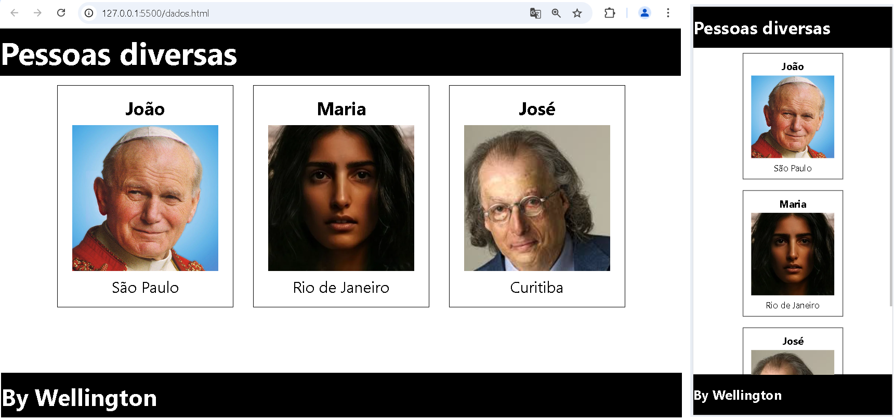

# Aula03 - UI (User Interface)

## Objetivo
Criar interfaces interativas com **cards** e **listas**.

### Capacidades Técnicas
- 1 Utilizar semântica de linguagem de marcação conforme normas
- 3 Utilizar ferramentas gráficas para interface web e mobile

## Conhecimentos
- 7 User Interface (UI) design
  - 7.1 Definição
  - 7.2 Aplicação
  - 7.3 Usabilidade

## Códigos da demonstração de cards em [./renderizacao](./rederizacao/)
- dados.json
```json
[
    {
        "id": 1,
        "nome": "João",
        "avatar": "https://img.cancaonova.com/cnimages/canais/uploads/sites/6/2003/10/formacao_o-rosto-mariano-do-pontificado-de-jpii.jpg",
        "cidade": "São Paulo"
    },
    {
        "id": 2,
        "nome": "Maria",
        "avatar": "https://praiaexpresso.com/wp-content/uploads/2024/01/m-02-2048.jpg?w=640",
        "cidade": "Rio de Janeiro"
    },
    {
        "id": 3,
        "nome": "José",
        "avatar": "https://encrypted-tbn0.gstatic.com/images?q=tbn:ANd9GcRBDEfo7VRQq6nHgv4vERG5VtZJzpPaYTZKbw&s",
        "cidade": "Curitiba"
    }
]
```
- Renderizado em cards com responsividade
- 

### Exemplo da visualização em lista


## Desafio 01 - Cards
- A: Renderize em uma página HTML em cards com as informações de produtos do arquivo **[produtos.json](./produtos.json)**, não é necessário que os cards contenham todas as informações do arquivo, mas é necessário que contenham a imagem, o nome e o preço do produto.
- B: Adicione responsividade à página, de forma que os cards sejam exibidos em uma única coluna em telas menores e em até 4 colunas em telas maiores, para testar acrescente mais produtos ao JSON.

## Desafio 02 - Lista
- A: Renderize em outra página HTML em lista com as informações de produtos do arquivo **[produtos.json](./produtos.json)**, não é necessário que a lista contenha todas as informações do arquivo, mas é necessário que contenha o nome e o preço do produto.

## Desafio 03 - UX (User Experience)
- A: Para melhorar a experiência do usuário, crie uma nova página html agora chamada **index.html** adicione dois botões no cabeçalho, um para exibir em cards e outro para exibir em lista os produtos do arquivo **[produtos.json](./produtos.json)**.

## Entregas
- Crie um repositório público no GitHub chamado `web-aula03-ui-ux`.
- Adicione o arquivo **README.md** com as informações do repositório.
- Habilitar o GitHub Pages no repositório para a branch `master` que contem o arquivo index.html.
- Enviar o link do github pages neste **[FORM](https://forms.gle/dX6Fns658eWhQeR67)**

## Portfolio
- Durante o ano passado iniciamos a criação de um Portfolio, porém com pouco conteúdo para acrescentar. Este ano, porém já temos pelo menos dois projetos para incluir.
- Deixe seu Portfolio em produção com git Pages e envie o link neste **[FORM](https://forms.gle/nEvLDErezfuQmQtW6)**
- Lembrando o nome do repositório deve ser o mesmo nome do seu usuário do GitHub.
- exemplo: https://wellifabio.github.io