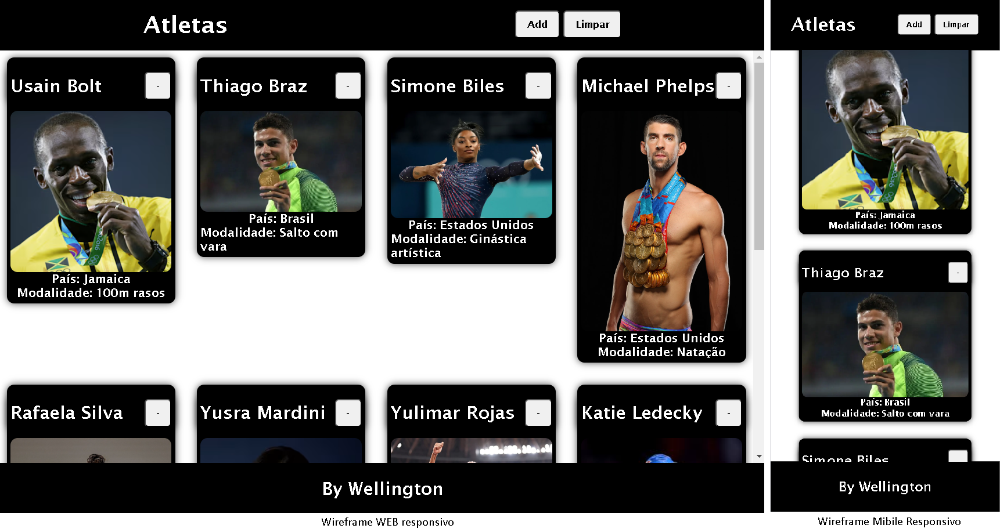
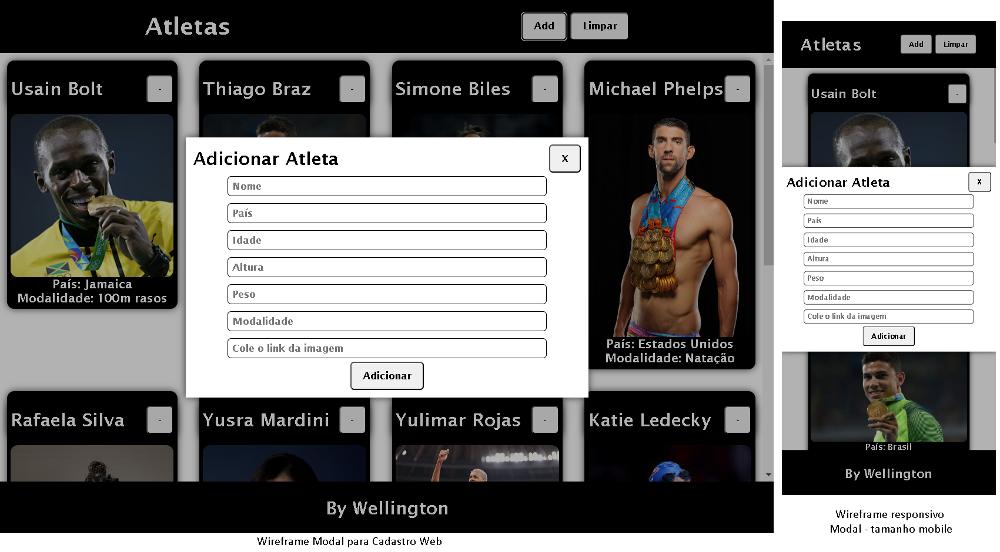

# Aula04
## Objetivos
- Manipulação de elementos DOM
- Janelas Modais (UI)
- Armazenmento local (Web Storage)
## Conhecimentos
  - 1.3 DOM (Document Object Model)
    - 1.3.1 Seleção de elementos
    - 1.3.2 Manipulação de elementos
  - 1.4. Orientação a Objetos (OO)
    - 1.4.1 Definição
    - 1.4.2 Classes
    - 1.4.3 Atributos
    - 1.4.4 Funções Internas
  - 1.6. Canvas
    - 1.8 Web storage

## Desafio
- Implementar uma interface de cadastro de atletas utilizando cards e um formulário em modal. O cadastro deve persistir localmente no navegador.
- Lista de objetos JSON com atletas para popular a interface.
- Implementar um botão para excluir um atleta da lista.
```json
[
    {
        "id": 1,
        "nome": "Usain Bolt",
        "pais": "Jamaica",
        "idade": 34,
        "altura": 1.95,
        "peso": 94,
        "modalidade": "100m rasos",
        "foto": "https://img.olympics.com/images/image/private/t_1-1_300/f_auto/primary/lmusmqtktq8slg9yl1xj"
    },
    {
        "id": 2,
        "nome": "Thiago Braz",
        "pais": "Brasil",
        "idade": 27,
        "altura": 1.92,
        "peso": 78,
        "modalidade": "Salto com vara",
        "foto": "https://lncimg.lance.com.br/cdn-cgi/image/width=828,quality=75,fit=pad,format=webp/uploads/2024/08/image_placeholder-1-aspect-ratio-512-320-15.jpg"
    },
    {
        "id": 3,
        "nome": "Simone Biles",
        "pais": "Estados Unidos",
        "idade": 24,
        "altura": 1.42,
        "peso": 47,
        "modalidade": "Ginástica artística",
        "foto": "https://fly.metroimg.com/upload/q_85,w_700/https://uploads.metroimg.com/wp-content/uploads/2024/07/28075125/biles-olimpiadas-dia-1.jpg"
    },
    {
        "id": 4,
        "nome": "Michael Phelps",
        "pais": "Estados Unidos",
        "idade": 36,
        "altura": 1.93,
        "peso": 88,
        "modalidade": "Natação",
        "foto": "https://s3.sa-east-1.amazonaws.com/static.activodeporte.com/brasil/uploads/2017/01/08160516/phelps_medals9.jpg"
    },
    {
        "id": 5,
        "nome": "Rafaela Silva",
        "pais": "Brasil",
        "idade": 29,
        "altura": 1.64,
        "peso": 57,
        "modalidade": "Judô",
        "foto": "https://conteudo.imguol.com.br/c/esporte/98/2023/10/28/pan-2023-rafaela-silva-conquistou-o-ouro-na-categoria-ate-57kg-do-judo-1698524242722_v2_3x4.jpg"
    },
    {
        "id": 6,
        "nome": "Yusra Mardini",
        "pais": "Time Olímpico de Refugiados",
        "idade": 23,
        "altura": 1.73,
        "peso": 55,
        "modalidade": "Natação",
        "foto": "https://img.olympics.com/images/image/private/t_1-1_300/f_auto/primary/dxzmsv8yszf1oejimkhj"
    },
    {
        "id": 7,
        "nome": "Yulimar Rojas",
        "pais": "Venezuela",
        "idade": 25,
        "altura": 1.92,
        "peso": 58,
        "modalidade": "Salto triplo",
        "foto": "https://assets.brasildefato.com.br/2024/09/image_processing20210802-16398-1gs4g3k.jpeg"
    },
    {
        "id": 8,
        "nome": "Katie Ledecky",
        "pais": "Estados Unidos",
        "idade": 24,
        "altura": 1.83,
        "peso": 70,
        "modalidade": "Natação",
        "foto": "https://encrypted-tbn0.gstatic.com/images?q=tbn:ANd9GcT-PCtdnlGCRP8AuXTAjNps_RFNTWp4xDlaZg&s"
    },
    {
        "id": 9,
        "nome": "Bruno Fratus",
        "pais": "Brasil",
        "idade": 32,
        "altura": 1.92,
        "peso": 87,
        "modalidade": "Natação",
        "foto": "https://www.ecp.org.br/wp-content/uploads/2024/04/04-11-BrunoFratus-Finkel-CC-4561.jpg"
    }
]
```
- Objetivo final, Listar os atletas em cards, com um botão para excluir o atleta da lista e um botão para adicionar um novo atleta.<br>
<br>

## Resumo
O projeto visto em aula encontra-se nesta pasta com o nome de "modal-storage".<br>
O projeto foi desenvolvido utilizando HTML, CSS e JavaScript.<br>
- Vimos os conceitos:
    - JSON (Objeto JavaScript)
      - JSON.parse()
      - JSON.stringify()
    - DOM (Document Object Model)
      - document.querySelector()
      - document.querySelectorAll()
      - document.createElement()
      - element.appendChild()
      - element.removeChild()
    - Eventos
      - addEventListener()
    - Web Storage
      - localStorage.setItem()
      - localStorage.getItem()
      - localStorage.removeItem()
    - Modal
      - Modal com JavaScript
      - Modal com CSS

