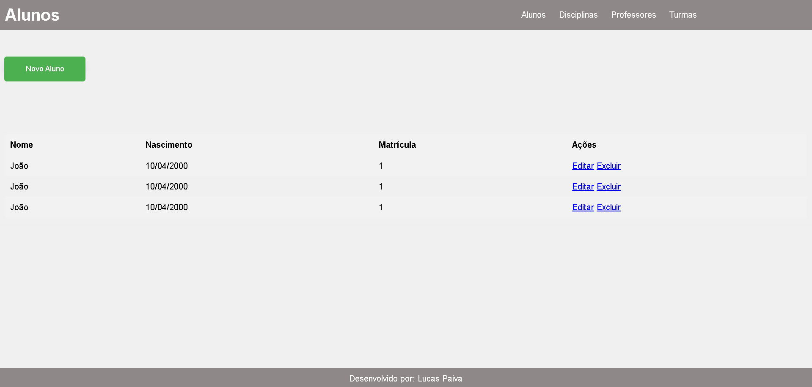

## Aula 5

#### Contextualização: 
- Dando continuidade no Projeto **Escola** onde foi desenvolvido a API e realizado os testes no Insomnia, agora iremos criar um front-end para consumir essa API.

#### Telas a serem desenvolvidas:
    - Cadastro de alunos.
    - Cadastro de professores.
    - Cadastro de disciplinas.
    - Cadastro de turmas. 

#### Paletas de cores:
    - Cores dos textos: white
    - Header: #8e8888
    - Fundo da body: #f0f0f0
    - Cor do botão de cadastro: #4CAF50

#### Wireframe das telas:

- Quando clicar no botão "Novo Aluno", deve abrir um modal com o formulário para cadastro de aluno.
- Com esse exemplo de wireframe, vocês podem criar as outras telas.

##### Desafio:
- Na tabela, personlize de forma mais moderna as opções "Editar" e "Excluir".
- Adicione um campo de pesquisa para filtrar os alunos (Na sua respectiva página).
- Adicione um campo de pesquisa para filtrar os professores (Na sua respectiva página).
- Adicione um campo de pesquisa para filtrar as disciplinas (Na sua respectiva página).
- Adicione um campo de pesquisa para filtrar as turmas (Na sua respectiva página).

## Critérios
|Criticidade|Capacidades Básicas e Socioemocionais|Critérios|
|-|:-:|-|
||1 Utilizar semântica de linguagem de marcação conforme normas|Separou os ítens como cabeçalho, conteúdo, menú, rodapé.|
||2 Elaborar formulários de página web|Criou formulários para cadastro em forma de modais ou como elemento dentro da página conforme solicitado|
||3 Utilizar ferramentas gráficas para interface web e mobile|Implementou funcionaidades HTML de responsividade apresentando o conteúdo tanto no tamanho web como mibile|
||4 Adequar a interface web para diferentes dispositivos de acesso|Implementou funcionaidades CSS de responsividade apresentando o conteúdo tanto no tamanho web como mibile|
||5 Desenvolver interfaces web interativas com linguagem de programação|Aplicou recursos de manipulação de janelas modais, carregou dados JSON, localStorage para persistência de dados|
||6 Aplicar técnicas de estilização de páginas web|Implementou técnicas de UI x UX com CSS|
||1 Demonstrar autogestão|Utilizou IA apenas como apoio tentando entender a solução, contou com ajuda de colegas ou ajudou com objetivo de melhorar o aprendizado|
||2 Demonstrar pensamento analítico|Compreende como o Front-end se relaciona com dados locais e externos, tirou dúvidas com instrutores se surgiram|
||3 Demonstrar inteligência emocional|Se dedicou ao aprendizado para compreender o mínimo do componente|
||4 Demonstrar autonomia|Questionou os intrutores ou colegas sobre dúvidas ou problemas ocorridos durante o desenvolvimento. Se propôs a resolver os problemas|