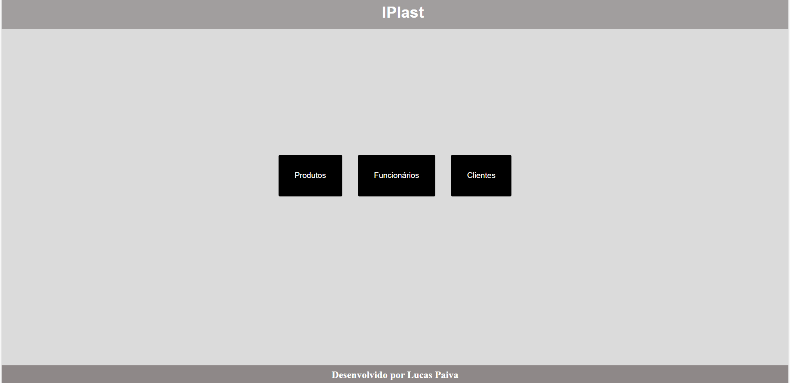
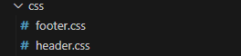
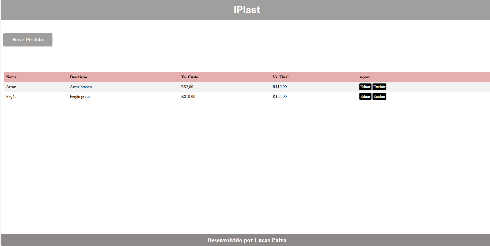
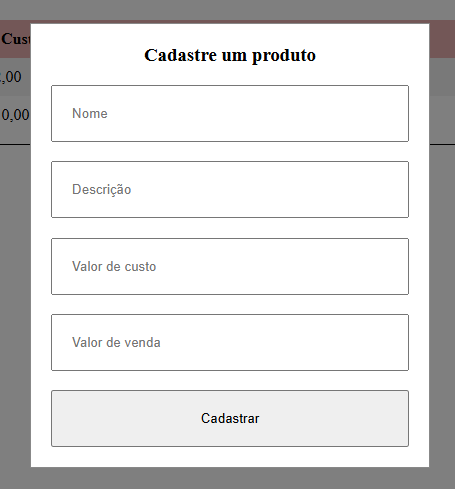
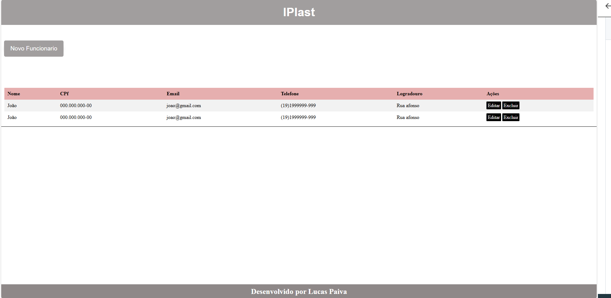
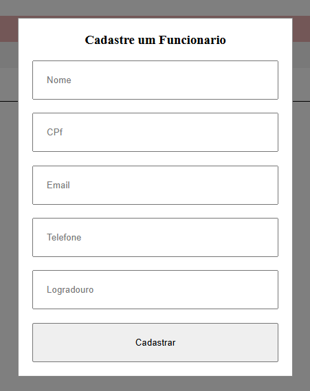
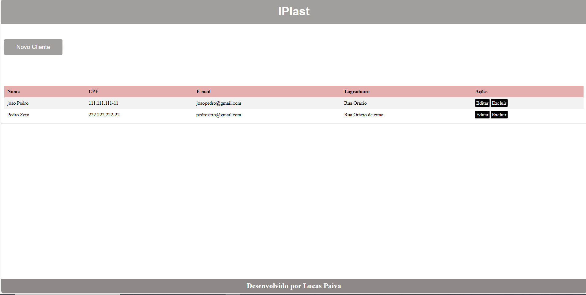
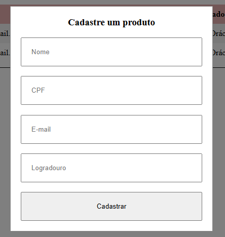

# Aula 06

### Verificação Prática Somativa.

|Orientações Gerais:|
|-|

- Desligue e guarde o telefone celular (Poíbido).
- Antes de iniciar a prova, leia atentamente as instruções contidas neste caderno e esclareça as dúvidas com o avaliador, caso necessário. 
- O envio da VPS será permitido somente após o intervalo do período da manhã.| 


### Contextualização do Desafio
Você é desenvolvedor da empresa SKARTECH, e rescentemente se deparou com uma nova demanda, que sera realizada para uma industria, do ramo de Plásticos na cidade de Pedreira, chamada IPlast, a mesma necessita de um sistema para gerenciamento dos seus: produtos (estoque), funcionários e clientes. 

### Desafio (Somente o visual da aplicação): 
Fazendo o uso dos seus conhecimentos, utilize as linguagens que aprendeu durante o curso para criar uma aplicação que faça o todo o gerenciamento de  "produtos (estoque), funcionários clientes". 

### Wireframes - Home

- Home Page: 


- Obs: O Header e o Footer, foi desenvolvido um CSS para cada um, como se fossem dois módulos, ex:


- Com isso, basta realizar os códigos necessários para os elementor ***header*** e ***footer*** e linkar o css com as páginas necessárias.

Consigurações, tipografia + paletas de cor:
```
Header + Footer:
background: rgb(161, 158, 158);
color: white;
font-size: 1vw;
font-family: Arial, Helvetica, sans-serif;

Main:
Body:  background: rgb(219, 219, 219);
```

### Wireframe - Produtos



### Wireframe - Funcionários



### Wireframe - Clientes


### Entrega
- Faça o upload dos arquivos para o seu Git, e acesso o <a href="https://forms.gle/ZzK5192p28kGh3p97">Forms</a>, com isso, preencha o seu nome o link do repositório da avaliação.
- O nome do repositório deverá ser VPS - Front.

## Critérios
|Criticidade|Capacidades Básicas e Socioemocionais|Critérios|
|-|:-:|-|
||1 Utilizar semântica de linguagem de marcação conforme normas|Separou os ítens como cabeçalho, conteúdo, menú, rodapé.|
||2 Elaborar formulários de página web|Criou formulários para cadastro em forma de modais ou como elemento dentro da página conforme solicitado|
||3 Utilizar ferramentas gráficas para interface web e mobile|Implementou funcionaidades HTML de responsividade apresentando o conteúdo tanto no tamanho web como mibile|
||4 Adequar a interface web para diferentes dispositivos de acesso|Implementou funcionaidades CSS de responsividade apresentando o conteúdo tanto no tamanho web como mibile|
||5 Desenvolver interfaces web interativas com linguagem de programação|Aplicou recursos de manipulação de janelas modais, carregou dados JSON, localStorage para persistência de dados|
||6 Aplicar técnicas de estilização de páginas web|Implementou técnicas de UI x UX com CSS|
||1 Demonstrar autogestão|Utilizou IA apenas como apoio tentando entender a solução, contou com ajuda de colegas ou ajudou com objetivo de melhorar o aprendizado|
||2 Demonstrar pensamento analítico|Compreende como o Front-end se relaciona com dados locais e externos, tirou dúvidas com instrutores se surgiram|
||3 Demonstrar inteligência emocional|Se dedicou ao aprendizado para compreender o mínimo do componente|
||4 Demonstrar autonomia|Questionou os intrutores ou colegas sobre dúvidas ou problemas ocorridos durante o desenvolvimento. Se propôs a resolver os problemas|