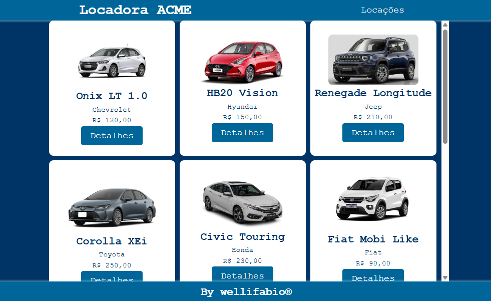
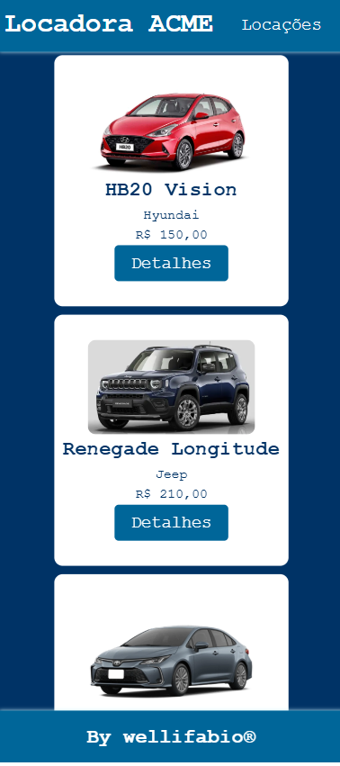
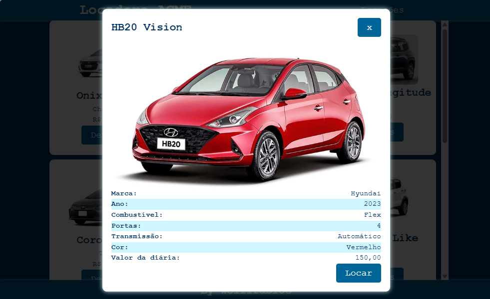
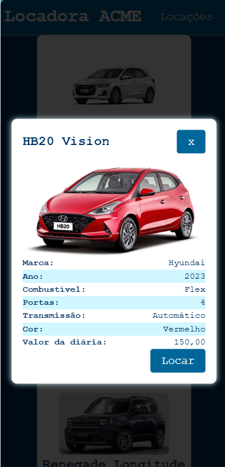
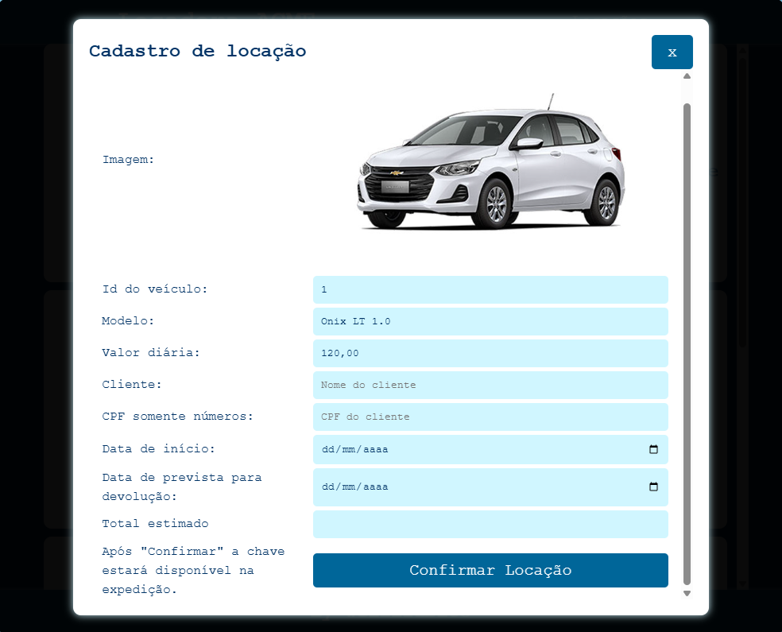
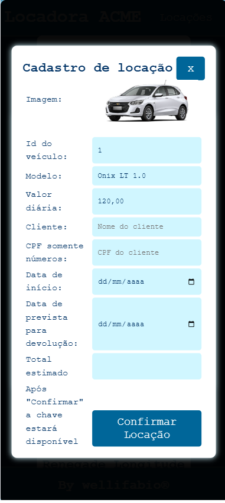
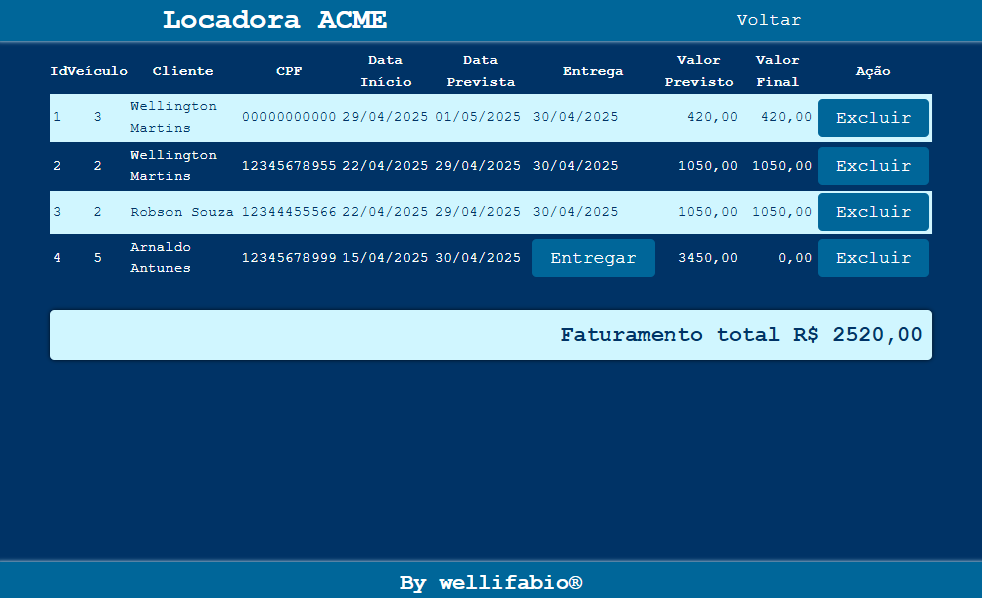
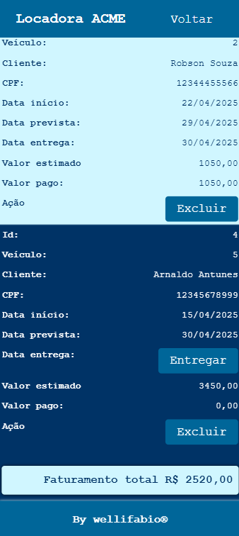

# Locação de Automóveis (Locadora ACME)
Situação de Aprendizagem - Front-End (HTML, CSS, JavaScript).
Funcionalidades (Localstorage, Modal e responsividade).

## Contextualização
A locadora de automóveis ACME, oferecer uma interface simples para listar os carros disponíveis, visualizar os detalhes de cada modelo e cadastrar a locação para um cliente. A aplicação será usada por atendentes internos da empresa, e deve priorizar a clareza, a usabilidade e a boa apresentação das informações.

## Desafio
Desenvolver as funcionalidades conforme requisitos

## Identidade Visual
- Fonte: Courrier
- Paletta de cores

- [ ] cor1: #003366
- [ ] cor2: #006699
- [ ] cor3: #0099CC
- [ ] cor4: #00CCFF
- [ ] cor5: #99DDFF
- [ ] transp1: rgba(0, 0, 0, 0.8)
- [ ] transp2: rgba(255, 255, 255, 0.8)

### Requisitos funcionais
- [RF001] O sistema deve apresentar todos os carros disponíveis para locação..
    - [RF001.1] Deve possuir um botão "Ver Detalhes" para apresentar os detalhes de cada carro.
- [RF002] Locação de carro.
    - [RF002.1] Sistema deve ter um formulário de locação.
    - [RF002.2] Dados do formulário: nome do cliente, cpf, data inicio da locação, data fim e o carro locado.
    - [RF002.3] Deve validar se o CPF tem 11 digítos (sem pontuações).
- [RF003] Todos os dados dos carros e cadastros de locação devem ser armazenados em LocalStorage.

### Casos de teste do Front-End
 - [CT001] Validar a responsividade.
 - [CT002] Validar se os dados estão corretos no botão "Ver Detalhes".
 - [CT003] Validação se os dados estão sendo gravados em LocalStorage.

 
 ## Entrega:
Fork do repositório público no GitHub com o código fonte do projeto, Git-Pages habilitado e link disponível no "About" do projeto.
 ```json
 [
    {
        "id": 1,
        "modelo": "Onix LT 1.0",
        "marca": "Chevrolet",
        "ano": 2022,
        "imagem": "https://www.chevroletnova.com.br/images/versoes/fotos/2024/03/lt-2024_17111311180.jpg",
        "combustivel": "Flex",
        "portas": 4,
        "transmissao": "Manual",
        "valor_diaria": 120.00,
        "cor":"Branco"
    },
    {
        "id": 2,
        "modelo": "HB20 Vision",
        "marca": "Hyundai",
        "ano": 2023,
        "imagem": "https://image1.mobiauto.com.br/images/api/images/v1.0/48474782/transform/fl_progressive,f_webp,q_85,w_959",
        "combustivel": "Flex",
        "portas": 4,
        "transmissao": "Automático",
        "valor_diaria": 150.00,
        "cor":"Vermelho"
    },
    {
        "id": 3,
        "modelo": "Renegade Longitude",
        "marca": "Jeep",
        "ano": 2023,
        "imagem": "https://image1.mobiauto.com.br/images/api/images/v1.0/459392576/transform/fl_progressive,f_webp,q_70,w_592",
        "combustivel": "Gasolina",
        "portas": 4,
        "transmissao": "Automático",
        "valor_diaria": 210.00,
        "cor":"Azul"
    },
    {
        "id": 4,
        "modelo": "Corolla XEi",
        "marca": "Toyota",
        "ano": 2022,
        "imagem": "https://www.webmotors.com.br/imagens/prod/348132/TOYOTA_COROLLA_2.0_VVTIE_FLEX_XEI_DIRECT_SHIFT_34813217124405529.webp?s=fill&w=170&h=125&t=true",
        "combustivel": "Flex",
        "portas": 4,
        "transmissao": "Automático",
        "valor_diaria": 250.00,
        "cor":"Cinza"
    },
    {
        "id": 5,
        "modelo": "Civic Touring",
        "marca": "Honda",
        "ano": 2021,
        "imagem": "https://img0.icarros.com/dbimg/galeriaimgmodelo/7/124443_1.jpg",
        "combustivel": "Gasolina",
        "portas": 4,
        "transmissao": "Automático",
        "valor_diaria": 230.00,
        "cor":"Branco"
    },
    {
        "id": 6,
        "modelo": "Fiat Mobi Like",
        "marca": "Fiat",
        "ano": 2022,
        "imagem": "https://production.autoforce.com/uploads/version/profile_image/10921/comprar-like-1-0_9eee82ebb4.png",
        "combustivel": "Flex",
        "portas": 4,
        "transmissao": "Manual",
        "valor_diaria": 90.00,
        "cor":"Branco"
    },
    {
        "id": 7,
        "modelo": "Kwid Zen",
        "marca": "Renault",
        "ano": 2023,
        "imagem": "https://garagem360.com.br/wp-content/uploads/2023/10/Renault-Kwid-Zen-2024-4.jpg",
        "combustivel": "Flex",
        "portas": 4,
        "transmissao": "Manual",
        "valor_diaria": 95.00,
        "cor":"Preto"
    },
    {
        "id": 8,
        "modelo": "Gol Trendline",
        "marca": "Volkswagen",
        "ano": 2021,
        "imagem": "https://combustivel.app/imgs/meta/consumo-gol-trendline-1-6-1.jpg",
        "combustivel": "Flex",
        "portas": 4,
        "transmissao": "Manual",
        "valor_diaria": 100.00,
        "cor":"Cinza"
    },
    {
        "id": 9,
        "modelo": "Compass Limited",
        "marca": "Jeep",
        "ano": 2022,
        "imagem": "https://garagem360.com.br/wp-content/uploads/2023/04/Jeep-Compass-Limited-2023-2.jpg",
        "combustivel": "Diesel",
        "portas": 4,
        "transmissao": "Automático",
        "valor_diaria": 270.00,
        "cor":"Cinza"
    },
    {
        "id": 10,
        "modelo": "Tracker Premier",
        "marca": "Chevrolet",
        "ano": 2023,
        "imagem": "https://www.chevroletnova.com.br/images/versoes/fotos/2024/03/premier-2024_17111365725.jpg",
        "combustivel": "Flex",
        "portas": 4,
        "transmissao": "Automático",
        "valor_diaria": 220.00,
        "cor":"Vermelho"
    }
]
```

## Wireframes
|Web|Mobile|
|-|-|
|||
|||
|||
|||

#### Obs: Os wireframes são apenas sugestões, você pode criar o layout que desejar, desde que atenda aos requisitos funcionais e não funcionais.
Use sua criatividade e faça um layout bonito e funcional.