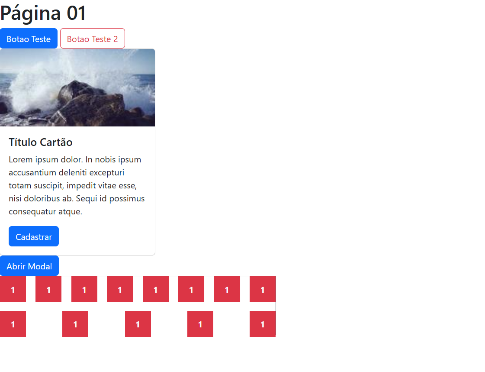
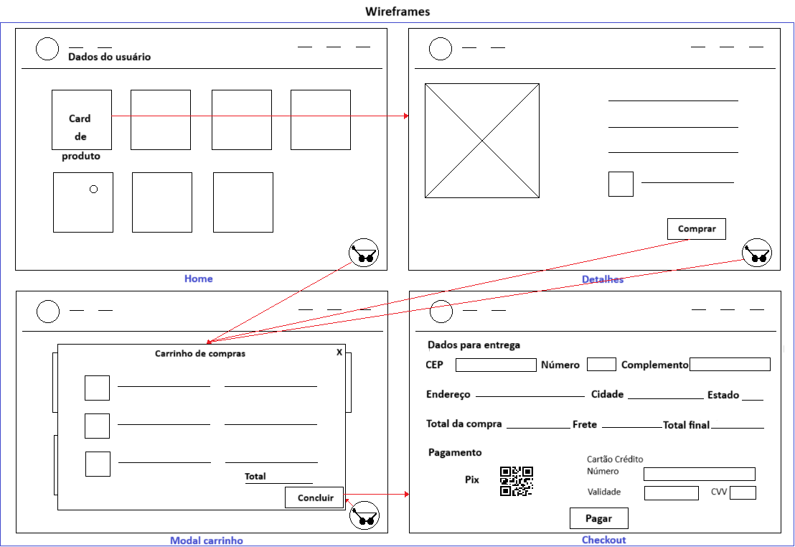

# Aula10
## Bootstrap
- [Documentação oficial](https://getbootstrap.com/)
Bootstrap é um framework para renderização front-end com pouco código, podendo substituir o CSS ou ser utilizado em conjunto.

### Exemplo em aula
```html
<!DOCTYPE html>
<html lang="en">
<head>
    <meta charset="UTF-8">
    <meta name="viewport" content="width=device-width, initial-scale=1.0">
    <title>Exemplo Bootstrap</title>
    <link href="https://cdn.jsdelivr.net/npm/bootstrap@5.3.6/dist/css/bootstrap.min.css" rel="stylesheet" integrity="sha384-4Q6Gf2aSP4eDXB8Miphtr37CMZZQ5oXLH2yaXMJ2w8e2ZtHTl7GptT4jmndRuHDT" crossorigin="anonymous">
    <script src="https://cdn.jsdelivr.net/npm/bootstrap@5.3.6/dist/js/bootstrap.bundle.min.js" integrity="sha384-j1CDi7MgGQ12Z7Qab0qlWQ/Qqz24Gc6BM0thvEMVjHnfYGF0rmFCozFSxQBxwHKO" crossorigin="anonymous"></script>
</head>
<body>
    <h1>Página 01</h1>
    <button class="btn btn-primary">Botao Teste</button>
    <button class="btn btn-outline-danger">Botao Teste 2</button>
    <div class="card" style="width: 18rem;">
        
        <div class="card-body">
            <h5 class="card-title">Título Cartão</h5>
            <p class="card-text">Lorem ipsum dolor. In nobis ipsum accusantium deleniti excepturi totam suscipit, impedit vitae esse, nisi doloribus ab. Sequi id possimus consequatur atque.</p>
            <a href="" class="btn btn-primary">Cadastrar</a>
        </div>
    </div>

    <button 
        class="btn btn-primary" 
        data-bs-toggle="modal"
        data-bs-target="#exampleModal"
    >
        Abrir Modal
    </button>

    <div 
        class="modal fade" 
        id="exampleModal" 
        tabindex="-1" 
        aria-labelledby="exampleModalLabel" 
        aria-hidden="true">
        <div class="modal-dialog">
            <div class="modal-content">
                <div class="modal-header">
                    <h1 class="modal-title">Meu modal</h1>
                </div>
                <div class="modal-body">
                    Lorem ipsum dolor sit amet consectetur adipisicing elit. Corporis magni minima soluta alias a quidem similique maxime eos voluptatum enim ab sint, non ad. Optio saepe fugiat vel ad nemo!
                </div>
                <div class="modal-footer">
                    <button class="btn btn-danger" data-bs-dismiss="modal">Fechar</button>
                    <button class="btn btn-outline-primary" data-bs-dismiss="modal">Ok</button>
                </div>
            </div>
        </div>
    </div>


    <div
        class="border border-secondary d-flex justify-content-between align-items-center gap-3 flex-wrap"
        style="width: 50vw; height: 15vh;"
    >
        <div
            class="bg-danger d-flex justify-content-center align-items-center" 
            style="width: 3rem; height: 3rem;"
        >
            <p class="text-light fw-bold m-0">1</p>
        </div>
        <div
            class="bg-danger d-flex justify-content-center align-items-center" 
            style="width: 3rem; height: 3rem;"
        >
            <p class="text-light fw-bold m-0">1</p>
        </div>
        <div
            class="bg-danger d-flex justify-content-center align-items-center" 
            style="width: 3rem; height: 3rem;"
        >
            <p class="text-light fw-bold m-0">1</p>
        </div>
        <div
            class="bg-danger d-flex justify-content-center align-items-center" 
            style="width: 3rem; height: 3rem;"
        >
            <p class="text-light fw-bold m-0">1</p>
        </div>
        <div
            class="bg-danger d-flex justify-content-center align-items-center" 
            style="width: 3rem; height: 3rem;"
        >
            <p class="text-light fw-bold m-0">1</p>
        </div>
        <div
            class="bg-danger d-flex justify-content-center align-items-center" 
            style="width: 3rem; height: 3rem;"
        >
            <p class="text-light fw-bold m-0">1</p>
        </div>
        <div
            class="bg-danger d-flex justify-content-center align-items-center" 
            style="width: 3rem; height: 3rem;"
        >
            <p class="text-light fw-bold m-0">1</p>
        </div>
        <div
            class="bg-danger d-flex justify-content-center align-items-center" 
            style="width: 3rem; height: 3rem;"
        >
            <p class="text-light fw-bold m-0">1</p>
        </div>
        <div
            class="bg-danger d-flex justify-content-center align-items-center" 
            style="width: 3rem; height: 3rem;"
        >
            <p class="text-light fw-bold m-0">1</p>
        </div>
        <div
            class="bg-danger d-flex justify-content-center align-items-center" 
            style="width: 3rem; height: 3rem;"
        >
            <p class="text-light fw-bold m-0">1</p>
        </div>
        <div
            class="bg-danger d-flex justify-content-center align-items-center" 
            style="width: 3rem; height: 3rem;"
        >
            <p class="text-light fw-bold m-0">1</p>
        </div>
        <div
            class="bg-danger d-flex justify-content-center align-items-center" 
            style="width: 3rem; height: 3rem;"
        >
            <p class="text-light fw-bold m-0">1</p>
        </div>
        <div
            class="bg-danger d-flex justify-content-center align-items-center" 
            style="width: 3rem; height: 3rem;"
        >
            <p class="text-light fw-bold m-0">1</p>
        </div>
    </div>
</body>
</html>
```
### Resultado


## API
- API de geração de imagens aleatórias https://picsum.photos/, exemplo de utilização a seguir

```
https://picsum.photos/200/100
```
Basta passar a largura e altura da imagem em pixels.

## Situação de aprendizagem (Lojinha)
### Contextualização
Você é programador web e foi designado ao projeto "Loja tem de tudo" que inicialmente precisa de uma página WEB Front-end.

### Desafio
Desenvolver uma home page de produtos uma página de detalhes, um carrinho de compras em forma de modal e uma página de check-out, com base no wireframe a seguir.

||
|-|
|1 Crie uma identidade visual, ícone, fonte e paleta de cores com Canvas<br>2 Crie um protótipo com as funcionalidades de navegação com Figma<br>3 Preenchja o arquivo de mockup chamado **./assets/dados.json** com produtos variados que serão carregados nos cards da home page, via **axios**.<br>4 Com base no protótipo codifique as páginas com **html** estilizando com **bootstrap** e aplicando as funcionalidades com **javascript**<br> utilize localStorage para armazenar os dados do carrinho.<br>5 Na página de check-out utilize a API https://viacep.com.br/ para obter os dados de endereço a partir do CEP **utilize axios** para consumir<br>6 Ao clicar em **Pagar** na página ckeck-out deve ser mostrado no console um JSON com os dados do cliente, endereço e pagamento (Caso os dados do cartão estejam em branco o pagamento será considerado com PIX senão cartão de Crédito)|

### Entrega
Faça fork do [repositório inicial](https://github.com/wellifabio/pfe1-lojinha-carrrinho-2025.git), clone em seu computador, desenvolva o front-end, altere o README.md, acrescentando o link do protótipo do Figma, faça commit e habilite o **gitpages**.