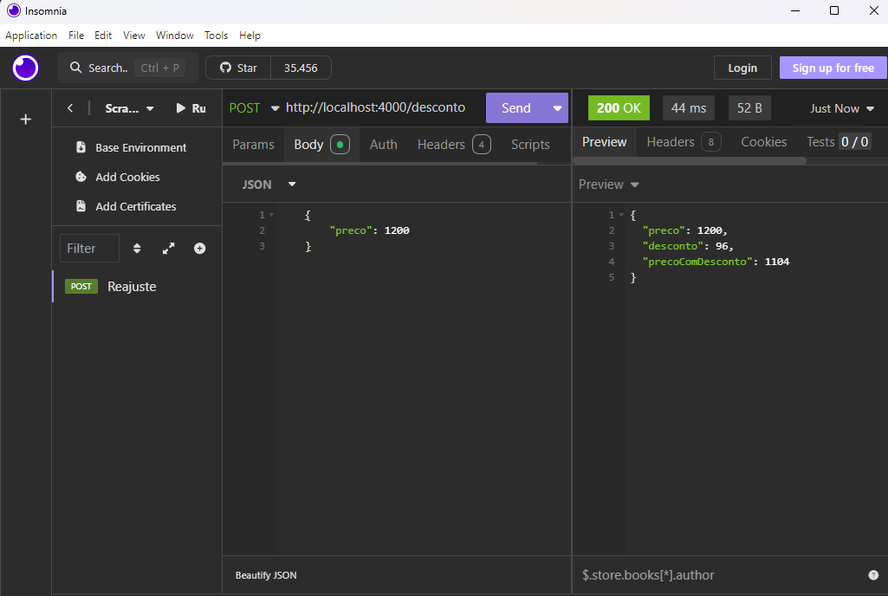
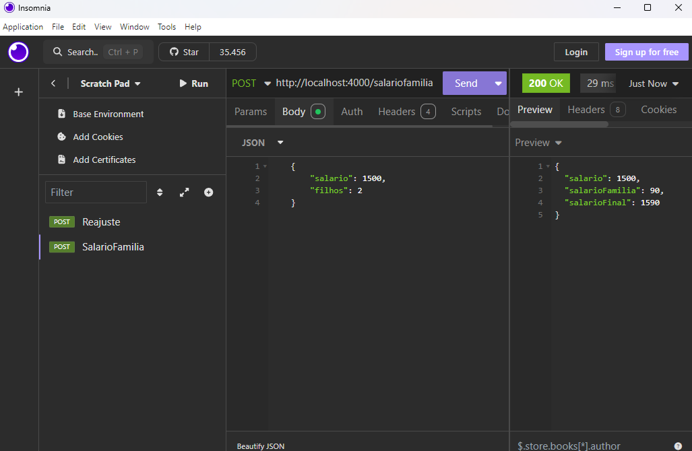

# Aula01
- Preparação do ambiente
    - VsCode
    - XAMPP
    - Node.js
    - Insomnia
- Revisão de Back-end
    - JavaScript
    - Node.js
    - Express
    - Cors
    - API Rest / JSON
    - Endpoints

## Demonstração
- 1 Desenvolva um endpoint que leia o preço de um produto e se o preço for maior do que 1000 reais aplique um desconto de 8%. Mostre o preço final. (O endpoint deve calcular o desconto no back-end e exibir o resultado no front-end atrvés do Insomnia)

- Passo a passo:
    - Crie uma pasta chamada "exemplos"
    - Abra com o VsCode e abra um terminal CTRL + ' confira se é cmd ou bash, inicie o projeto e instale as dependências "express e cors"
    ```bash
    npm init -y
    npm i express cors
    ```
    - Crie um arquivo chamado "index.js" e adicione o seguinte código:
    ```javascript
    const express = require('express');
    const cors = require('cors');
    const app = express();
    app.use(cors());
    app.use(express.json());
    app.post('/desconto', (req, res) => {
        const { preco } = req.body;
        let desconto = 0;
        if (preco > 1000) {
            desconto = preco * 0.08;
        }
        let precoComDesconto = preco - desconto;
        res.json({ preco, desconto, precoComDesconto });
    });

    app.listen(4000, () => {
        console.log('Servidor rodando em http://localhost:4000');
    });
    ```
    - Execute o arquivo com o comando:
    ```bash
    node index.js
    #ou
    npx nodemon
    ```
    - Abra o Insomnia e crie uma requisição POST para http://localhost:4000/desconto com o seguinte corpo:
    ```json
    {
        "preco": 1200
    }
    ```
    - O resultado esperado é o da imagem abaixo:
    

- 2 Desenvolva um endpoint que leia o salário de um funcionário e o número de filhos. Se o salário for menor do que 2000 o funcionário receberá um salário família equivalente a 45 reais por filho. Apresente o salário final. (O endpoint deve calcular o desconto no back-end e exibir o resultado no front-end atrvés do Insomnia). O resultado esperado é o da imagem abaixo:


## Exercícios
- 1 Desenvolva um endpoint que calcule desconto de INSS de um funcionário, se o salário for menor ou igual a 1212,00 reais será de 7,5%, se estiver entre 1212,01 e 2427,35 será de 9%, se estiver entre 2427,36 e 3641,03 o desconto é 12%, se estiver entre 3641,04 e 7087,22 será de 14% e se for maior do que 7087,22 o teto que é o máximo cobrado 14% de 7087,22. Mostre o desconto e o valor do salário final.
- 2 Desenvolva um endpoint que leia os valores de três lados de um triângulo (a, b e c) e se os três lados forem diferentes escreva ESCALENO se os três lados forem iguais EQUILÁTERO e se apenas dois lados forem iguais ISÓSCELES.
- 3 Desenvolva um endpoint que leia o nome e o preço de uma mercadoria. Se o preço for menor do que 1000 terá um aumento de 5% no preço da mercadoria, senão o aumento será de 7%. Mostrar o nome da mercadoria e o seu novo preço.
- 4 Desenvolva um endpoint que leia 6 números inteiros e exiba na tela ao final, o maior número que foi digitado pelo usuáriou.
- 5 Escreva um endpoint que leia 5 números inteiros em qualquer ordem e exiba na tela ao final, os cinco números em ordem crescente.
- 6 Escreva um endpoint que leia dois números inteiros e determine qual é o maior e o menor.
- 7 Desenvolva um algortimo que faça o cálculo do reajuste salarial do funcionário, baseado nos seguintes parâmetros:
    - 15% de aumento : 1.500,00 <= salario Atual < 1.750,00
    - 12% de aumento : 1.750,00 <= salario Atual < 2.000,00
    - 9% de aumento : 2.000,00 <= salario Atual < 3.000,00
    - 6% de aumento : salario Atual >= 3.000,00
- 8 Crie um endpoint que calcule a média de 3 notas do aluno e informe sua situação: (nota maior ou igual a 6 : aprovado), (nota inferior a 6 e maior ou igual a 4 : recuperação), (nota menor que 4 : reprovado).
- 9 Uma loja está fazendo uma promoção e precisa de ajuda no momento da venda, para liberar os descontos. Baseado na peça, calcule o desconto e exiba o valor final da venda. (camisa - 20% de desconto, bermuda - 10% de desconto, calça - 15% de desconto).