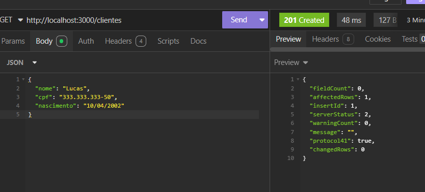
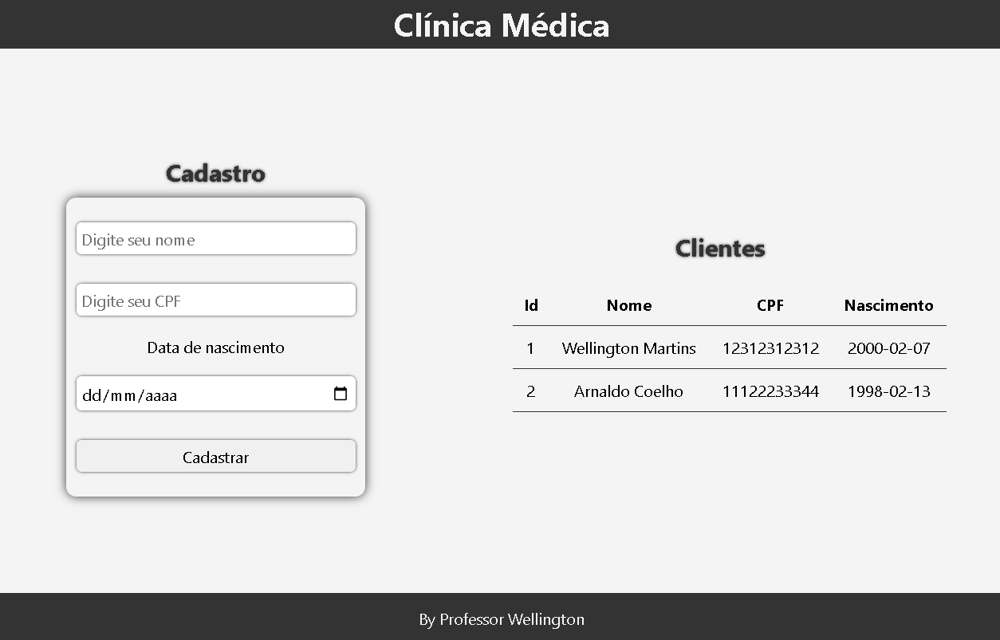
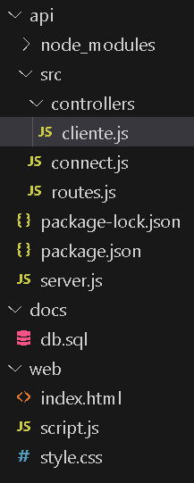

# Aula 02

#### Conhecimentos:
- Revisão de Back-end
    - JavaScript
    - Node.js
    - Express
    - Cors
    - API Rest / JSON
    - Endpoints

    - API - Criação de API (Plataforma de Interface de Aplicação)
    - CRUD - Funcionalidades de Cadastro, consulta
    - MVC - Padrão de projeto (Modelo, Visão e Controle) (SRC => Controller, Connect + routes.js)
    - Testes - Testes unitários da API utilizando software Insomnia

## Desafio (Back End) - Contexto:
- Foi solicitado que você realize o desenvolvimento de um projeto onde o objetivo principal é um Sistema para Gerenciamento de Clientes em uma Clínica Médica.

- Utilizando o VS Code + o Node.js, desenvolva junto com o professor a API.

- Iremos utilizar os verbos POST e GET para criarmos os cadastros dos clientes.

#### Script para o banco de dados
```
CREATE DATABASE clinica;
USE clinica;

CREATE TABLE clientes(
    id_cliente INTEGER PRIMARY KEY AUTO_INCREMENT,
    nome VARCHAR(255) NOT NULL,
    cpf VARCHAR(255) NOT NULL,
    nascimento VARCHAR(255) NOT NULL
);
```

#### Retorno esperado no Insomnia


## Desafio (Front End) - Contexto: 

- Foi solicitado que você realize o desenvolvimento de um projeto onde o objetivo principal é um Sistema para Gerenciamento de Clientes em uma Clínica Médica.

- Por agora deverá ser desenvolvido apenas uma tela de cadastro básica, onde o funcionário cadastra os seguintes campos: Nome do cliente, cpf e nascimento, portanto será necessário um botão com o nome "CADASTRAR".

#Conteúdos dos arquivos vistos em Aula
- Estrutura de pastas

- server.js
```js
const express = require('express');
const cors = require('cors');
const routes = require('./src/routes');

const app = express();
app.use(cors());
app.use(express.json());
app.use(routes);

app.listen(4000, () => {
    console.log('Servidor em http://localhost:4000');
});
```
- connect.js
```js
const mysql = require('mysql');
const con = mysql.createConnection({
    host: 'localhost',
    user: 'root',
    database: 'clinica'
});
module.exports = con;
```
- cliente.js
```js
const con = require('../connect');

function create(req, res) {
    const { nome, cpf, nascimento } = req.body;
    const sql = `INSERT INTO clientes (nome, cpf, nascimento) VALUES ('${nome}', '${cpf}', '${nascimento}')`;
    con.query(sql, (error, result) => {
        if (error) {
            res.status(500).json('Erro ao cadastrar cliente');
        } else {
            res.status(201).json('Cliente cadastrado com sucesso');
        }
    });
};

function read(req, res) {
    const sql = 'SELECT * FROM clientes';
    con.query(sql, (error, result) => {
        if (error) {
            res.status(500).json('Erro ao consultar clientes');
        } else {
            res.status(200).json(result);
        }
    });
}
```
- routes.js
```js
const express = require('express');

const routes = express.Router();

const Cliente = require('./controllers/cliente');

routes.get('/', (req, res) => {
    res.send('API Clínica Respondendo');
});

routes.post('/clientes', Cliente.create);
routes.get('/clientes', Cliente.read);

module.exports = routes;
```
## Front-End
- index.html
```html
<!DOCTYPE html>
<html lang="en">

<head>
    <meta charset="UTF-8">
    <meta name="viewport" content="width=device-width, initial-scale=1.0">
    <link rel="stylesheet" href="style.css">
    <title>Clínica Médica</title>
</head>

<body>
    <header>
        <h1>Clínica Médica</h1>
    </header>
    <main>
        <section>
            <h2>Cadastro</h2>
            <form id="cadastro">
                <input type="text" name="nome" placeholder="Digite seu nome" required>
                <input type="number" name="cpf" placeholder="Digite seu CPF" required>
                <label for="nascimento">Data de nascimento</label>
                <input type="date" name="nascimento" required>
                <button type="submit">Cadastrar</button>
            </form>
        </section>
        <section>
            <h2>Clientes</h2>
            <table>
                <thead>
                    <tr>
                        <th>Id</th>
                        <th>Nome</th>
                        <th>CPF</th>
                        <th>Nascimento</th>
                    </tr>
                </thead>
                <tbody id="clientes">
                </tbody>
            </table>
        </section>
    </main>
    <footer>By Professor Wellington</footer>
</body>
<script src="script.js"></script>

</html>
```
- style.css
```css
*{
    margin: 0;
    padding: 0;
    box-sizing: border-box;
    font-family: 'Segoe UI', Tahoma, Geneva, Verdana, sans-serif;
}

body{
    width: 100vw;
    height: 100vh;
    background-color: #f4f4f4;
    display: flex;
    flex-direction: column;
    justify-content: space-between;
    align-items: center;
}

header, footer{
    width: 100%;
    height: 60px;
    background-color: #333;
    color:#f4f4f4;
    display: flex;
    justify-content: center;
    align-items: center;
}

main{
    width: 100%;
    height: 100%;
    display: flex;
    flex-direction: row;
    justify-content: space-around;
    align-items: center;
}

form{
    width: 300px;
    height: 300px;
    display: flex;
    flex-direction: column;
    justify-content: space-around;
    align-items: center;
    background-color: #f4f4f4;
    border-radius: 10px;
    box-shadow: 0 0 10px #333;
    padding: 10px;
}

input, button{
    width: 100%;
    margin: 10px;
    padding: 5px;
    border: none;
    border-radius: 5px;
    padding: 5px;
    font-size: 16px;
    box-shadow: 0 0 3px #333;
}

button{
    cursor: pointer;
}

h2{
    color: #333;
    width: 100%;
    text-align: center;
    padding: 10px;
    text-shadow: 0 0 3px #333;
}

table{
    width: 100%;
    border-collapse: collapse;
    margin: 10px;
}

tr{
    border-bottom: 1px solid #333;
}

th, td{
    padding: 10px;
    text-align: center;
}
```
- script.js
```js
//Enviar os dados do formulário para o servidor
const cadastro = document.getElementById('cadastro');
cadastro.addEventListener('submit', (event) => {
    event.preventDefault();
    const corpo = {
        nome: cadastro.nome.value,
        cpf: cadastro.cpf.value,
        nascimento: cadastro.nascimento.value
    }
    fetch('http://localhost:4000/clientes', {
        method: 'POST',
        headers: {
            'Content-Type': 'application/json'
        },
        body: JSON.stringify(corpo)
    })
    .then(response => response.status)
    .then(status => {
        if (status === 201) {
            alert('Cliente cadastrado com sucesso');
            window.location.reload();
        } else {
            alert('Erro ao cadastrar cliente');
        }
    });
});

//Receber os dados do servidor e exibir na tabela
fetch('http://localhost:4000/clientes')
.then(response => response.json())
.then(clientes => {
    const tabela = document.getElementById('clientes');
    clientes.forEach(cliente => {
        const linha = document.createElement('tr');
        linha.innerHTML = `
            <td>${cliente.id_cliente}</td>
            <td>${cliente.nome}</td>
            <td>${cliente.cpf}</td>
            <td>${cliente.nascimento}</td>
        `;
        tabela.appendChild(linha);
    });
});
```