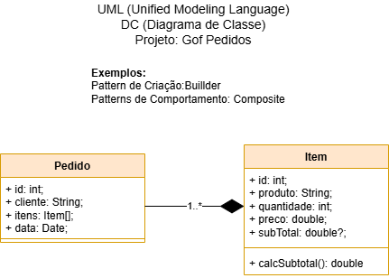

# Aula07 - Gof
## Design Patterns
- Soluções clássicas baseadas no livro Gof (Gang of four, "A gangue dos 4")
- São 23 soluções clássicas divididas em três categorias (Criação, Estrutura, Comportamento).

|Gof - Patterns|
|-|
|

## Exemplos

- 01 Quando utilizamos o ORM prisma para acesso a um Banco de Dados estamos aplicando o padrão de projeto **Singleton**
    - Através das variáveis de ambiente .env
    ```js
    DATABASE_URL="mysql://root@localhost:3306/gof"
    PORT=5000
    ```
- 
- 02 Exemplo do pattern **Criação - Builder** nas classes Pedido e Item
- builderPedido.js
```js
class Pedido{

    itens = [];

    constructor(id, cliente) {
        this.id = id;
        this.cliente = cliente;
        this.data = new Date();
    }

    addItem(item) {
        this.itens.push(item);
    }
}

module.exports = Pedido;
```
- builderItem
```js
class Item{
    constructor(id, produto, preco, quantidade) {
        this.id = id;
        this.produto = produto;
        this.preco = preco;
        this.quantidade = quantidade;
        this.subtotal = this.calcularSubtotal();
    }
    calcularSubtotal() {
        return this.preco * this.quantidade;
    }
}

module.exports = Item;
```
- 03 Exemplo do pattern **Estrutura - Composite** de estrutura
```js
const Pedido = require('../models/builderPedido');
const Item = require('../models/builderItem');

const pedido = new Pedido(1, "Arnaldo");

const readPedido = async (req, res) => {
    res.json(pedido);
}

const createItem = async (req, res) => {
    const { produto, preco, quantidade } = req.body;
    const item = new Item(pedido.itens.length + 1, produto, preco, quantidade)
    pedido.addItem(item);
    res.json(pedido);
}

module.exports = {
    readPedido,
    createItem
};
```


## Atividades
Em grupos escolha uma solução classica, comunique-se com os colegas de sala para não escolherem os mesmos patterns. estude a solução.
Monte uma pequena apresentação/demonstração para explicar para a turma após o almoço.
### Entrega
- Crie um repositorio no git chamado "patterns-nome-do-pattern"
- Crie um arquivo README.md com a pesquisa/apresentação.
- Coloque os arquivos necessários neste repositório
#### [Link do forms para entrega](https://docs.google.com/forms/d/e/1FAIpQLSfmg2P-1b2SAbCcSHbphFLm4h9omvmubBQjzdd9QxCruvXV8A/viewform?usp=dialog)

### Apresentações
|Grupo|Tipo|Pattern|
|-|-|-|
|Araújo, Zanon, Kauê, Giachetto, Marcos|Criação|[Factore](https://github.com/GabrielBZanon/pattenrs-nome-do-pattern.git)|
|Beatriz, Eloá e Laila|Estrutura|[Proxy](https://github.com/LailaCM/Proxy.git)|
|Gabriela, Heloísa, Lohaine, Maria Clara e Miriam|Estrutura|[Facade](https://github.com/mariapcaleffi/patterns-facade.git)|
|Dahra Fagionato, Nicole Santos, Duda Berto, Pedro Lima, Emily Goulart|Estrutura|[Decorator](https://github.com/DahraFagionato/pattenrs-decorator.git)|
|Isabele e Matheus|Comportamento|[Command](https://github.com/Matheus-SNeves/pattenrs-command)|
|Joao Lucas, Duda S., Milena|Comportamento|[Strategy](https://github.com/milenafelisbelo/pattenrs-Strategy-Pattern.git)|
|Guilherme Canina, Olavo, Guilerme S, Lucas Hasmann, Leonardo|Comportamento|[Adapter](https://github.com/GuilhermeCanina/patterns-adapter)|

#### [Exemplos Criação](./patterns/criacao/)
#### [Exemplos Estrutura](./patterns/estrutura/)
#### [Exemplos Comportamento](./patterns/comportamento/)
