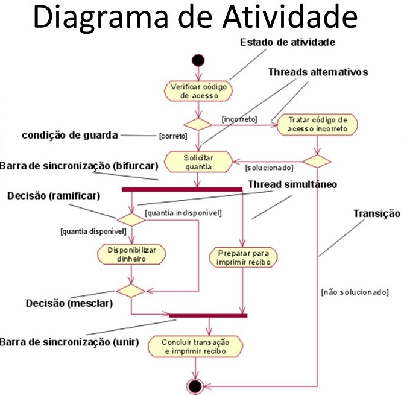
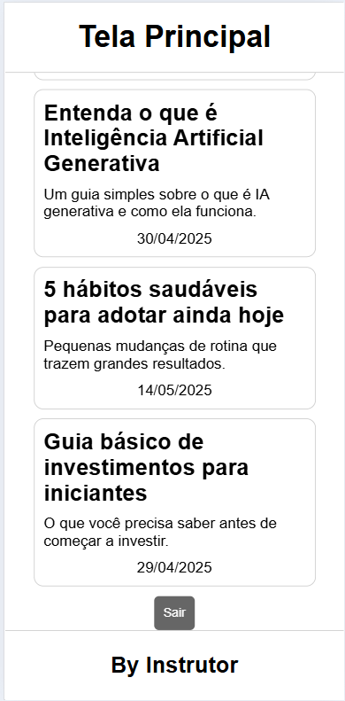

# Aula 09

## [Link do projeto](https://github.com/wellifabio/3des-login-auth-2025.git)

## Atividade - Documentação Back-end
- Testar backend com **insomnia**.
- Estudar e documentar estrutura do projeto.
- Detalhar e documentar bibliotecas utilizadas.
- Documentar descrição do funcionamento.
- Desenhar fluxo de informação (diagrama de atividades).

## Mais informações
.env
```js
SECRET_JWT=f?#cPV9]2sc"}gQhO)Yx7IT1M*zuv&;FVC(vsFAz;]n2tK:T*uH|@Ixrow3bLC+
```
- Exemplo de DA (Diagrama de Atividades)
<br>
## Entrega
### [Formulário para a entrega do documento PDF](https://docs.google.com/forms/d/e/1FAIpQLScR2Qm1be3V2ODMS3Exm2yVNuoMDDDw-Q0qm6oC4taS1RX92g/viewform?usp=dialog)

## Atividade 02
Com os conhecimentos adquiridos desenvolva um front-end com duas telas (login.html e home.html) e autentique com uma **api** Node.js com **JWT(JSON web Token)**, pode utilizar a mesma API desta aula.
- Na página Home mostre a **lista de posts** obtidas da API, lembre-se que para obter resposta no verbo **get** na rota 'http://localhost:300/posts' você precisa enviar o **bearer-token**.

|||
|:-:|:-:|
|Tela de Login<br>(login.html)|Tela Home<br>(home.html)|

## Entregas
Repositório github com uma pasta ./api para o back-end e outra com ./web com o front-end, um arquivo README.md com o nome do projeto **Login JWT**, informações das **Tecnologias** e um **Passo a passo de como testar**
- Não esqueça do **.gitignore** contendo **node-modules**

### [Form para entrega do reposiório Git](https://docs.google.com/forms/d/e/1FAIpQLSfLGAnGozI0zwfecLV3D-Pvt4Kil6xfzo5YNXmPu_57gfHYzw/viewform?usp=dialog)

## Decodificar o token
O token JWT vem separado em três partes divididas pelo caracter ponto, os dados ficam na segunda parte.
- Podemos usar o comando JavaScript **split('.')[1]** para obter esta parte em seguida usamos o camando **atob()** para traduzir a criptografia **base64**, converta para JSON e obtenha os dados como nome do usuário e avatar.