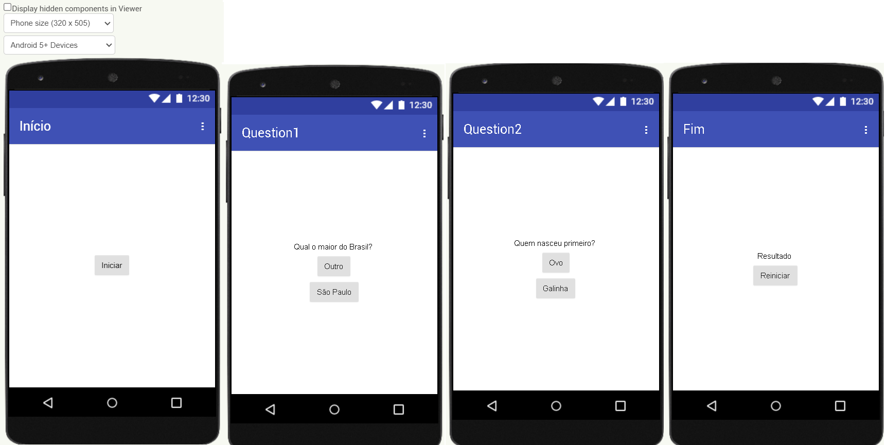

# Aula01 - Programação Mobile

## Ambientes DEV
- NoCode Low Code (web)
    - Mit - App vinventor
    - Kodular
- Code (Local)
    - Android Studio
    - Flutter
        - Dart

## Conhecimentos
- 1 Dispositivos móveis 
  - 1.1 Definição 
  - 1.2 Histórico 
  - 1.3 Características 
  - 1.4 Arquitetura  
  - 1.5 Ambiente de desenvolvimento 
    - 1.5.1 Instalação e configuração 
    - 1.5.2 Gerenciamento de dependências 
    - 1.5.3 Recursos e interfaces

## Ambiente de desenvolvimento
- NoCode - Instalar o emulador **aiStarter**
- Code - Instalar o ambiente Flutter (**Flutter SDK**, **Android Studio** e **VsCode**)
### Instaladores
    - [Emulador para o App Inventor](https://appinventor.mit.edu/explore/ai2/setup-emulator) NoCode
    - [Flutter](https://flutter.dev/docs/get-started/install) Code
    - [Android Studio](https://developer.android.com/studio/install?hl=pt-br#windows) 

## Mit - App inventor
Low ou No Code, criar aplicativos com programação em bloco.

### Demonstração 1
Aplicativo Calculadora Simples
- Layout
- Blocos - Ações dos botões e telas
- Botões
- Troca de telas
- Texto para Fala

|Caculadora|
|-|
||
|Blocos da primeira tela|
||
|Blocos da segunda tela|
||

## Tipos de Build
- Arquivo .aia (Projeto) exportar o arquivo neste formato para enviar para o professor via github
- Arquivo .apk (Aplicativo) Versão para instalar no celular do desenvolvedor
- Connection QR Code (Aplicativo) Versão para instalar no celular do desenvolvedor. Utiliza o QR Code para conectar com o App Inventor

### Exercício Quiz (Individual)
- Criar um quiz com 2 perguntas e 2 alternativas cada conforme imagens a seguir:

|Blocos de todas as telas|
|-|
||

## Desafio
Em grupos com até 4 componentes, crie um quiz com pelo menos 10 questões, várias escolhas, sobre um dos temas a seguir:
- Temas
    - História
    - Inglês
    - Geografia
    - Biologia
    - Química
    - Física
    - Espanhol
- Caso o grupo tenha 5 integrantes escolha dois temas.

|Alunos|Tema|
|-|-|
|Duda Silva, Milena, João|Biologia|
|Isabelle, Matheus Neves|Biologia|
|Zanon, Marcos, Araújo, Lucas G|Geografia|
|Laila, Bia|História|
|Dahra, Pedro, Duda Berto, Emily, Nicole|Espanhol e História|
|Olavo e Kauê|Espanhol|
|Mirian, Heloisa, Lohaine, Gabriela, Maria Clara|Inglês e Geografia|
|Canina, Henrico, Hasman, Leonardo, Stafocher|Física e Inglês|
|Menegon, Eloá|Física|

## Instruções de entrega
- Ao concluir o projeto exportar o arquivo .aia e enviar para o repositório do github
- Exportar o arquivo .apk e instalar no celular para uso didático
- Apresentar o quiz ao professor da matéria escolhida como tema.
    - Pedir para o professor responder o quiz e mostrar a pontuação final.
    - Pedir a opinião do professor sobre o quiz.
    - Pedir sugestões de melhorias.
- Criar um repositório público no github com o nome **quiz-tema**, exemplo: **quiz-biologia**
- Criar um arquivo README.md contendo:
    - Título do Quiz
    - Tecnologias utilizadas (Exp: Mit App Inventor, .apk, .aia)
    - Print das telas do quiz
    - Nome do professor que testou o quiz
    - Comentário do professor sobre o quiz, se gostou, se faria alguma sugestão de melhoria.
- Enviar o link do repositório para o professor neste **[formulário](https://forms.gle/Gj977RJHYpEZ4jSu8)**