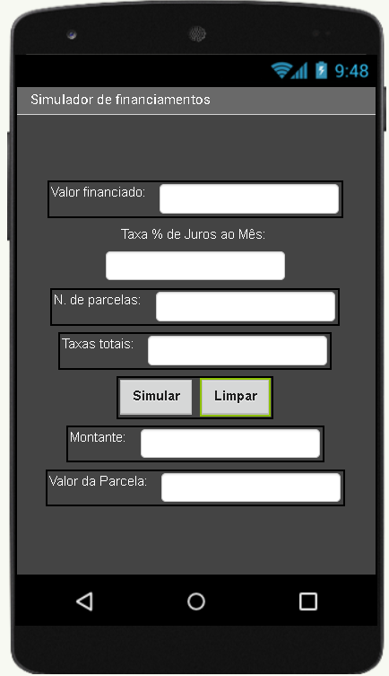

# Aula03 - Exercícios de Layout e Lógica

|Layout|Lógica|
|-|-|
||**Contextualização:** As taxas de juros continuam autíssimas dificultando a aquisição de bens e serviços. Antes de comprar um bem financiado como um carro, uma moto, um imóvel ou até mesmo um eletrodoméstico, é importante simular o valor das parcelas e o custo total do financiamento. **Objetivo:** Desenvolver um aplicativo semelhante ao da imagem ao lado que recebe como entrada o valor do bem, o número de parcelas, a taxa de juros mensal e as taxas adicionais e exibe o valor da parcela e o Montante total do financiamento.|
||**Contextualização:** Uma alternativa ao financiamento é a paciência, quando a aquisição de um bem não é de necessidade básica ou essencial. Neste caso, é possível investir o dinheiro e esperar o tempo necessário para adquirir o bem à vista. **Objetivo:** Desenvolver um aplicativo semelhante ao da imagem ao lado que recebe como entrada o valor mensal que podemos investir o número de meses e a taxa de juros mensal e exibe o montante acumulado sem juros e com juros compostos.|
||**Contextualização:** O professor de instalações elétricas ensina seus alunos como calcular a bitola adequada para cada uso de uma instalação. Solicitou que os alunos de Desenvolvimento de sistemas criem um aplicativo que faça este cálculo. **Objetivo:** Desenvolver um aplicativo semelhante ao da imagem ao lado que recebe como entrada a corrente elétrica em ampères e a distância em metros e exibe a bitola do fio em milímetros quadrados, tanto para tensão de 110V quanto para 220V. **Fórmula:** bitola110 = (2 * corrente * distância) / 294.64 bitola220 = (2 * corrente * distância) / 510.4|

Faça os exercícios utilizando o Mit App Inventor e ao concluir apresente ao professor.