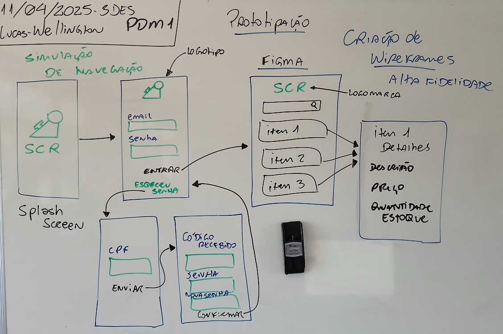
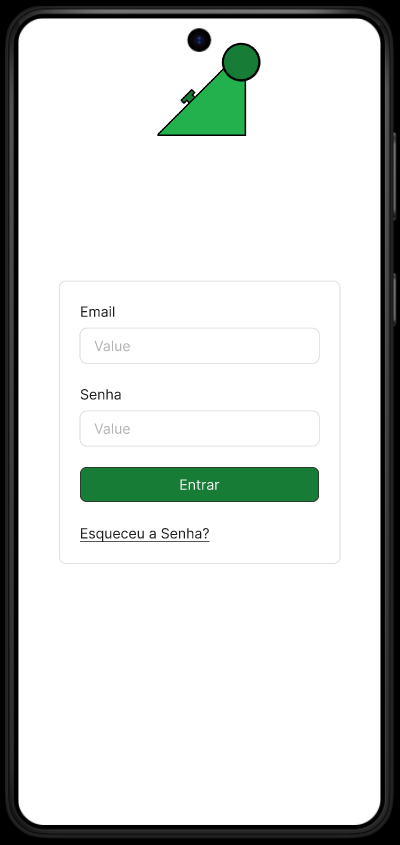
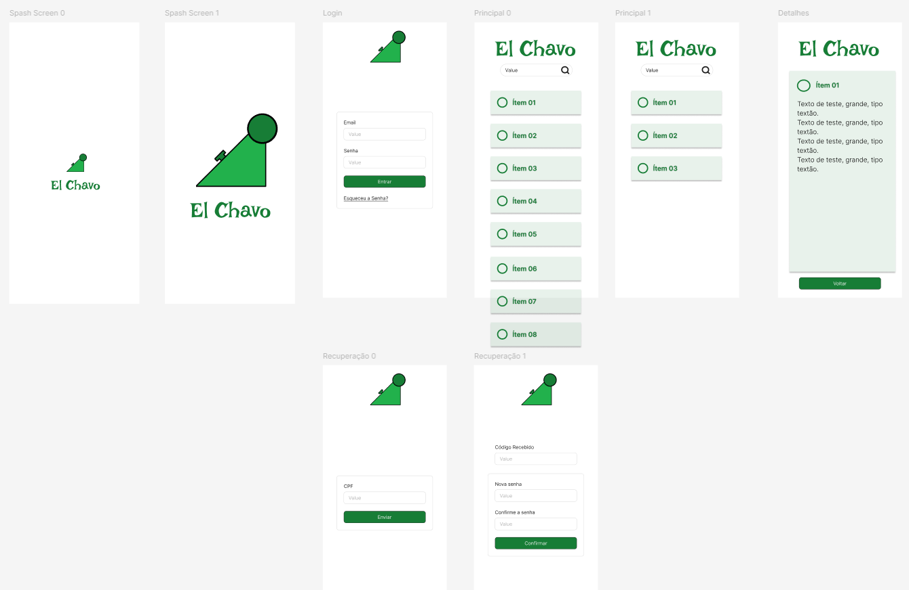
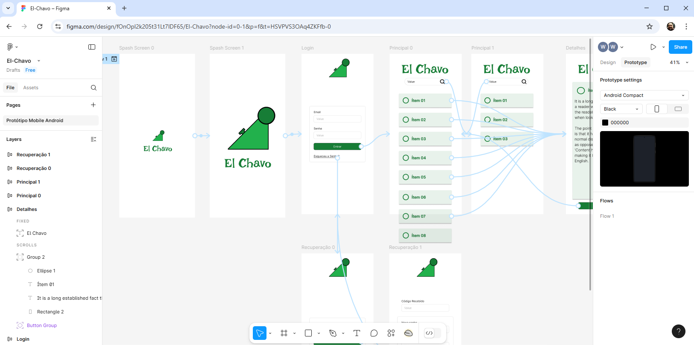

# Aula06
## Protótipação com Figma
Um protótipo é uma ótima maneira de apresentar um produto (Em nosso caso um site, um projeto web full-stack ou um App mobile) a um cliente. É uma ferramenta com funcionalidas reduzidas geralmente com uma boa apresentação gráfica para conquistar um cliente.

### Figma

|Ambiente para criação de protótipos https://www.figma.com/|
|-|
||
||

### Demonstração
- Simulação de navegação entre telas
- Efeitos na trocas de telas
- Rolagem de tela

|Figma - Protótipo Funcional|
|-|
||
|Tela de design|
||
|Tela de Protótipo|
|[Link do Protótipo no **FIGMA**](https://www.figma.com/design/fOnOpl2k205t31Lt7lDF65/El-Chavo?node-id=0-1&t=1qeuVer2eDFkyXmL-1)|