# Aula07 - VPF01(Verificação Prática Formativa)

## Situação de aprendizagem: Design
### Contextualização
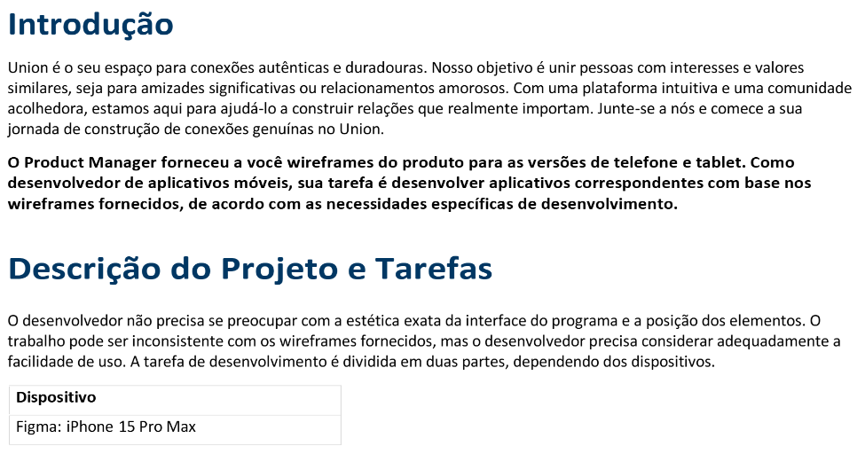

### Identidade Visual
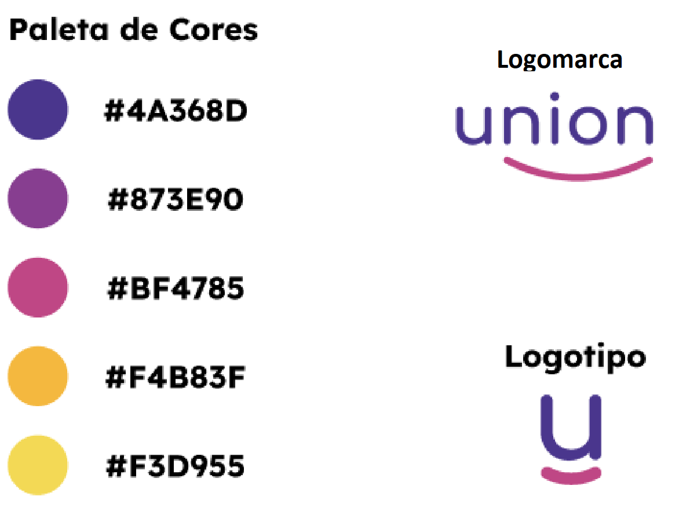
- Os arquivos de identidade visual estão na pasta **`assets`** do projeto.
- Os arquivos de imagem para ilustração estão na pasta **`media-files`** do projeto.

### Instruções gerais
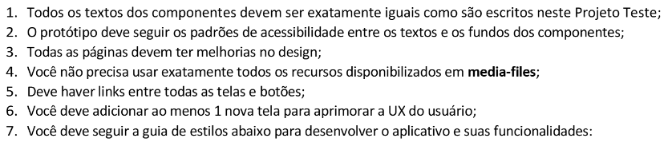

### Páginas
#### Tela01
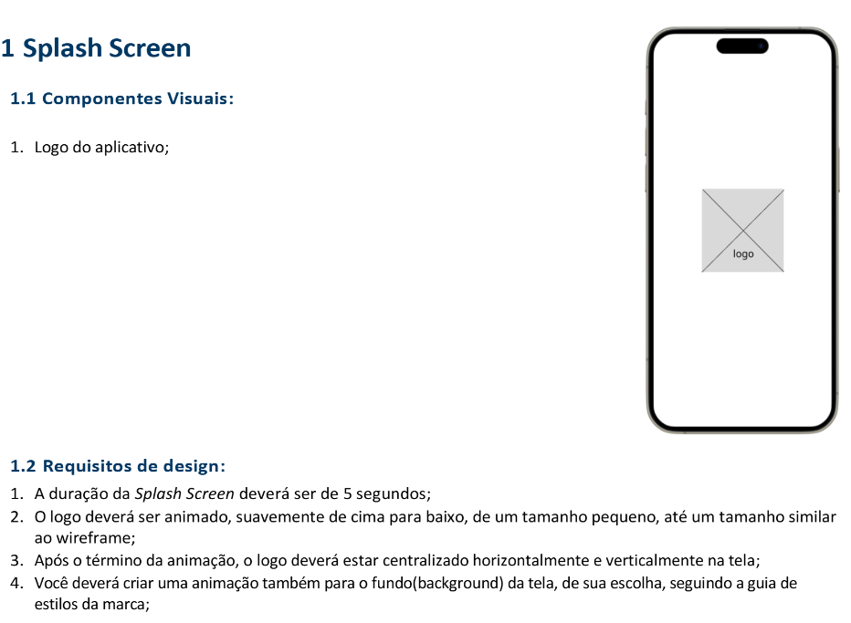
#### Tela02
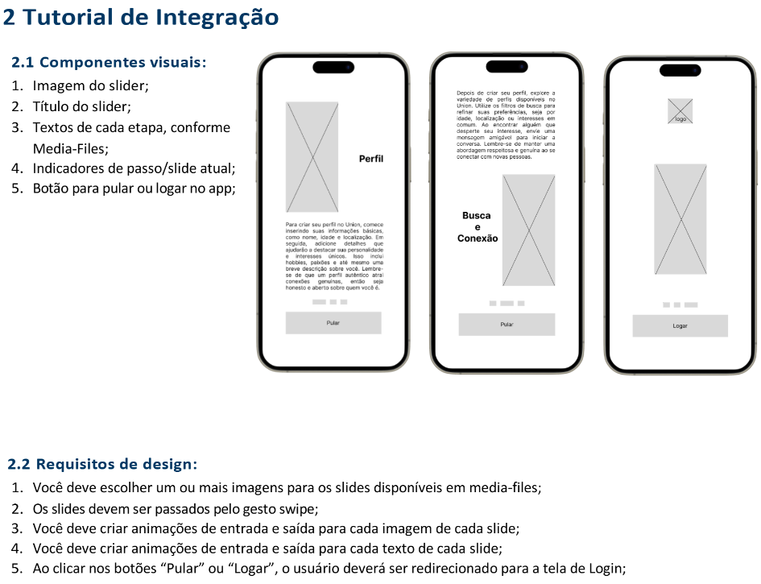
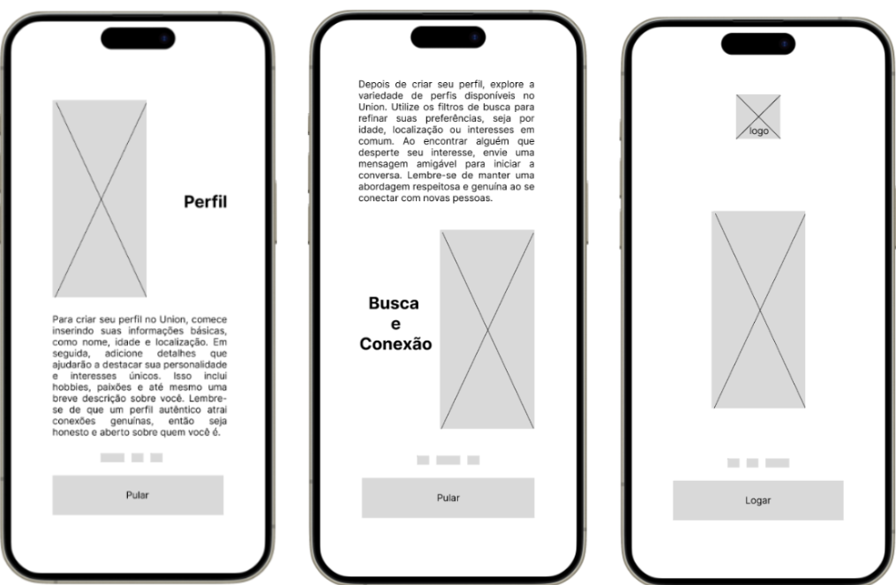
#### Tela03
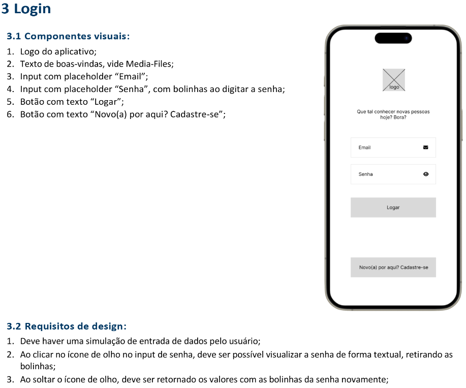
- 4 Ao clicar no botão logar deve direcionar para a tela4 **Início**
#### Tela04
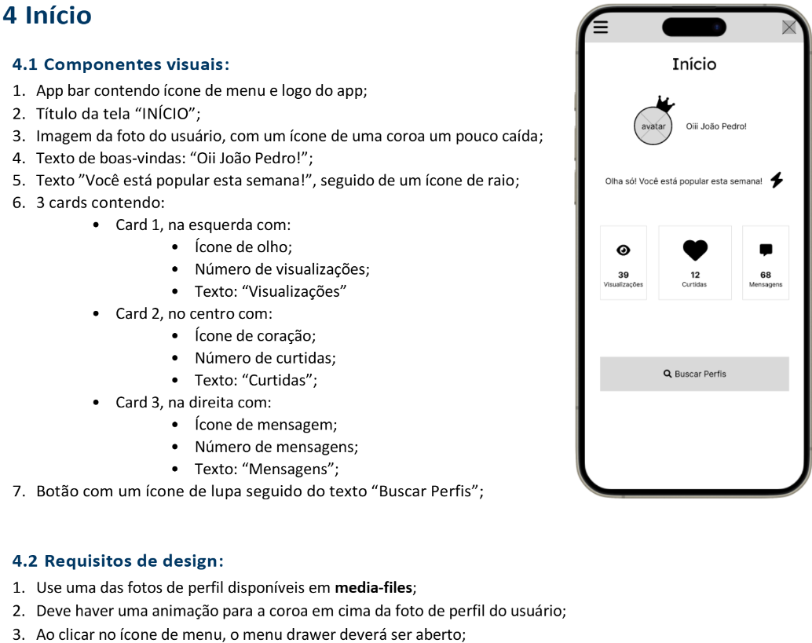
- 4 Ao clicar no botão "Buscar Perfis" deve direcionar para a tela5 **Uniões**
#### Tela05
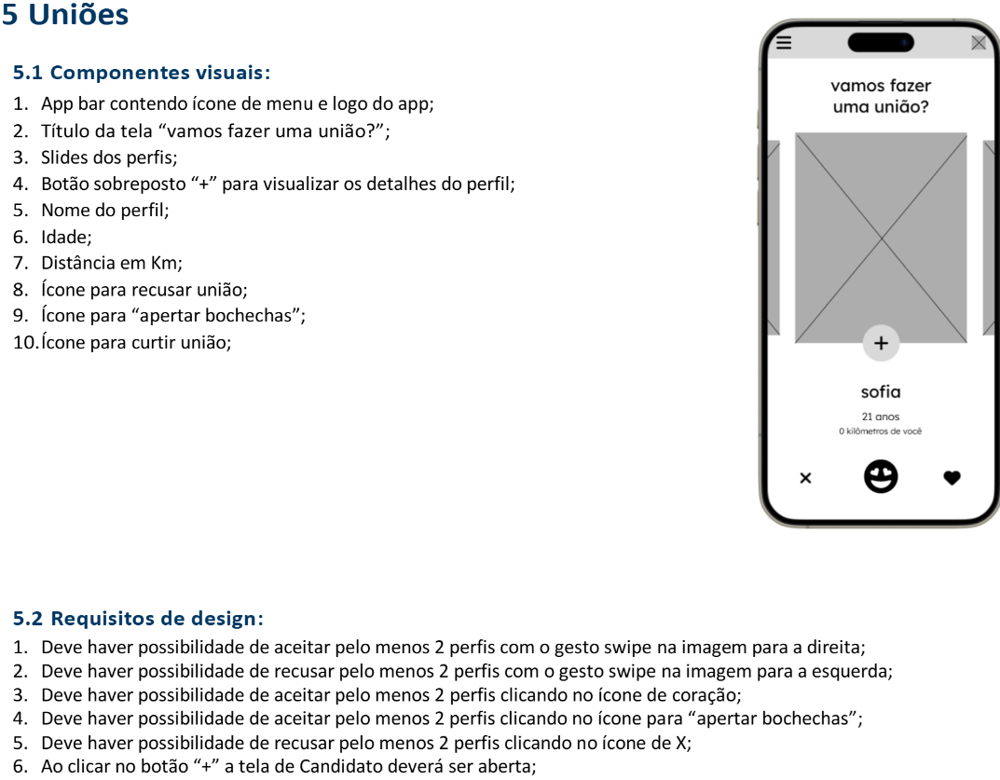
#### Tela06
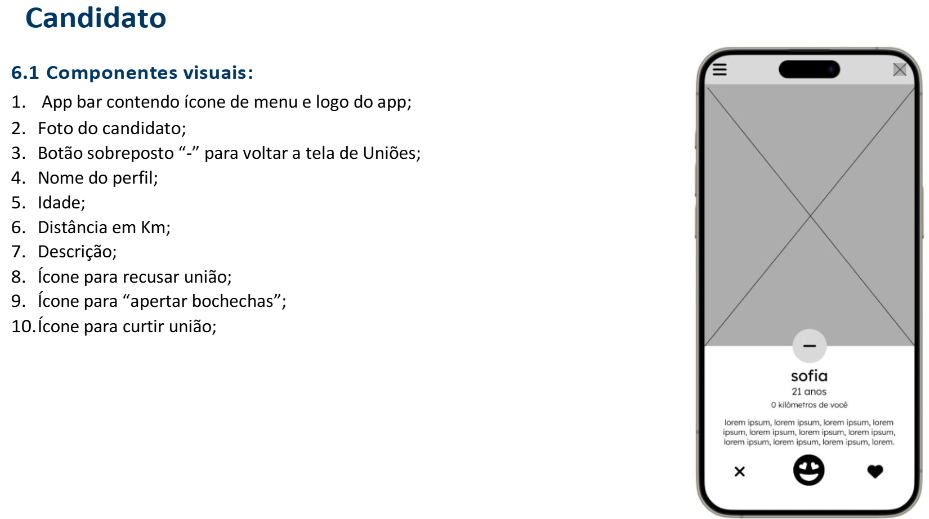
#### Tela07
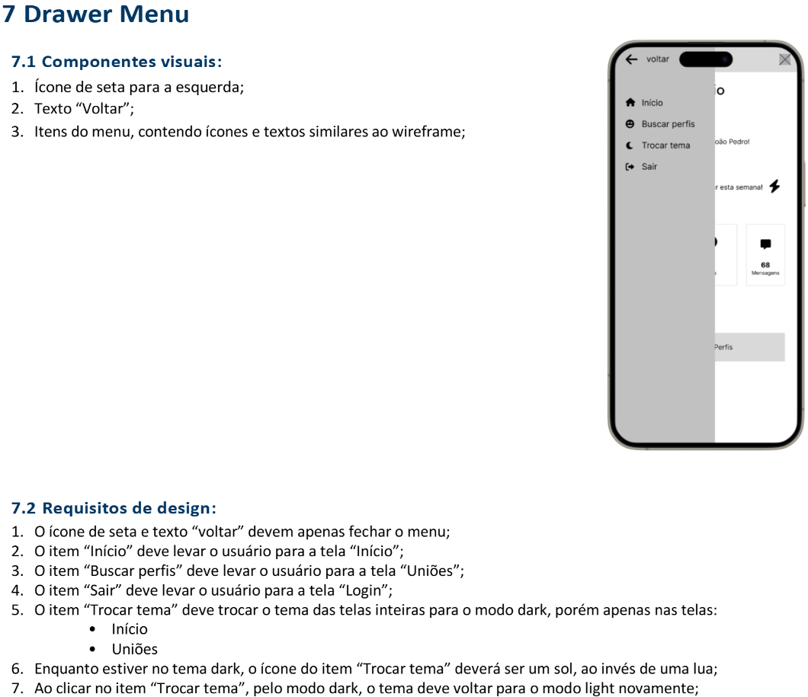

## Entrega
- [Formulário para enviar o link do figma](https://docs.google.com/forms/d/e/1FAIpQLSeJbBIqZcfNt2ZxZo-xJvYVkPV4theC8Ue1CjNYnEDb4WllIw/viewform?usp=dialog)

## Critérios
|Criticidade|Capacidades Básicas e Socioemocionais|Critérios|
|-|:-:|-|
||1 Identificar as características de programação de dispositivos móveis|Design: Criou o prototipo configurando um **dispositivo** mobile especificado|
||2 Preparar o ambiente necessário ao desenvolvimento do sistema para a plataforma mobile|Configurou o abiente flutter, Android Studio no computador Local e/ou criou projeto remoto|
||3 Interpretar os requisitos do sistema, tendo em vista a elaboração dos componentes em ambiente mobile|Implementou os componentes visuais conforme especificado|
||4 Definir os elementos de entrada, processamento e saída para a codificação das funcionalidades mobile|Implementou os requisitos de design ou funcionais conforme descrito|
||5 Projetar interfaces para dispositivos móveis|Criou o protótipo funcional, Implementou as funcionalidades conforme wireframes|
||1 Demonstrar autogestão|Utilizou IA apenas como apoio tentando entender a solução, contou com ajuda de colegas ou ajudou com objetivo de melhorar o aprendizado|
||2 Demonstrar pensamento analítico|Compreende como o Wireframes, Protótipos e Ambientes de desenvolvimento Mobile se relacionam, Compreende o fluxo de dados entre API, App e Locais|
||3 Demonstrar inteligência emocional|Se dedicou ao aprendizado para compreender o mínimo do componente|
||4 Demonstrar autonomia|Questionou os intrutores ou colegas sobre dúvidas ou problemas ocorridos durante o desenvolvimento. Se propôs a resolver os problemas|

## [Protótipo do Resultado](https://www.figma.com/proto/5uvnEMO85cp3SIRbn85yjY/Union?node-id=2027-75&t=iTGHvVHG3jPZO8n2-1&scaling=scale-down&content-scaling=fixed&page-id=0%3A1&starting-point-node-id=2%3A2)