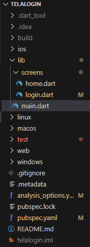
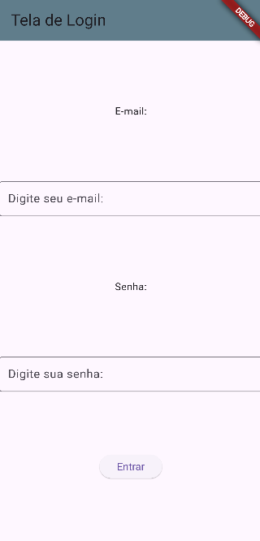
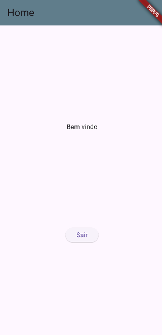

# Aula08 - Flutter
- Primeiro exemplo **Tela de Login**
- Ambiente Local - **Android Studio** ou **VsCode**
- Ambiente Web - [IDX](https://idx.google.com)

## Iniciando um projeto com VsCode
- 0 Certifique-se que o plugin do Flutter esteja instalado no VsCode.
- 1 Abra o VsCode pressione CTRL + Shift + P e digite **flutter**
- 2 Escolha novo projeto, escolha o local e o nome do projeto "totas em minúsculas, sem espaços ou acentos"
- Limpe o arquivo **./lib/main.dart** pois é criado uma tela de exemplo e ditite o código a seguir
```dart
import 'package:flutter/material.dart';

void main() {
  runApp(
    MaterialApp(
      title: 'MeuAplicativo',
      home: Scaffold(
        appBar: AppBar(title: const Text('Tela inicial')),
        body: Center(child: Text('Alô mundo!'))),
    ),
  );
}
```

## Exemplo de um app de tela de login
Esta primeira versão faremos o login com os dados:
```
email: aluno@email.com
senha: senha123
```
- main.dart
```dart
import 'package:flutter/material.dart';
import '/screens/login.dart';

void main() {
  runApp(const MaterialApp(title:'Login', home:Login(title:'Tela de Login')));
}
```
||||
|-|-|-|
|Estrutura|Tela de login|Tela Home|

## [Link do projeto feito em aula](https://github.com/wellifabio/flutter-loginbasico-2025.git)

- login.dart
```dart
import 'package:flutter/material.dart';

import 'home.dart';

class Login extends StatefulWidget {
  final String? title;
  const Login({super.key, this.title});
  @override
  State<Login> createState() => LoginState();
}

class LoginState extends State<Login> {
  String email = '';
  String senha = '';

  @override
  void initState() {
    super.initState();
    email = '';
    senha = '';
  }

  validar(context) {
    setState(() {
      if (email == 'aluno@email.com' && senha == 'senha123') {
        Navigator.push(
          context,
          MaterialPageRoute(builder: (context) => Home(title: 'Home')),
        );
      } else {
        showDialog(
          context: context,
          builder: (BuildContext context) {
            return AlertDialog(
              title: Text("Erro"),
              content: Text("Email ou senha inválidos"),
              actions: <Widget>[
                ElevatedButton(
                  child: Text("Fechar"),
                  onPressed: () {
                    Navigator.of(context).pop();
                  },
                ),
              ],
            );
          },
        );
      }
    });
  }

  @override
  Widget build(BuildContext context) {
    return Scaffold(
      appBar: AppBar(
        title: Text(widget.title.toString()),
        backgroundColor: Colors.blueGrey,
      ),
      body: Center(
        child: Column(
          mainAxisAlignment: MainAxisAlignment.spaceEvenly,
          children: [
            Text('E-mail:'),
            TextField(
              decoration: InputDecoration(
                border: OutlineInputBorder(),
                labelText: 'Digite seu e-mail:',
              ),
              onChanged: (text) {
                email = text;
              },
            ),
            Text('Senha:'),
            TextField(
              obscureText: true,
              decoration: InputDecoration(
                border: OutlineInputBorder(),
                labelText: 'Digite sua senha:',
              ),
              onChanged: (text) {
                senha = text;
              },
            ),
            ElevatedButton(
              onPressed: () {
                validar(context);
              },
              child: Text('Entrar'),
            ),
          ],
        ),
      ),
    );
  }
}

```
- home.dart
```dart
import 'package:flutter/material.dart';

class Home extends StatelessWidget {
  final String? title;
  const Home({super.key, this.title});

  @override
  Widget build(BuildContext context) {
    return MaterialApp(
      home: Scaffold(
        appBar: AppBar(
          title: Text(this.title.toString()),
          backgroundColor: Colors.blueGrey,
        ),
        body: Center(
          child: Column(
            mainAxisAlignment: MainAxisAlignment.spaceEvenly,
            children: [
              const Text('Bem vindo'),
              ElevatedButton(onPressed: (){Navigator.pop(context);}, child: const Text('Sair'))
            ],
          ),
        ),
      ),
    );
  }
}

```

## Desafio
- 1 Autenticar o login com os dados contidos em um arquivo JSON na pasta ./assets do projeto.
- assets/dados.json
```json
[
  {
    "id": 1,
    "nome": "Ana Silva",
    "email": "ana@email.com",
    "senha": "senai123"
  },
  {
    "id": 2,
    "nome": "Marcelo Silva",
    "email": "marcelo@email.com",
    "senha": "senai123"
  },
  {
    "id": 3,
    "nome": "Maria Silva",
    "email": "maria@email.com",
    "senha": "senai123"
  }
]
```
- 2 Altere o campo de senha para que fique mais completa com o ícone do **olho** para ocultar e mostrar
