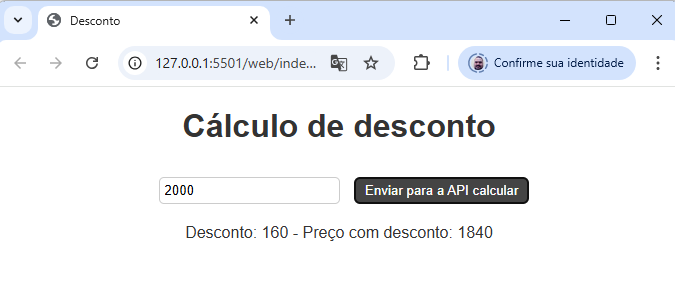
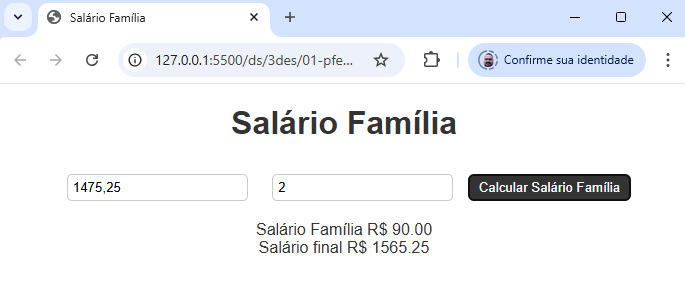
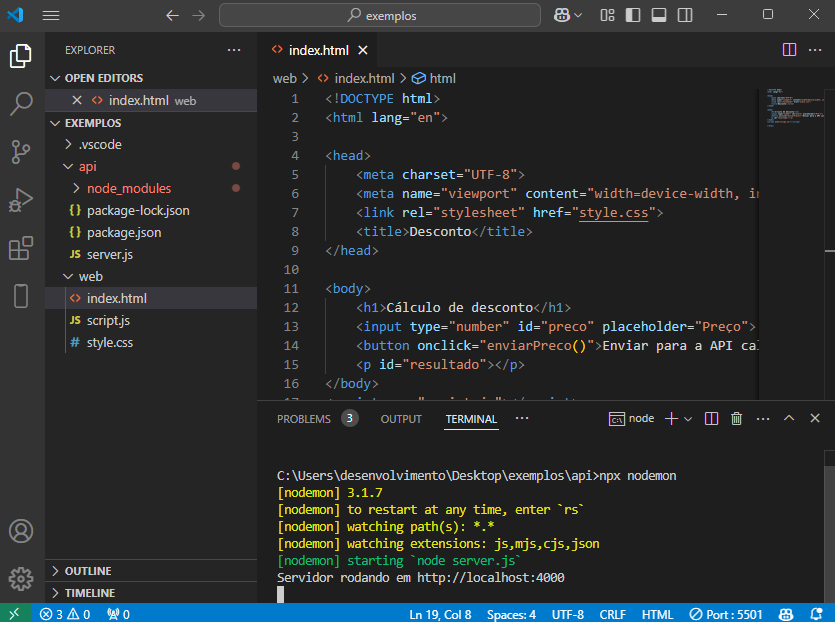

# Aula01
- Preparação do ambiente
    - VsCode
    - XAMPP
    - Node.js
    - Insomnia
- Revisão dos conceitos básicos de projetos Web
    - UI (User Interface)
    - UX (User Experience)
    - API (Application Programming Interface)
    - Full Stack

## Demonstração full stack
- 1 Desenvolva feacture / funcionalidade que leia o preço de um produto e se o preço for maior do que 1000 reais aplique um desconto de 8%. Mostre o preço final. (O endpoint deve calcular o desconto no back-end e exibir o resultado no front-end atrvés do Insomnia)

- Passo a passo:
    - Para o projeto crie uma pasta chamada "exemplos"
    - Abra com o VsCode e abra um terminal CTRL + ' confira se é cmd ou bash, crie uma pasta para o **back-end** chamada **api** e outra pasta para o front-end chamada **web**, acesse a pasta api e crie um arquivo chamado "server.js" e adicione o código a seguir:
    ```bash
    md api
    md web
    cd api
    ```
    ```javascript
    const express = require('express');
    const cors = require('cors');
    const app = express();
    app.use(cors());
    app.use(express.json());
    app.post('/desconto', (req, res) => {
        const { preco } = req.body;
        let desconto = 0;
        if (preco > 1000) {
            desconto = preco * 0.08;
        }
        let precoComDesconto = preco - desconto;
        res.json({ preco, desconto, precoComDesconto });
    });

    app.listen(4000, () => {
        console.log('Servidor rodando em http://localhost:4000');
    });
    ```
    - Inicie o servidor back-end instale as dependências e execute com Node.JS:
    ```bash
    npm init -y
    npm install express cors
    node index.js
    #ou
    npx nodemon
    ```
    - Para testar abra o Insomnia e crie uma requisição POST para http://localhost:4000/desconto com o seguinte corpo:
    ```json
    {
        "preco": 1200
    }
    ```
    - Na pasta web crie a interface **Front-End** para consumir o endpoint criado. Separe os códigos em três arquivos: index.html, style.css e script.js:
    - index.html
    ```html
    <!DOCTYPE html>
    <html lang="en">
    <head>
        <meta charset="UTF-8">
        <meta name="viewport" content="width=device-width, initial-scale=1.0">
        <title>Lista de exercícios</title>
        <link rel="stylesheet" href="style.css">
    </head>
    <body>
        <h1 id="titulo"></h1>
        <div id="exp1">
            <h2>Cálculo de desconto</h2>
            <input type="number" step="0.01" id="preco" placeholder="Preço">
            <button onclick="exemplo()">Obter desconto</button>
            <p id="resultado0"></p>
        </div>
        <div id="exp1">
            <h2>Cálculo de desconto</h2>
            <input type="number" step="0.01" id="preco" placeholder="Preço">
            <button onclick="exemplo()">Obter desconto</button>
            <p id="resultado0"></p>
        </div>
        <div id="exp1">
            <h2>Cálculo de desconto</h2>
            <input type="number" step="0.01" id="preco" placeholder="Preço">
            <button onclick="exemplo()">Obter desconto</button>
            <p id="resultado0"></p>
        </div>
        <div id="exp1">
            <h2>Cálculo de desconto</h2>
            <input type="number" step="0.01" id="preco" placeholder="Preço">
            <button onclick="exemplo()">Obter desconto</button>
            <p id="resultado0"></p>
        </div>
    </body>
    <script src="index.js"></script>
    </html>
    ```
    - style.css
    ```css
    body {
    font-family: Arial, sans-serif;
    text-align: center;
    }

    h1 {
        color: #333;
    }

    input {
        padding: 5px;
        margin: 10px;
        border: 1px solid #ccc;
        border-radius: 5px;
    }

    button {
        padding: 5px 10px;
        border: 1px solid #ccc;
        border-radius: 5px;
        background-color: #333;
        color: #fff;
        cursor: pointer;
    }

    button:hover {
        background-color: #444;
    }

    p {
        margin: 10px;
        color: #333;
    }
    ```
    - index.js
    ```javascript
    const titulo = document.getElementById('titulo');
    fetch('http://localhost:4000/')
        .then(resp => resp.json())
        .then(resp => titulo.innerHTML = resp);
    
    function exemplo(){
        let resultado = document.getElementById('resultado0');
        let dados = {
            preco : Number(document.getElementById('preco').value)
        }
        fetch('http://localhost:4000/desconto',
            {
                method: 'POST',
                headers: {
                    'Content-Type': 'application/json'
                },
                body: JSON.stringify(dados)
            })
        .then(resp => resp.json())
        .then(resp => {
            resultado.innerHTML = `Preço com desconto: R$ ${resp.precoComDesconto.toFixed(2)}`;
        });
    }
    ```
    - Abra o arquivo index.html no navegador ou utilizando o Live Server e teste o cálculo do desconto.
    
    Neste exemplo, o back-end é responsável por calcular o desconto e o front-end por exibir o resultado, a comunicação entre eles é feita através de requisições HTTP.<br>Os arquivos do front-end já estão estruturados no padrão MVC (Model, View, Controller), onde o script.js é o controller, o index.html é a view e o style.css é a model.

- 2 Desenvolva feacture / funcionalidade que leia o salário de um funcionário e o número de filhos. Se o salário for menor do que 2000 o funcionário receberá um salário família equivalente a 45 reais por filho. Apresente o salário final. (O endpoint deve calcular o desconto no back-end e exibir o resultado no front-end atrvés do Insomnia). O resultado esperado é o da imagem abaixo:

O segundo exemplo de pode utilizar a mesma API back-end criada no exemplo anterior, basta criar um novo endpoint para calcular o salário família.<br> O front-end pode ser criado em outro arquivo HTML, ou no mesmo arquivo index.html, basta adicionar um novo botão e função para enviar os dados para o back-end.
A estrutura de pastas e arquivos do projeto de exemplo está representada na imagem abaixo:


## Exercícios full-stack
- 1 Desenvolva feacture / funcionalidade que calcule desconto de INSS de um funcionário, se o salário for menor ou igual a 1212,00 reais será de 7,5%, se estiver entre 1212,01 e 2427,35 será de 9%, se estiver entre 2427,36 e 3641,03 o desconto é 12%, se estiver entre 3641,04 e 7087,22 será de 14% e se for maior do que 7087,22 o teto que é o máximo cobrado 14% de 7087,22. Mostre o desconto e o valor do salário final.
- 2 Desenvolva feacture / funcionalidade que leia os valores de três lados de um triângulo (a, b e c) e se os três lados forem diferentes escreva ESCALENO se os três lados forem iguais EQUILÁTERO e se apenas dois lados forem iguais ISÓSCELES.
- 3 Desenvolva feacture / funcionalidade que leia o nome e o preço de uma mercadoria. Se o preço for menor do que 1000 terá um aumento de 5% no preço da mercadoria, senão o aumento será de 7%. Mostrar o nome da mercadoria e o seu novo preço.
- 4 Desenvolva feacture / funcionalidade que leia 6 números inteiros e exiba na tela ao final, o maior número que foi digitado pelo usuáriou.
- 5 Escreva feacture / funcionalidade que leia 5 números inteiros em qualquer ordem e exiba na tela ao final, os cinco números em ordem crescente.
- 6 Escreva feacture / funcionalidade que leia dois números inteiros e determine qual é o maior e o menor.
- 7 Desenvolva um algortimo que faça o cálculo do reajuste salarial do funcionário, baseado nos seguintes parâmetros:
    - 15% de aumento : 1.500,00 <= salario Atual < 1.750,00
    - 12% de aumento : 1.750,00 <= salario Atual < 2.000,00
    - 9% de aumento : 2.000,00 <= salario Atual < 3.000,00
    - 6% de aumento : salario Atual >= 3.000,00
- 8 Crie feacture / funcionalidade que calcule a média de 3 notas do aluno e informe sua situação: (nota maior ou igual a 6 : aprovado), (nota inferior a 6 e maior ou igual a 4 : recuperação), (nota menor que 4 : reprovado).
- 9 Uma loja está fazendo uma promoção e precisa de ajuda no momento da venda, para liberar os descontos. Baseado na peça, calcule o desconto e exiba o valor final da venda. (camisa - 20% de desconto, bermuda - 10% de desconto, calça - 15% de desconto).
