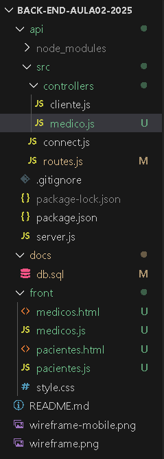
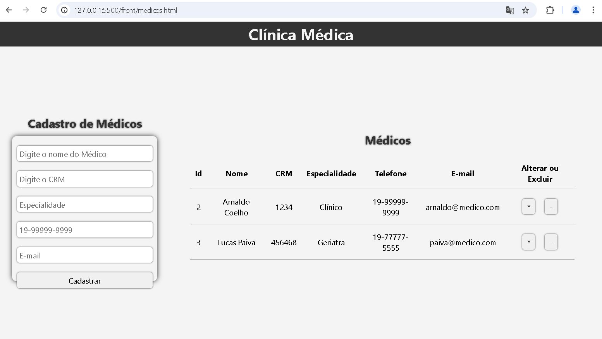
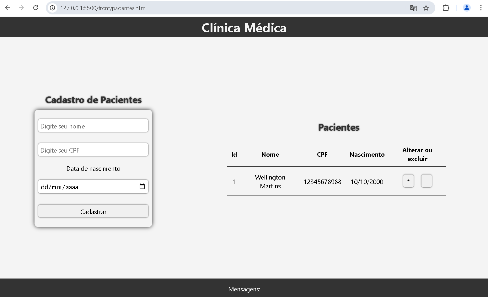

# Aula02 - Projeto de Software

## Capacidades técnicas
- 7 Definir os softwares a serem utilizados no desenvolvimento do sistema
- 8 Definir as dependências de software considerando os componentes do sistema, para a sua implantação
- 10 Implementar as funcionalidades de acordo com os requisitos definidos
- 11 Pesquisar em diversas fontes de informação tendo em vista as melhores práticas de mercado considerando, inclusive, a performance e a qualidade de software
 
## Adicionando funcionalidades em um sistema em desenvolvimento (Feactures)

### Contextualização
Você faz parte de uma equipe de desenvolvedores atuando como um dev fullstack em um projeto de software. O projeto é um sistema de gerenciamento de consultas médicas. O sistema já possui algumas funcionalidades implementadas, como o cadastro de pacientes. Agora, você foi designado para implementar a funcionalidade de cadastro de médicos.

### Requisitos
- 1 O sistema deve permitir o cadastro de médicos
    - Os médicos devem possuir os seguintes atributos:
        - Id (Auto incremento)
        - Nome - texto(255)
        - CRM - texto(20)
        - Especialidade -texto(255)
        - Telefone - texto(20)
        - Email - texto(255)
- 2 O sistema deve permitir a edição de médicos
- 3 O sistema deve permitir a exclusão de médicos
- 4 O sistema deve permitir a listagem de médicos

#### Instruções para o backend e Banco de dados
    - Deverá ser acrescentada a tabela de médicos no banco de dados e no script .sql
    - No backend, deverá ser criado um novo controller para médicos e adicionadas as rotas http (/medicos) em routes.js

### Tarefas
1. Navegar até o [projeto no github](https://github.com/wellifabio/back-end-aula02-2025.git) do projeto e fazer o **fork** do repositório.
2. Clonar o repositório para a sua máquina local
3. Seguir as instruções para executar o projeto.
4. Implementar as funcionalidades de cadastro, edição, exclusão e listagem de médicos em uma nova UI chamada medicos.html
5. Implementar as rotas necessárias para acessar a nova UI e as funcionalidades de médicos no **backend** e arquivo **./src/controllers/medicos.js**
6. No **front-end** Renomear os arquivos index.html para **pacientes.html** e script.js para **pacientes.js**
7. Enviar as alterações para o seu repositório no github.

### Observações
- A pasta do projeto deve ficar semelhante a estrutura abaixo:
- 
- A tela de cadastro de médicos:
- 
- A tela index.html, de cadastro de pacientes alterada para pacientes.html:
- 