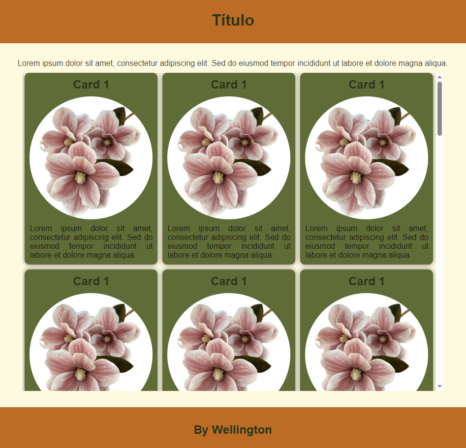

# Exemplo para testar paleta de cores
- Página com cards e uma imagem de flor com cor neutra para testar paletas
- style.css
```css
:root{
    --c1: #fefae0;
    --c2: #283618;
    --c3: #606c38;
    --c4: #bc6c25;
    --t1: rgba(0, 0, 0, 0.7);
    --t2: rgba(255, 255, 255, 0.7);
}

```
- No arquivo style.css basta trocar as cores da paleta e abrir o index.html com live server do **VsCode**

