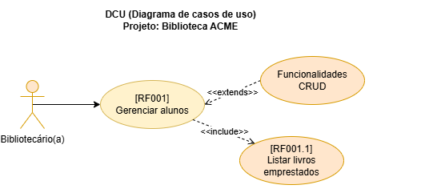
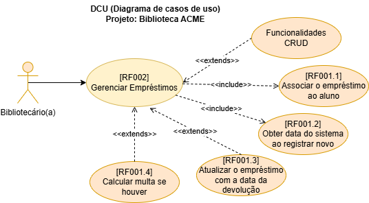

# Projeto: BIBLIOTECA ACME API

## Documento de Requisitos
A BIBLIOTECA ACME é a biblioteca da escola ACME, é nossa cliente e necessita de um sistema Web para registro dos empréstimos de livros. A seguir os requisitos funcionais e não funcionais serão elencados e identificados da seguinte forma:
    - Requisitos funcionais [RF00X] onde RF significa Requisito Funcional e 00X a numeração do mesmo.
    - Requisitos não funcionais [NF00X] onde NF significa Não Funcional e 00X a numeração do mesmo.
### Requisitos funcionais
- [RF001] O sistema deve permitir o CRUD de alunos.
    - Prioridade (x)Essencial, ( )importante, ( )Desejável
    - [RF001.1] A rota **readOne** do **aluno** deve mostrar os dados de um aluno e seus empréstimos, contendo os dados dos livros emprestados.
        - Prioridade ( )Essencial, (x)importante, ( )Desejável
- 
- [RF002] O sistema deve permitir o CRUD de emprestimo.
    - Prioridade (x)Essencial, ( )importante, ( )Desejável
    - [RF002.1] O sistema deve associar o emprestimo a um aluno e a um livro.
        - Prioridade (x)Essencial, ( )importante, ( )Desejável
    - [RF002.2] Ao cadastrar um novo emprestimo **create** no controller, a data e hora da **retirada** deve ser gerada pelo Banco de Dados @dedault(now()).
        - Prioridade ( )Essencial, (x)importante, ( )Desejável
    - [RF002.3] Ao cadastrar uma novo emprestimo **create** no controller, a **devolucao**, deve ser nula **"?"** pois será preenchida na rota **update** quando o aluno devolver o livro.
        - Prioridade ( )Essencial, (x)importante, ( )Desejável
    - [RF002.4] Se ao realizar **update** o campo **devolucao** for enviado o sistema deve calcular a **multa** que segue o seguinte critério:
        - O aluno pode ficar apenas 3 dias com o livro.
        - Se a data da devolução for mais de três dias após a data da retirada, deverá ser cobrada uma multa de 10.00 por dia.
        - Prioridade ( )Essencial, ( )importante, (x)Desejável
- 
### Requisito não funcional
- [RN001] Linguagem de programação JavaScript
- [RN002] Framework de back-end **Node.js**
- [RN003] ORM **Prisma**
- [RN004] IDE de desenvolvimento **VsCode**
- [RN004] IDE de testes **Insomnia**