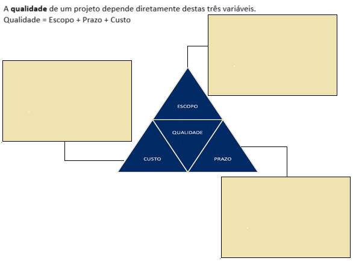

# Aula08

## Análise de viabilidade SWOT (FOFA)
A análise de viabilidade mensura os riscos de um projeto, uma boa ferramenta para esta análise é através da matriz SWOT

- Forças (Strengths)
- Fraquesas (Weaknesses)
- Oportunidades (Opportunities)
- Ameaças (Threats)

||
|:-:|
|Em analogia com "O Pequeno Príncipe" onde ele tinha como sua maior motivação a **rosa**, seus **espinhos** como ameaça, os **brotos** como oportunidades e os **baobás** como ameaças já que é uma árvore muito grande que podia devorar o planeta inteiro, faça a análise do seu projeto|

## Triângulo de ferro
Conhecido como triângulo de ferro, a qualidade de um projeto é definida como a soma das pontas do triângulo.

||
|:-:|
|Preencher o triângulo com o **Escopo, Custo e Prazo** detalhando em especial o escopo do seu projeto|

## Próxima Sprint 16/06
- [ ] UML DC (Diagrama de Classes) **Back-end**
- [ ] UML DA (Diagrama de Atividades) **Front-end**
- [ ] Análise de viabilidade Matriz SWOT
- [ ] Triângulo de Ferro Escopo, Prazo e Custo
- [ ] Iniciar a codificação/desenvolvimento **Banco de dados**
- [ ] Iniciar a codificação/desenvolvimento **Back-end**
- [ ] Prótótipo Figma Front-end
- [ ] Iniciar a codificação/desenvolvimento **Front-end**
- [ ] Prótótipo Figma Mobile

## Matheus e Isabele
- [x] UML DC (Diagrama de Classes) **Back-end**
- [x] UML DA (Diagrama de Atividades) **Front-end**
- [x] Análise de viabilidade Matriz SWOT
- [x] Triângulo de Ferro Escopo, Prazo e Custo
- [x] Iniciar a codificação/desenvolvimento **Banco de dados**
- [x] Iniciar a codificação/desenvolvimento **Back-end**
- [x] Prótótipo Figma Front-end
- [x] Iniciar a codificação/desenvolvimento **Front-end**
- [x] Prótótipo Figma Mobile
- [Link do repositório](https://github.com/Matheus-SNeves/SENAI-TCC.git)

## Bia, Eloa e Laila
- [x] UML DC (Diagrama de Classes) **Back-end**
- [ ] UML DA (Diagrama de Atividades) **Front-end**
- [x] Análise de viabilidade Matriz SWOT
- [x] Triângulo de Ferro Escopo, Prazo e Custo
- [x] Iniciar a codificação/desenvolvimento **Banco de dados**
- [x] Iniciar a codificação/desenvolvimento **Back-end**
- [x] Prótótipo Figma Front-end (Site demonstrativo)
- [x] Iniciar a codificação/desenvolvimento **Front-end**
- [x] Prótótipo Figma Mobile
- [Link do repositório](https://github.com/LailaCM/Casa-Floralles.git)

## João, Duda Silva, Milena, Olavo
- [x] UML DC (Diagrama de Classes) **Back-end**
- [x] UML DA (Diagrama de Atividades) **Front-end**
- [x] Análise de viabilidade Matriz SWOT
- [x] Triângulo de Ferro Escopo, Prazo e Custo
- [x] Iniciar a codificação/desenvolvimento **Banco de dados**
- [x] Iniciar a codificação/desenvolvimento **Back-end**
- [x] Prótótipo Figma Front-end
- [ ] Iniciar a codificação/desenvolvimento **Front-end**
- [x] Prótótipo Figma Mobile
- [Link do repositório Olavo](https://github.com/Olavomarques/Projeto-TCC.git)
- [Link do repositório João](https://github.com/jaolucas1234/Projeto-TCC.git)

## Emily, Gabriel Araújo, Henrico, Lucas Menegon
- [ ] UML DC (Diagrama de Classes) **Back-end**
- [ ] UML DA (Diagrama de Atividades) **Front-end**
- [x] Análise de viabilidade Matriz SWOT
- [x] Triângulo de Ferro Escopo, Prazo e Custo
- [x] Iniciar a codificação/desenvolvimento **Banco de dados**
- [x] Iniciar a codificação/desenvolvimento **Back-end**
- [x] Prótótipo Figma Front-end ()
- [x] Iniciar a codificação/desenvolvimento **Front-end**
- [x] Prótótipo Figma Mobile
- [Link do repositório](https://github.com/menegonlucas/projeto_tcc.git)

## Dahra, Duda Berto, Nicole, Pedro
- [x] UML DC (Diagrama de Classes) **Back-end**
- [x] UML DA (Diagrama de Atividades) **Front-end**
- [x] Análise de viabilidade Matriz SWOT
- [ ] Triângulo de Ferro Escopo, Prazo e Custo
- [ ] Iniciar a codificação/desenvolvimento **Banco de dados**
- [ ] Iniciar a codificação/desenvolvimento **Back-end**
- [x] Prótótipo Figma Front-end
- [x] Iniciar a codificação/desenvolvimento **Front-end**
- [x] Prótótipo Figma Mobile
- [Link do repositório](https://github.com/DahraFagionato/tcc-koisushi.git)

## Heloisa, Lohaine, Maria Clara, Mirian
- [x] UML DC (Diagrama de Classes) **Back-end**
- [x] UML DA (Diagrama de Atividades) **Front-end**
- [x] Análise de viabilidade Matriz SWOT
- [x] Triângulo de Ferro Escopo, Prazo e Custo
- [x] Iniciar a codificação/desenvolvimento **Banco de dados**
- [x] Iniciar a codificação/desenvolvimento **Back-end**
- [x] Prótótipo Figma Front-end
- [x] Iniciar a codificação/desenvolvimento **Front-end**
- [ ] Prótótipo Figma Mobile
- [Link do repositório](https://github.com/mariapcaleffi/tcc-gelco.git)

## Gabriel Zanon, Kaue, Lucas Giachetto, Lucas Colombo, Marcos
- [x] UML DC (Diagrama de Classes) **Back-end**
- [x] UML DA (Diagrama de Atividades) **Front-end**
- [x] Análise de viabilidade Matriz SWOT
- [x] Triângulo de Ferro Escopo, Prazo e Custo
- [x] Iniciar a codificação/desenvolvimento **Banco de dados**
- [x] Iniciar a codificação/desenvolvimento **Back-end**
- [x] Prótótipo Figma Front-end
- [x] Iniciar a codificação/desenvolvimento **Front-end**
- [ ] Prótótipo Figma Mobile
- [Link do repositório](https://github.com/GabrielBZanon/TCC---Full-Stack.git)

## Guilherme Canina, Massucato, Leonardo, Lucas Hasmann
- [ ] UML DC (Diagrama de Classes) **Back-end**
- [x] UML DA (Diagrama de Atividades) **Front-end**
- [x] Análise de viabilidade Matriz SWOT
- [x] Triângulo de Ferro Escopo, Prazo e Custo
- [x] Iniciar a codificação/desenvolvimento **Banco de dados**
- [x] Iniciar a codificação/desenvolvimento **Back-end**
- [x] Prótótipo Figma Front-end
- [x] Iniciar a codificação/desenvolvimento **Front-end**
- [x] Prótótipo Figma Mobile
- [Link do repositório](https://github.com/GuilhermeCanina/TCC-Senai2025.git)

## Gabriela
- [ ] UML DC (Diagrama de Classes) **Back-end**
- [ ] UML DA (Diagrama de Atividades) **Front-end**
- [x] Análise de viabilidade Matriz SWOT
- [x] Triângulo de Ferro Escopo, Prazo e Custo
- [x] Iniciar a codificação/desenvolvimento **Banco de dados**
- [x] Iniciar a codificação/desenvolvimento **Back-end**
- [x] Prótótipo Figma Front-end
- [x] Iniciar a codificação/desenvolvimento **Front-end**
- [x] Prótótipo Figma Mobile
- [Link do repositório](https://github.com/Gabihdemori/NexoERP_TCC.git)

#### Obs: Todos os ítens da Sprint devem ser apresentados no dia 16/06 e estar em um repositório do GitHub de um integrante do grupo, o repositório deve conter um README.md com as informações do projeto e os links dos protótipos Figma, o repositório deve estar público.