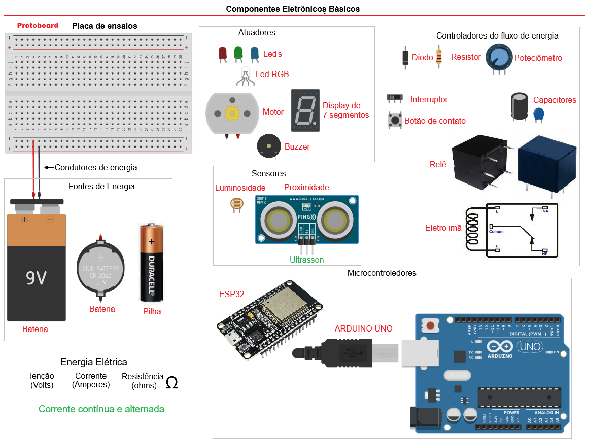
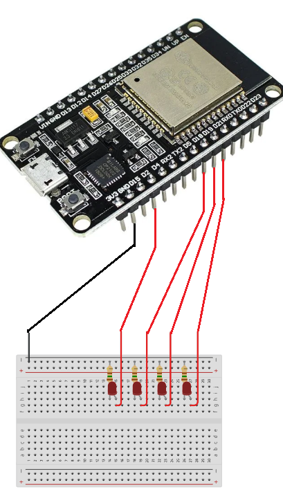
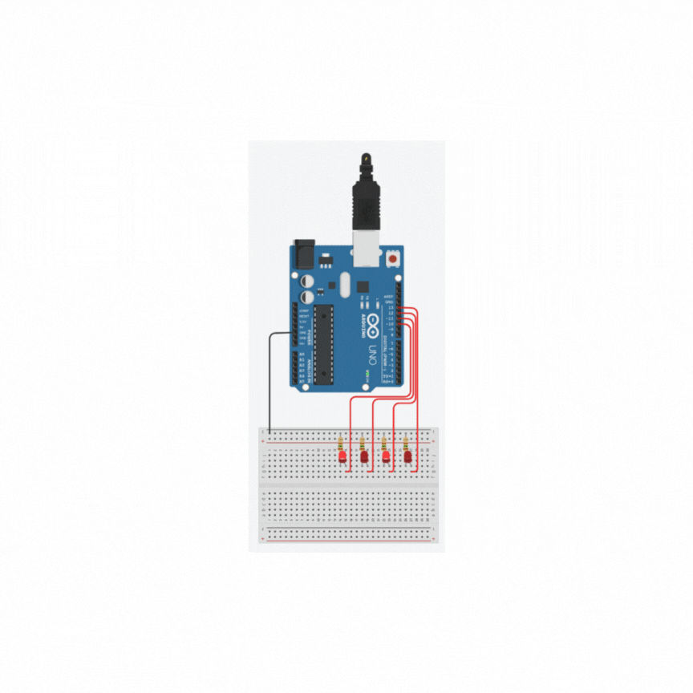
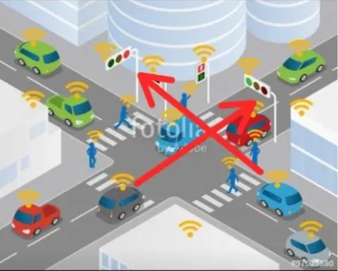

# Aula01 - Experimentos

## Objetivos
- Relembrando **conceitos** vistos em AITO (Redes com IoT do primeiro semestre)
- Realizar experimento com componentes reais (ESP32) a partir de experimentos feitos com simulador **[TinkerCAD](https://www.tinkercad.com/)**

### [Introdução](./introducao.pdf)

### Capacidades Técnicas
- 1 Identificar as diferenças entre as aplicações do **[IoT e IIoT](./iot_vs_iiot.md)** 
- 2 Identificar os tipos de hardwares e soluções disponíveis 
- 3 Configurar ambientes de desenvolvimento

### Capacidades Socioemocionais
- 1 Demonstrar autogestão
- 6 Trabalhar em equipe 

## Conhecimentos
- 1 Automação em IoT 
  - 1.1 Residencial  
  - 1.2 Pessoal 
  - 1.3 Industriais  
  - 1.4 Aplicações 
- 2 Requisitos para Instalação 
  - 2.1 Hardware 
    - 2.1.1 Conectividade 
    - 2.1.2 Periféricos 
  - 2.2 Sensores e Atuadores 
    - 2.2.1 Interfaces de I/O 
    - 2.2.2 Analógica 
- 3 Ambiente de desenvolvimento 
  - 3.1 IDE (Integrated Development Enviroment) 
    - 3.1.1. Tipos 
    - 3.1.2. Seleção 
  - 3.2. Configuração 

## Laboratórios
- Prático - Utilizando kit IoT com microcontrolador **ESP32**
## Componentes Eletrônicos Básicos


## 1 Acendendo vários Leds
ASP32 é uma placa com microcontroladora digital programável em linguagem C, possui vários pinos que podem ser programáveis onde conectamos sensores e atuadores

O circuito acima possui 4 leds, 4 resistores ligados as portas D2, D18, D19 e D21, e conectados em uma **protoboard** e ligados no **GND** (terra).<br>O código a seguir pisca as luzes alternadamente de duas em duas.
```c
int led1 = 2;
int led2 = 18;
int led3 = 19;
int led4 = 21;

void setup(){
	pinMode(led1, OUTPUT);
	pinMode(led2, OUTPUT);
	pinMode(led3, OUTPUT);
	pinMode(led4, OUTPUT);
}
void loop(){
	digitalWrite(led1,1);
  	digitalWrite(led2,0);
  	digitalWrite(led3,1);
  	digitalWrite(led4,0);
  	delay(500);
  	digitalWrite(led1,0);
  	digitalWrite(led2,1);
  	digitalWrite(led3,0);
  	digitalWrite(led4,1);
  	delay(500);
}
```
### Resultado
O exemplo de resultado está demonstrado com um microcontrolador ARDUINO porém com ASP32 o resultado será semelhante.


## Desafio
|Contextualização|
|-|
|Sr. Adolfo é síndico de um condomínio muito grande, possui mais de 1500 casas com duas vagas na garagem cada uma. Nos horários de pico o cruzamento principal que leva a portaria fica congestionado, para resolver o problema precisa instalar um semáforo|



|Desafio|
|-|
|Construa dois semaforos controlados por um ASP32 para o cruzamento da portaria, como protótipo, deixe a luz verde com 2,5 segundos, a amarela com 0,5 segundos e o vermelho com 3 segundos, garanta que não haja acidentes causados por má programação dos semáforos|

#### Exemplo
A imagem abaixo é apenas uma ilustração das ligações com um **ARDUINO UNO**, porém replique a experiência em grupo com a o microcontrolador **ASP32** presente no **Kit** disponibilizado.


## [Baixar o Driver ESP32](https://www.pololu.com/file/0J14/pololu-cp2102-windows-220616.zip)

