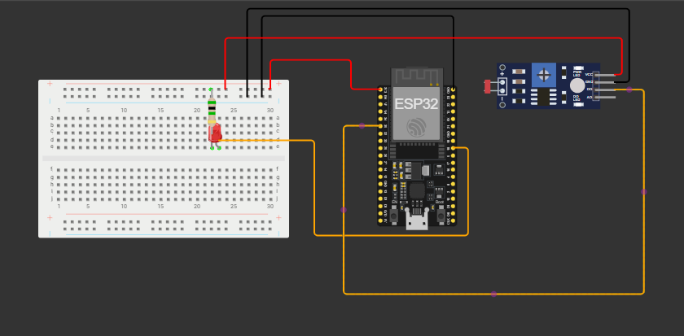
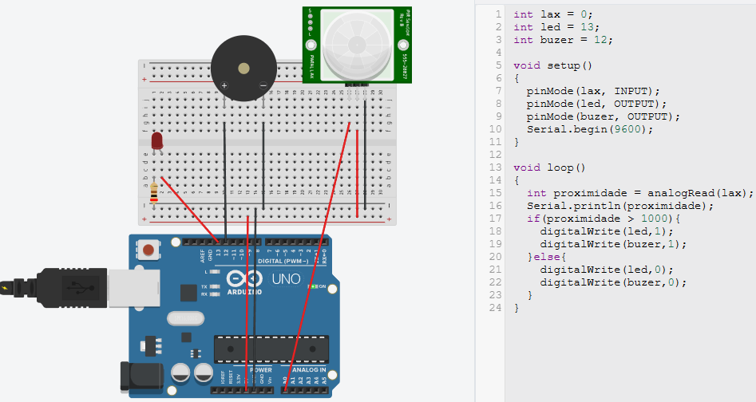

# Aula02

## Automação de Luzes
Automação de luzes é o uso de dispositivos eletrônicos e sistemas inteligentes para controlar a iluminação de forma automática ou remota, sem depender exclusivamente da ação manual (interruptores comuns).

### Sensor LDR
- LDR significa Light Dependent Resistor (resistor dependente de luz).

- Também chamado de fotoresistor.

- Ele é feito de material semicondutor que altera sua resistência conforme a intensidade da luz que incide sobre ele.

### Como funciona?

- No claro: a resistência do LDR diminui bastante (pode chegar a algumas centenas de ohms).

- No escuro: a resistência do LDR aumenta muito (pode ir para centenas de kΩ até MΩ).

### Vantagens na automação LDR
- Conforto → acender e apagar luzes automaticamente ou pelo celular.

- Eficiência energética → evita deixar luzes acesas sem necessidade.

- Segurança → simulação de presença em casas (liga e desliga mesmo se não houver ninguém).

- Acessibilidade → ajuda idosos e pessoas com mobilidade reduzida.

OBS: Muito utilizado no IoT de cidades inteligentes.

## Estrutura do projeto utilizando ESP32


## Código de automação
```c
const int ldrPin = 35; // Pino ADC onde o LDR está conectado
const int ledPin = 18; // Pino do LED para acionar

void setup() {
  Serial.begin(115200); // Inicia a comunicação serial
  pinMode(ledPin, OUTPUT); // Configura o pino do LED como saída
  pinMode(ldrPin, INPUT);
}

void loop() {
  int ldrValue = analogRead(ldrPin); // Lê o valor do sensor LDR
  ldrValue = map(ldrValue, 0, 5000, 30, 0);
  
  Serial.print("Valor do LDR: ");
  Serial.println(ldrValue);

  if (ldrValue < 26) { // Se estiver mais escuro 
    digitalWrite(ledPin, HIGH); // Liga o LED
  } else { // Se estiver mais claro
    digitalWrite(ledPin, LOW); // Desliga o LED
  }

  delay(500); // Aguarda 500 milissegundos antes da próxima leitura
}
```

## Atividade 01 (Chapolin)
Simulação de um alarme, utilizando o sensor PIR.
Ao detectar a preseça do inimigo as **anteninhas de vinil** do Chapolin colorado acionam um **buzer** e acendem um **led**.

A ilustração acima utiliza um ARDUINO UNO, realize o mesmo experimento com a **ESP32**.
## Atividade 02 (Estacionamento)
**Contextualização:** Todos já encontraram em estacionamento de shopping, mercados, atacados, entre outros. Uma luz em cima do estacionamento de carros, quando a luz verde está acesa indica que a vaga está livre, quando vermelha quer dizer que está ocupada.

Isso facilita a mobilidade dos estacionamento e a indicação de vagas.

Realize um projeto utilizando a base do exemplo de aula para fazer a atividade.

Componentes a serem utilizados (OBRIGATÓRIO): Módulo Sensor de Distância Ultrassônico HC-SR04, Leds vermelho e verde.

Quando sensor identificar algum obstaculo ele deve acender VERMELHO, quando não tiver nada o led verde deve ficar aceso.

