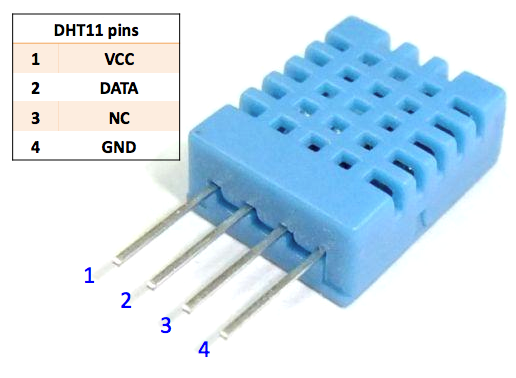
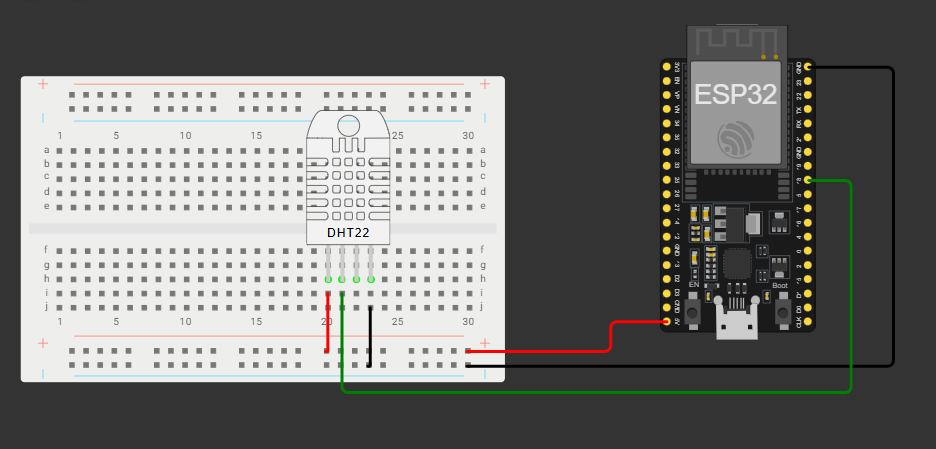
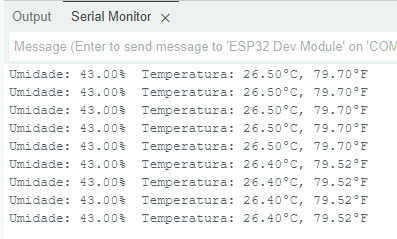

# Aula03
- [Questionário](https://docs.google.com/forms/d/e/1FAIpQLSfh54_bz0gpJLadbtPDu5iSZhMa7ewUA7T4T_ik_DV8UthJNA/viewform?usp=publish-editor)

## Sensor DHT11

O DHT11 é um sensor digital de baixo custo e alta confiabilidade usado para medir a **umidade relativa e a temperatura do ambiente**. Ele possui um termistor **NTC** para a leitura da temperatura e um sensor tipo **HR202** para a umidade. O sensor se comunica com um microcontrolador (como o ESP32) através de um sinal serial digital, sendo ideal para projetos de automação, monitoramento climático e sistemas de controle ambiental. 

### Principais características:

#### Medição digital:
- Envia dados de umidade e temperatura em formato digital, o que simplifica a integração com microcontroladores. 

#### Confiabilidade:
- Oferece excelente estabilidade e confiabilidade a longo prazo para as medições. 

#### Baixo custo:
- É uma solução acessível para projetos que necessitam de monitoramento de temperatura e umidade. 

#### Faixa de medição:
- A temperatura é medida entre 0 e 50 °C, e a umidade relativa entre 20% e 90%. 

#### Facilidade de uso:
- Integra-se facilmente com plataformas como o ESP32, exigindo apenas poucos fios para a conexão. 

#### Aplicações:
- É amplamente utilizado em monitoramento de estufas, automação residencial, controle de sistemas de ar condicionado (HVAC) e projetos de Internet das Coisas (IoT). 

## Pinos do DHT11



## Estrutura do projeto utilizando ESP32



## Código de Automação

```c
#include "DHT.h"

#define DHTPIN 18
#define DHTTYPE DHT11

DHT dht(DHTPIN, DHTTYPE); // constructor to declare our sensor

void setup() {

  Serial.begin(115200);
  Serial.println("O ESP32 Esta funcionando");
    
  dht.begin();
}

void loop() {
  
  delay(1000);
  
  float h = dht.readHumidity();
  //Faz a leitura da umidade em %.
  float t = dht.readTemperature();
  //Faz a leitura da temperatura em Celsius
  float f = dht.readTemperature(true);
  //Faz a leiturada temperatura em Fahrenheit

  if (isnan(h) || isnan(t) || isnan(f)) {
    Serial.println("Sem receber dados do sensor DHT11");
    return;
    //Trata erros de leitura do sensor
  }

  Serial.print("Umidade: ");
  Serial.print(h);
  Serial.print("%  Temperatura: ");
  Serial.print(t);
  Serial.print("°C, ");
  Serial.print(f);
  Serial.println("°F");
  
}
```

### Retorno esperado


## Como conectar o ESP32 no WiFi??

```c
#include <WiFi.h>

const char* ssid = "NomeWiFi"; // Insira o nome da sua rede Wi-Fi
const char* password = "SenhaDoWiFi";    // Insira a senha da sua rede

void setup() {

  Serial.begin(115200);
  Serial.println("O ESP32 Esta funcionando");
  WiFi.begin(ssid, password);

  while (WiFi.status() != WL_CONNECTED) {
    delay(1000);
    Serial.println("Conectando ao Wi-Fi...");
  }

  Serial.println("Wi-Fi conectado!");
  Serial.print("Endereço IP: ");
  Serial.println(WiFi.localIP());
}

void loop(){
    
}
```

### Retorno do Wi-Fi


