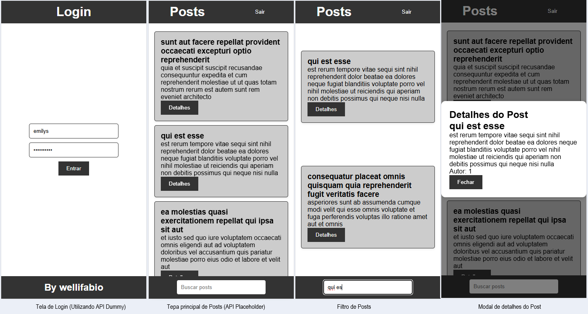

# Desafio Front-end - Nível Jr

## Technologias utilizadas
- HTML
- CSS
- JavaScript
- API Fetch

## Print das telas
As telas do resultado no modo responsivo em um dispositivo simulado Sansung Galaxy S8 

## Para testar
- 1 Clone o repositório
- 2 Abra com VsCode e execute o index.html via live server