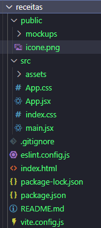

# Aula02 -  Vite / React
O **Vite** é uma ferramenta de construção rápida e leve para projetos **front-end**. Ele é especialmente útil para projetos React devido à sua configuração simples e desempenho otimizado.
- Nesta aula, vamos configurar um projeto React usando Vite e criar uma aplicação simples de livro de receitas que permite aos usuários ver em forma de cards as receitas disponíveis no arquivo `receitas.json` com os dados a seguir:

```json
{
  "receitas": [
    {
      "id": 1,
      "titulo": "Bolo de Cenoura",
      "ingredientes": [
        "2 xícaras de cenoura ralada",
        "1 xícara de açúcar",
        "1/2 xícara de óleo",
        "3 ovos",
        "2 xícaras de farinha de trigo",
        "1 colher de sopa de fermento em pó"
      ],
      "modoPreparo": "Bata no liquidificador a cenoura, o açúcar, o óleo e os ovos. Misture com os ingredientes secos e asse em forno pré-aquecido a 180°C por 40 minutos.",
      "imagem": "https://cozinha365.com.br/wp-content/uploads/2025/02/Bolo-de-cenoura-S.webp"
    },
    {
      "id": 2,
      "titulo": "Pão de Queijo",
      "ingredientes": [
        "250g de polvilho doce",
        "100ml de leite",
        "50ml de óleo",
        "1 ovo",
        "100g de queijo minas ralado",
        "sal a gosto"
      ],
      "modoPreparo": "Misture todos os ingredientes até formar uma massa homogênea. Modele os pães e asse em forno pré-aquecido a 180°C por 20 minutos.",
      "imagem": "https://www.receitas-sem-fronteiras.com/media/hehe-3_crop.jpg/rh/pao-de-queijo-3-ingredientes.jpg"
    },
    {
      "id": 3,
      "titulo": "Bolo de Chocolate",
      "ingredientes": [
        "2 xícaras de açúcar",
        "1 xícara de manteiga",
        "4 ovos",
        "2 xícaras de farinha de trigo",
        "1 xícara de chocolate em pó",
        "1 colher de sopa de fermento em pó"
      ],
      "modoPreparo": "Bata o açúcar com a manteiga até obter um creme. Adicione os ovos, um a um, e misture bem. Incorpore os ingredientes secos e asse em forno pré-aquecido a 180°C por 50 minutos.",
      "imagem": "https://recipesblob.oetker.com.br/assets/a81bc035eb7f407faaa2c93e04edaf78/750x910/bolo-de-aniversrio-de-chocolate.jpg"
    },
    {
      "id": 4,
      "titulo": "Bife à Cavalo",
      "ingredientes": [
        "4 bifes de alcatra ou contra filé",
        "4 ovos",
        "sal e pimenta a gosto",
        "óleo para fritar"
      ],
      "modoPreparo": "Tempere os bifes com sal e pimenta. Frite os bifes em uma frigideira com óleo quente. Em outra frigideira, frite os ovos. Sirva os bifes com os ovos por cima.",
      "imagem": "https://www.comidaereceitas.com.br/wp-content/uploads/2011/03/bife_cavalo.jpg"
    }
  ]
}
```

## Iniciando o novo projeto WEB receitas com Vite
Crie uma pasta raiz, abra com **VS Code** e execute o seguinte comando no terminal **CMD** ou **bash**:
```bash
npm create vite@latest receitas -- --template react
cd receitas
npm install
npm run dev
```
Pode aparecer alguma confirmação, pressione `y` para confirmar:
### Estrutura de Pastas
Será criada uma estrutura de pastas semelhante a esta:
<br>
- Para executar o projeto modelo base que foi criado basta segurar o CTRL e clicar no link que aparece no terminal.
```bash
 ➜  Local:   http://localhost:5173/
```


### Codificando a Home Page
Vamos codificar a home pagem para listar em forma de **cards** cada receita do arquivo `receitas.json`, antes crie uma pasta chamada **mockups** dentro da pasta **public** do seu projeto e adicione o arquivo `public/mockups/receitas.json` com o conteúdo exibido no **início** desta aula:
- Agora vamos criar o componente principal da aplicação, a página `src/App.jsx` com o conteúdo a seguir:

```jsx
import { useEffect, useState } from 'react';
import './App.css';


function Modal({ receita, onClose }) {
  if (!receita) return null;
  return (
    <div className="modal-overlay" onClick={onClose}>
      <div className="modal" onClick={e => e.stopPropagation()}>
        <h2>{receita.titulo}</h2>
        <h3>Ingredientes:</h3>
        <ul>
          {receita.ingredientes.map((ingrediente, idx) => (
            <li key={idx}>{ingrediente}</li>
          ))}
        </ul>
        <h3>Modo de Preparo:</h3>
        <p>{receita.modoPreparo}</p>
        <button onClick={onClose}>Fechar</button>
      </div>
    </div>
  );
}

function App() {
  const [receitas, setReceitas] = useState([]);
  const [modalReceita, setModalReceita] = useState(null);

  useEffect(() => {
    // Obtendo os dados de uma API simulada
    const fetchData = async () => {
      const response = await fetch('/mockups/receitas.json');
      const data = await response.json();
      setReceitas(data.receitas);
    };
    fetchData();
  }, []);

  return (
    <>
      <header><h1>Receitas</h1></header>
      <main className="card-container">
        {receitas.map((receita) => (
          <div className="card" key={receita.id}>
            <h2>{receita.titulo}</h2>
            <h3>Ilustração:</h3>
            
            <button onClick={() => setModalReceita(receita)}>Ver Receita</button>
          </div>
        ))}
      </main>
      <footer>
        <p>Receitas do Fessor &copy; 2025</p>
      </footer>
      <Modal receita={modalReceita} onClose={() => setModalReceita(null)} />
    </>
  );
}

export default App;
```
- Vamos codificar as duas páginas de estilo, a `index.css` e a `App.css`, para deixar nossa aplicação mais organizada. A primeira normalmente contém estilos globais, enquanto a segunda é específica para os componentes da aplicação.
- `src/index.css`
```css
:root {
  --c1: #f0f0f0;
  --c2: #e0e0e0;
  --c3: #d0d0d0;
  --c4: #c0c0c0;
  --t1: rgba(0, 0, 0, 0.1);
  line-height: 1;
  font-weight: 400;
}

* {
  margin: 0;
  padding: 0;
  box-sizing: border-box;
  font-family: 'Courier New', Courier, monospace;
}

button{
  border: none;
  border-radius: 4px;
  padding: 0.5rem 1rem;
  background-color: var(--c1);
  font-weight: bold;
  box-shadow: 0 2px 4px var(--t1);
  cursor: pointer;
  transition: background-color 0.3s;
}

button:hover {
  background-color: darken(var(--c1), 5%);
}

.modal-overlay{
  position: fixed;
  top: 0;
  left: 0;
  right: 0;
  bottom: 0;
  background-color: rgba(0, 0, 0, 0.5);
  display: flex;
  align-items: center;
  justify-content: center;
}

.modal {
  max-width: 800px;
  background-color: var(--c1);
  padding: 2rem;
  border-radius: 8px;
  box-shadow: 0 2px 4px var(--t1);
}
```
- `src/App.css`
```css
#root {
  width: 100vw;
  height: 100vh;
  display: flex;
  flex-direction: column;
  align-items: center;
  justify-content: space-between;
}

header,
footer {
  width: 100%;
  padding: 1rem;
  background-color: var(--c2);
  box-shadow: 0 2px 4px var(--t1);
  display: flex;
  align-items: center;
  justify-content: space-around;
}

main {
  width: 100%;
  max-width: 800px;
  height: fit-content;
  padding: 2rem;
  background-color: var(--c1);
  box-shadow: 0 2px 4px var(--t1);
  display: flex;
  flex-wrap: wrap;
  align-items: center;
  justify-content: center;
  gap: 1rem;
  overflow-y: auto;
}

.card {
  width: 100%;
  max-width: 300px;
  padding: 1rem;
  background-color: var(--c3);
  box-shadow: 0 2px 4px var(--t1);
  border-radius: 8px;
  display: flex;
  flex-direction: column;
  align-items: center;
  justify-content: center;
  gap: 1rem;
  & img {
    max-width: 100%;
    height: auto;
    border-radius: 4px;
  }
}
```
- Por fim antes de executar e conferir, vamos ajustar o arquivo `index.html` para escolher o ícone da aplicação e o título que aparecerá na aba do navegador, edite o arquivo `index.html` para ficar conforme o código a seguir:
```html
<!doctype html>
<html lang="en">

<head>
  <meta charset="UTF-8" />
  <link rel="icon" type="image/png" href="/icone.png" />
  <meta name="viewport" content="width=device-width, initial-scale=1.0" />
  <title>Receitas do fessor</title>
</head>

<body id="root">

</body>
<script type="module" src="/src/main.jsx"></script>

</html>
```

### Print dos resultados


## Desafio
Este tutorial consome dados estáticos do arquivo `receitas.json`. Para tornar a aplicação mais dinâmica, o desafio é consumir a API de receitas que usamos na aula de Mobile (https://receitasapi-b-2025.vercel.app/)
- Dica: Utilize o `axios` para fazer as requisições HTTP. Instale com o comando:
```bash
npm install axios
```
- Crie um modal para **cadastrar** e **editar** receitas.
- Em cada card crie dois botões, um para **editar** e outro para **excluir** a receita.
- Dica: pode fazer uso de IA para ajudar na construção do código, porém tente entender o que está sendo feito.