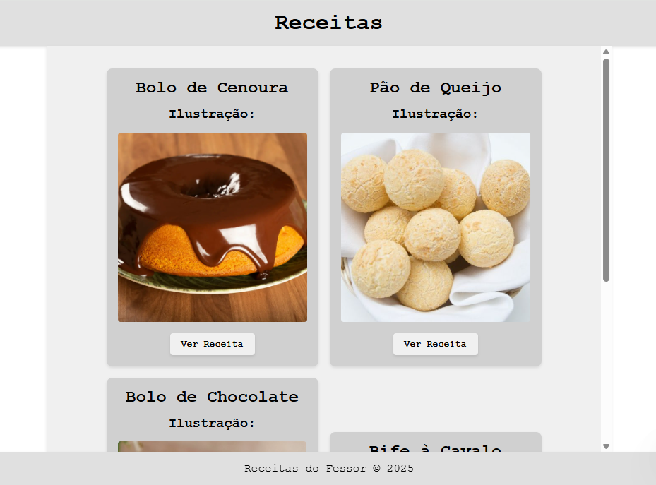
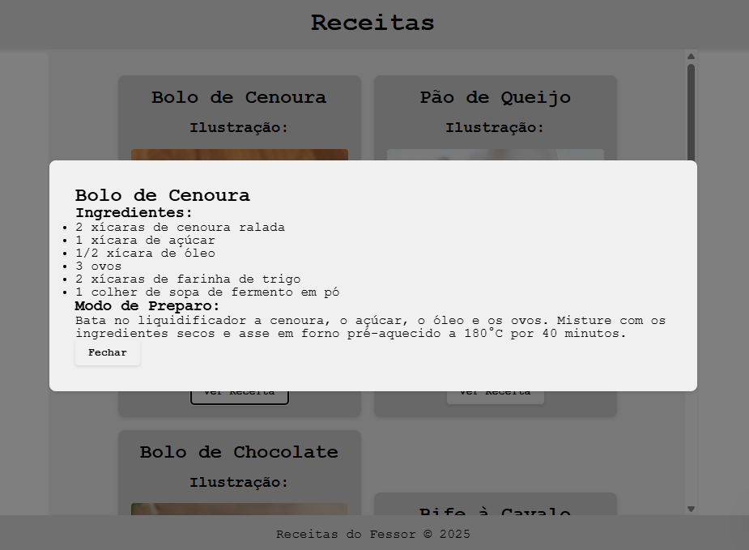

# Livro de Receitas

Exemplo de um livro de receitas utilizando React e Vite.
|Screenshots|
|-|
||
||

## Passos para testar
1. Clone o repositório
2. Instale as dependências com `npm install`
3. Inicie o servidor de desenvolvimento com `npm run dev`
4. Acesse `http://localhost:3000` no seu navegador