# Aula 03 - Firebase com Firestore

## FireStore
O FireStore é um **banco de dados NoSQL** em tempo real que permite armazenar e sincronizar dados entre os clientes e o servidor. Ele é parte do Firebase, uma plataforma de desenvolvimento de aplicativos móveis e web.

## Experimento
- Criar um Front-End simples consumindo dados do FireStore.
- Anexando o Firebase ao projeto local

### Obs
No ambiente de front-end puro (HTML/JS rodando no navegador), não é possível usar arquivos .env para esconder variáveis sensíveis, pois tudo que está no JS será exposto ao usuário final. O arquivo .env só é útil eKvm projetos Node.js/backend ou em projetos front-end que usam ferramentas de build (como Vite, Webpack, etc.), onde as variáveis são injetadas no build e nunca expostas diretamente.

No seu caso, usando apenas HTML/JS puro, o firebaseConfig sempre ficará visível no código-fonte do navegador. Isso é esperado e aceito pelo próprio Firebase, pois essas chaves não concedem acesso administrativo ao projeto, apenas permitem o uso dos serviços conforme as regras de segurança do Firestore.

Se quiser esconder as chaves, seria necessário um backend intermediário. Caso queira usar variáveis de ambiente, recomendo migrar para um framework/bundler moderno (Vite, React, Angular, etc.).

### https://console.firebase.google.com/

## Passo a passo para criar um projeto Firebase, Adicionar Firestore e configurar o ambiente
- 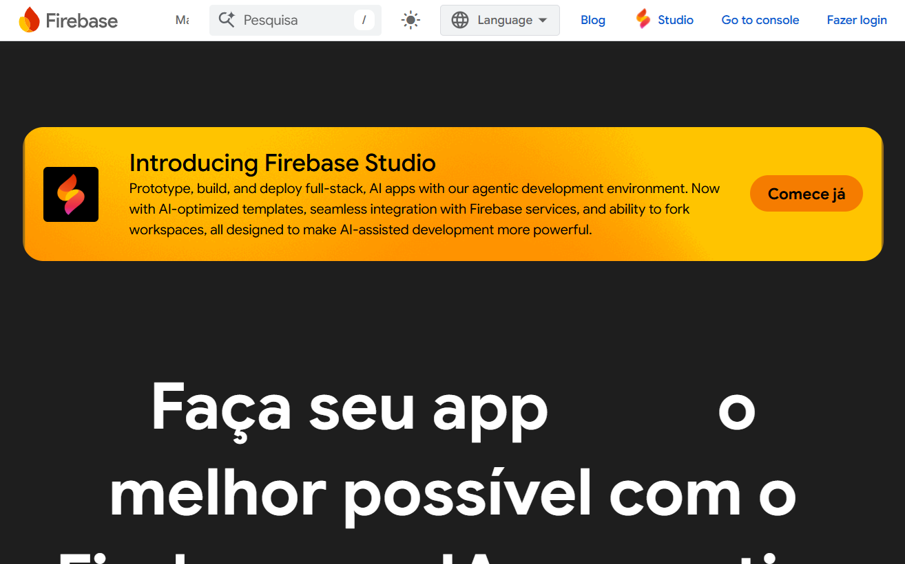
- 1 Crie sua conta no Firebase
- 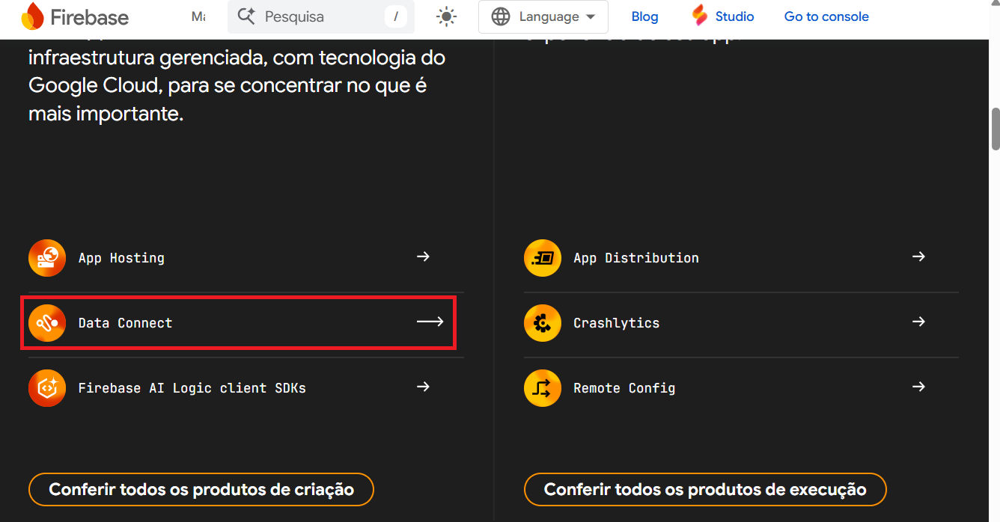
- 2 Crie um ambiente tipo "Data connect"
- 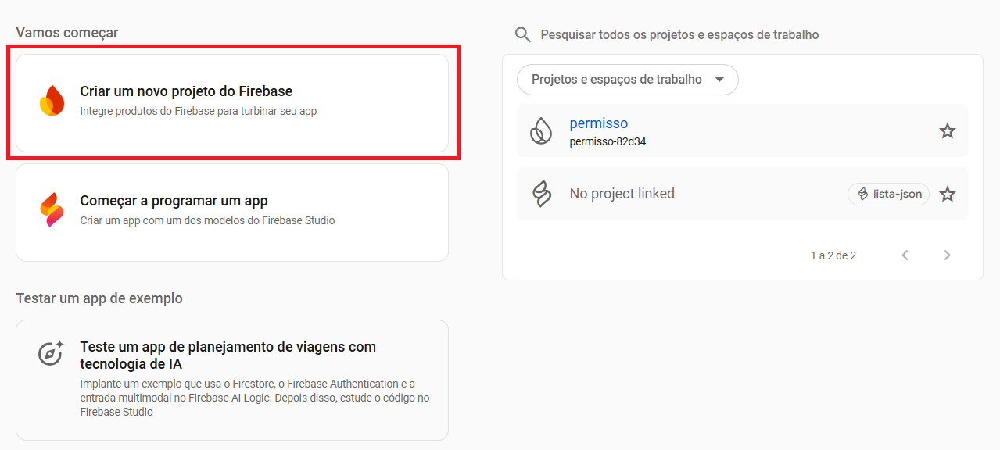
- 3 Crie um novo Projeto
- 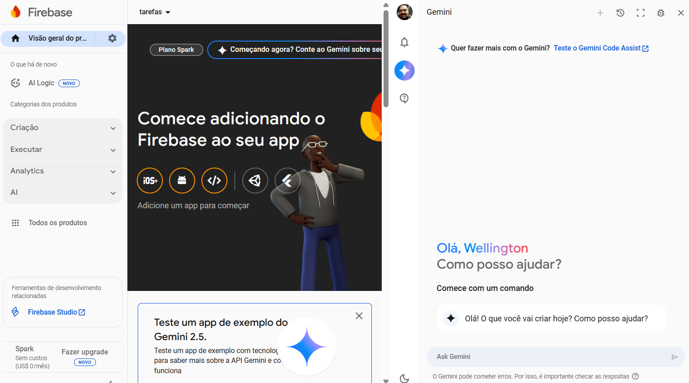
- 4 Adicione um App ao seu projeto
- 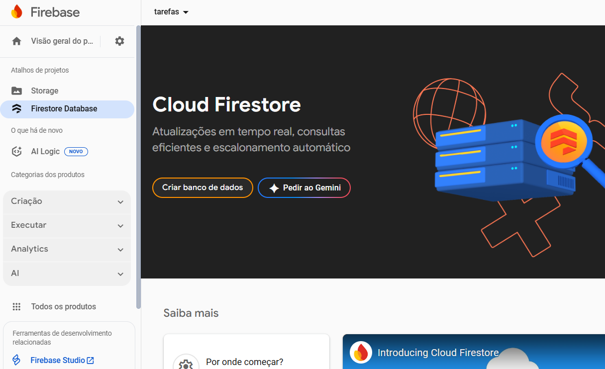
- 5 Configure o Firestore no seu App
- 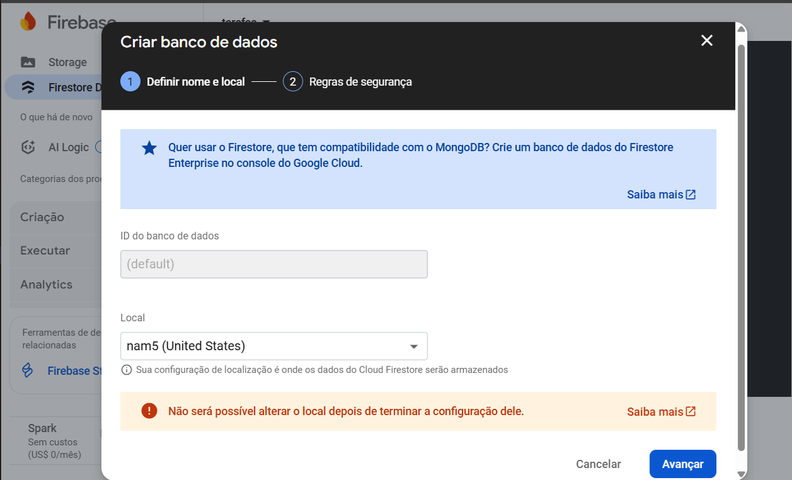
- 6 Crie um banco de dados Firestore
- 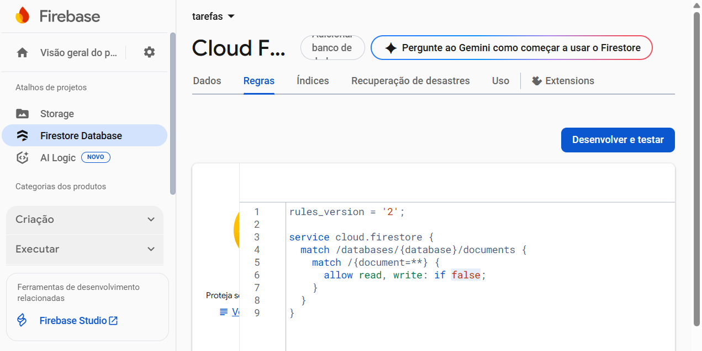
- 7 Para testar localmente altere o **if false** para **if true**

### Criando a UI Web para consumir os dados do Firestore
- Crie a estrutura de pastas e arquivos a seguir, para criar o Front-end que consumirá os dados do Firestore
```cmd
app
├──index.html
├──style.css
└──script.js
```
O arquivo `index.html` deve conter a estrutura básica do seu aplicativo, incluindo referências ao CSS e ao JavaScript. Aqui está um exemplo de como ele pode ser estruturado:
```html
<!DOCTYPE html>
<html lang="pt-BR">

<head>
    <meta charset="UTF-8">
    <meta name="viewport" content="width=device-width, initial-scale=1.0">
    <link rel="stylesheet" href="style.css">
    <title>Tarefas a fazer</title>
</head>

<body>
    <header>
        <h1>Tarefas</h1>
        <button onclick="document.getElementById('modalNovo').classList.remove('oculto')">Nova Tarefa</button>
    </header>
    <main>
    </main>
    <footer>
        <h2>By wellifabio</h2>
    </footer>
    <section id="modalNovo" class="modal oculto">
        <div class="janela">
            <h2>Nova Tarefa</h2>
            <form id="formNovaTarefa">
                <div>
                    <label for="titulo">Título:</label>
                    <input type="text" id="titulo" name="titulo" required>
                </div>
                <div>
                    <label for="conteudo">Conteúdo:</label>
                    <textarea id="conteudo" name="conteudo" required></textarea>
                </div>
                <div>
                    <label for="data">Data:</label>
                    <input type="date" id="data" name="data" required>
                </div>
                <button type="submit">Cadastrar</button>
                <button type="button"
                    onclick="document.getElementById('modalNovo').classList.add('oculto')">Fechar</button>
            </form>
        </div>
    </section>
    <script type="module" src="script.js"></script>
</body>

<script>
    const firebaseConfig = {
        //Cole os dados do Firebase
    };
</script>

</html>
```
- O Arquivo `script.js`
```js
import { initializeApp } from "https://www.gstatic.com/firebasejs/10.12.2/firebase-app.js";
import { getFirestore, collection, addDoc, getDocs, deleteDoc, doc } from "https://www.gstatic.com/firebasejs/10.12.2/firebase-firestore.js";

// Initialize Firebase
const app = initializeApp(firebaseConfig);

const form = document.getElementById("formNovaTarefa");
form.addEventListener("submit", function (e) {
    e.preventDefault();

    const titulo = form.titulo.value;
    const conteudo = form.conteudo.value;
    const data = form.data.value;

    // Enviar dados para o Firestore
    const db = getFirestore(app);
    addDoc(collection(db, "tarefas"), {
        titulo,
        conteudo,
        data
    })
        .then(() => {
            window.location.reload();
        })
        .catch((error) => {
            console.error("Erro ao cadastrar tarefa:", error);
        });
});

function listarTarefas() {
    const db = getFirestore(app);
    const tarefasRef = collection(db, "tarefas");

    // Limpar main existente
    const main = document.querySelector("main");
    main.innerHTML = "";

    // Obter tarefas do Firestore
    getDocs(tarefasRef)
        .then((snapshot) => {
            snapshot.forEach((doc) => {
                const id = doc.id;
                const tarefa = doc.data();
                const div = document.createElement("div");
                div.classList.add('card');
                div.innerHTML = `<h2>${tarefa.titulo}</h2><hr>`;
                div.innerHTML += `<p>${tarefa.conteudo}</p>`;
                div.innerHTML += `<p>(${tarefa.data})</p>`;
                const botoesDiv = document.createElement('div');
                botoesDiv.classList.add('botoes');
                const btnExcluir = document.createElement('button');
                btnExcluir.textContent = 'Excluir';
                btnExcluir.addEventListener('click', () => { excluirTarefa(id) });
                botoesDiv.appendChild(btnExcluir);
                div.appendChild(botoesDiv);
                main.appendChild(div);
            });
        })
        .catch((error) => {
            console.error("Erro ao listar tarefas:", error);
        });
}

function excluirTarefa(id) {
    const db = getFirestore(app);
    const tarefasRef = collection(db, "tarefas");
    const tarefaRef = doc(tarefasRef, id);

    // Excluir tarefa do Firestore
    deleteDoc(tarefaRef)
        .then(() => {
            window.location.reload();
        })
        .catch((error) => {
            console.error("Erro ao excluir tarefa:", error);
        });
}

listarTarefas();
```
- E o arquivo `style.css`
```css
* {
    margin: 0;
    padding: 0;
    box-sizing: border-box;
    font-family: Verdana, Geneva, Tahoma, sans-serif;
}

:root {
    --c1: #f0f0f0;
    --c2: #333;
    --c3: #830;
    --c4: #fb7;
}

body {
    display: flex;
    flex-direction: column;
    align-items: center;
    height: 100vh;
    width: 100vw;
    justify-content: space-between;
}

header,
footer {
    width: 100%;
    height: 10vh;
    background-color: var(--c4);
    padding: 1rem;
    text-align: center;
    display: flex;
    justify-content: space-around;
    align-items: center;
}

main {
    width: 100%;
    display: flex;
    flex-wrap: wrap;
    justify-content: center;
    align-items: flex-start;
    gap: 20px;
    background-color: var(--c4);
    overflow-y: auto;
    height: 80vh;
    border-top: solid 1px var(--c2);
    border-bottom: solid 1px var(--c2);
    padding: 20px;
}

button {
    background-color: var(--c2);
    color: white;
    border: none;
    padding: 0.5rem 1rem;
    border-radius: 5px;
    transition: background-color 0.3s;
    box-shadow: 0 2px 5px rgba(0, 0, 0, 0.1);
    cursor: pointer;
}

button:hover {
    background-color: var(--c3);
}

input,
select,
textarea {
    border: 1px solid var(--c2);
    border-radius: 5px;
    padding: 0.5rem;
    width: 100%;
    margin-bottom: 1rem;
}

.card {
    background-color: var(--c3);
    color: white;
    border-radius: 5px;
    max-width: 400px;
    padding: 1rem;
    box-shadow: 0 2px 5px rgba(0, 0, 0, 0.1);
    min-width: 350px;
}

.botoes{
    width: 100%;
    display: flex;
    flex-direction: row;
    justify-content: flex-end;
}

.modal {
    display: flex;
    justify-content: center;
    align-items: center;
    position: fixed;
    top: 0;
    left: 0;
    right: 0;
    bottom: 0;
    background-color: rgba(0, 0, 0, 0.5);
}

.janela {
    background-color: white;
    border-radius: 5px;
    padding: 2rem;
    box-shadow: 0 2px 10px rgba(0, 0, 0, 0.1);
}

.oculto {
    display: none;
}
```

- No arquivo `index.html` você cola os dados de conexão do seu App no treixo de código abaixo.
```html
<script>
    const firebaseConfig = {
        //Cole os dados do Firebase
    };
</script>
```
- Estes dados vem do seu Aplicativo Firebase de conexão.
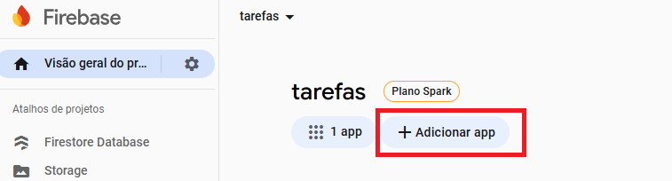
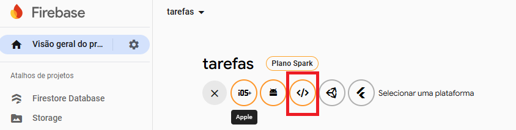
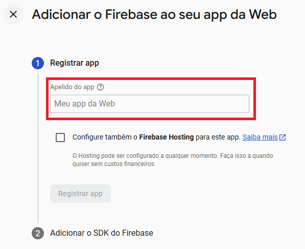
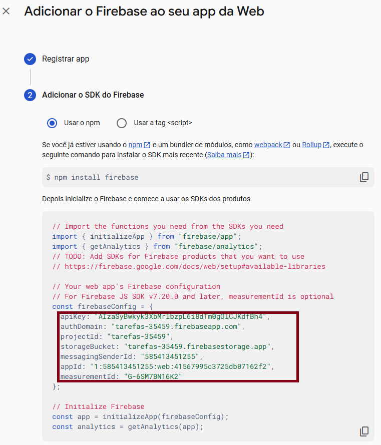
- Print do resultado
<br>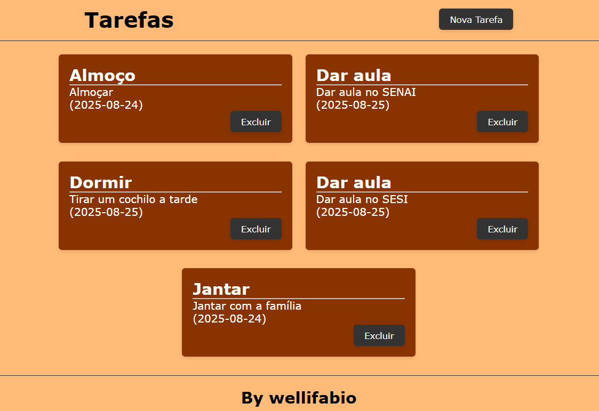

### Obs:
Esta interface Web por segurança só pode ser usada localmente, pois se enviada para o github em um repositório público vai expor sua chave de conexão.

Para criar Aplicativos públicos seguros, devemos utilizar um Framework como React para proteger as chaves em um **.env**