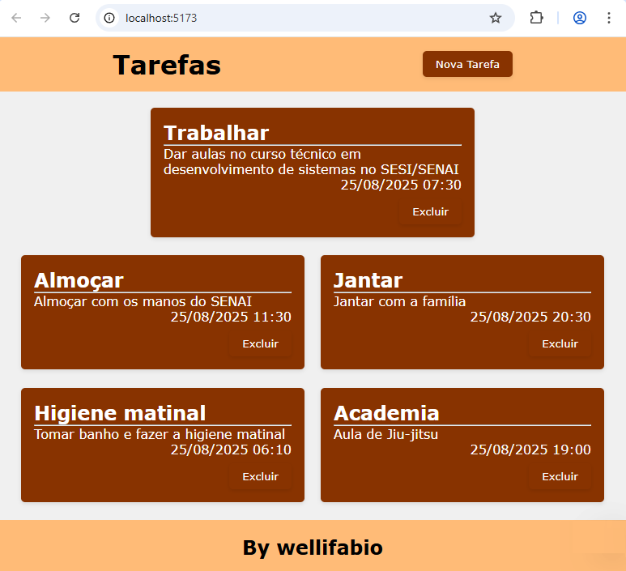

# Projeto React Tarefas

Este é um projeto simples, para aulas do Framework React de gerenciamento de tarefas utilizando Firebase.
<br>
## Tecnologias Utilizadas

- React
- Firebase Firestore
- Vite

## Como Executar o Projeto

1. Clone o repositório
2. Instale as dependências
```bash
npm install
```
3. Crie um arquivo **.env** na raiz com as variávies do Firebase:
```js
VITE_API_KEY=xxxxxxxxxxxxxxxxxxxxxxxxxxxxxxxx
VITE_AUTH_DOMAIN=xxxxxxxxxxxxxxxxxxxxxxxxxxxxxxxx
VITE_PROJECT_ID=xxxxxxxxxxxxxxxxxxxxxxxxxxxxxxxx
VITE_STORAGE_BUCKET=xxxxxxxxxxxxxxxxxxxxxxxxxxxxxxxx
VITE_MESSAGING_SENDER_ID=xxxxxxxxxxxxxxxxxxxxxxxxxxxxxxxx
VITE_APP_ID=xxxxxxxxxxxxxxxxxxxxxxxxxxxxxxxx
VITE_MEASUREMENT_ID=xxxxxxxxxxxxxxxxxxxxxxxxxxxxxxxx
```
4. Habilite a regra do Firestore para permitir leitura e escrita:
```js
rules_version = '2';

service cloud.firestore {
  match /databases/{database}/documents {
    match /{document=**} {
      allow read, write: if true;
    }
  }
}
```
5. Execute o projeto
```bash
npm run dev
```

## Para fazer o deploy rapidamente com Git Pages baixe a extensão "gh-pages"
```bash
npm i gh-pages --save-dev
```
Antes de fazer o commit das configurações de deploy, execute o deploy com o comando:

```bash
npm run deploy
```
Pronto! Sua aplicação React está agora implantada no GitHub Pages.
