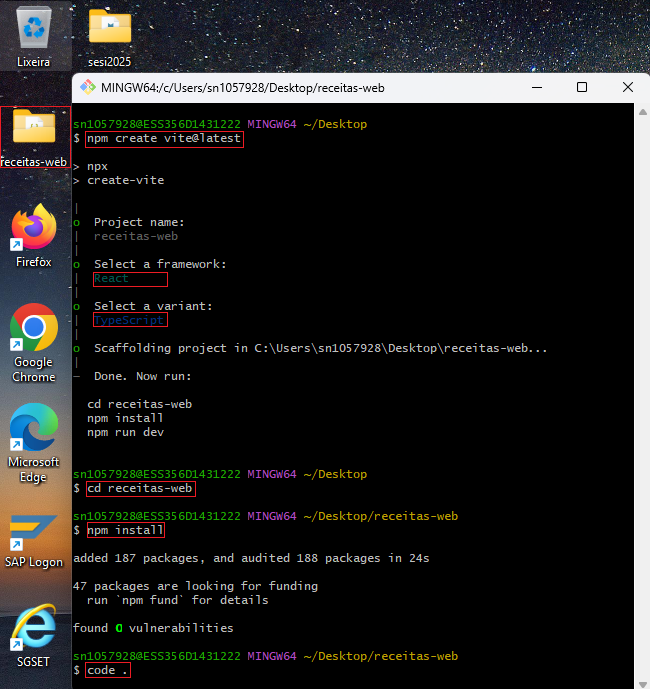
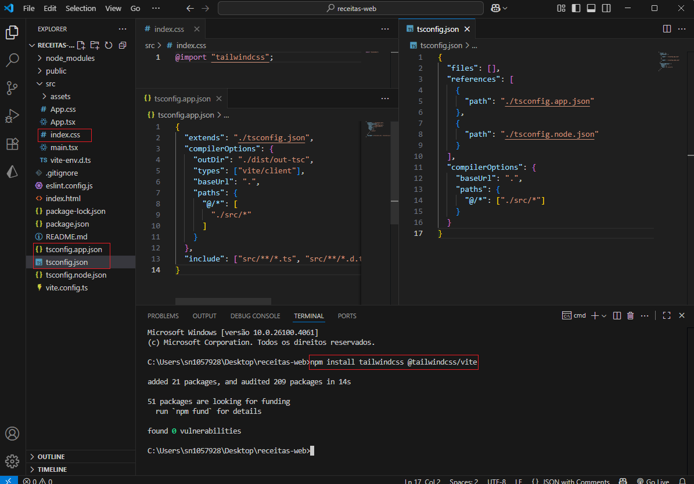
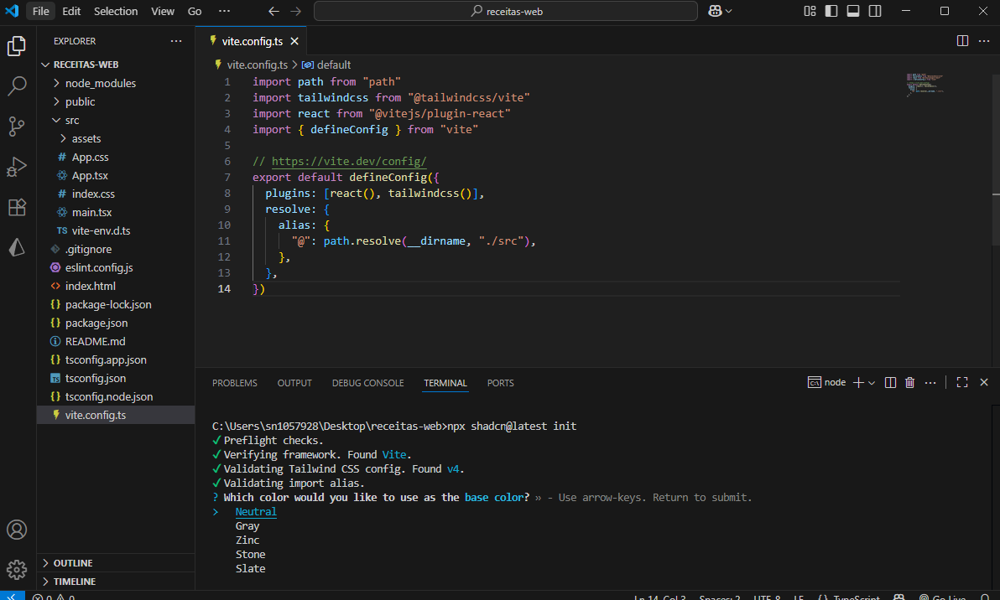
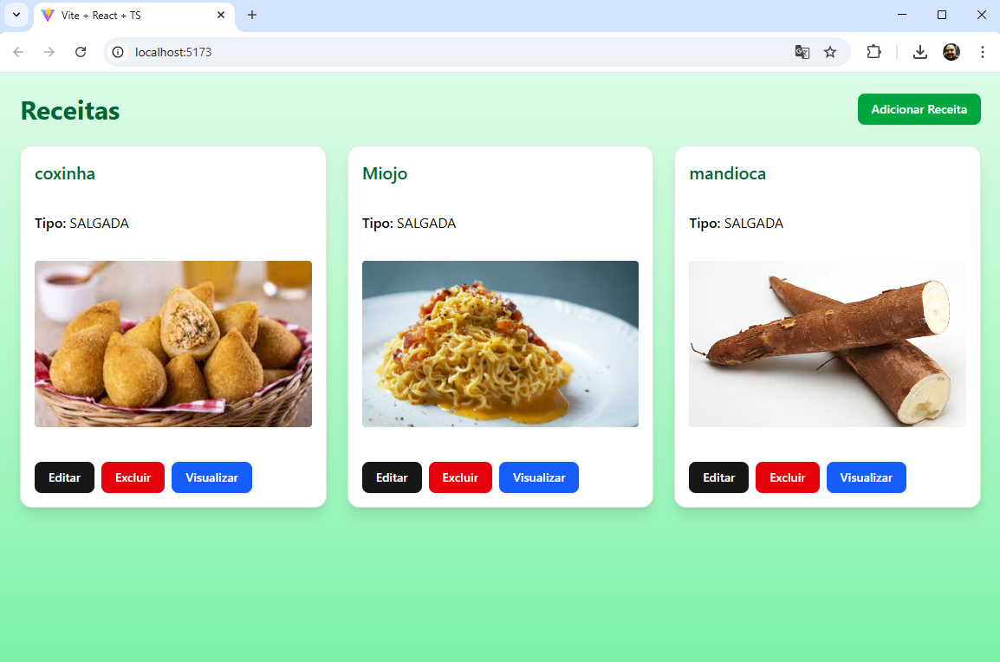
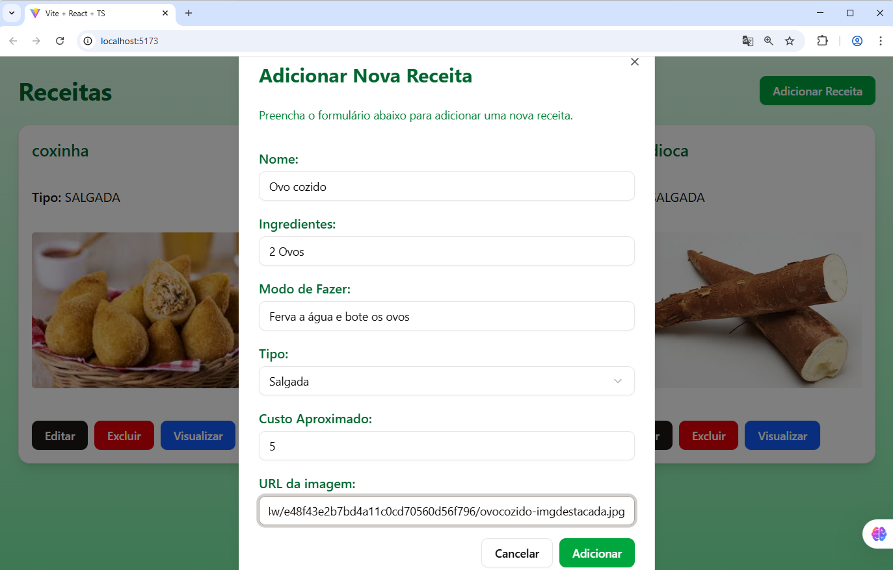
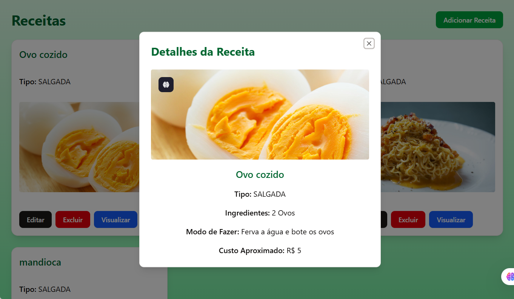
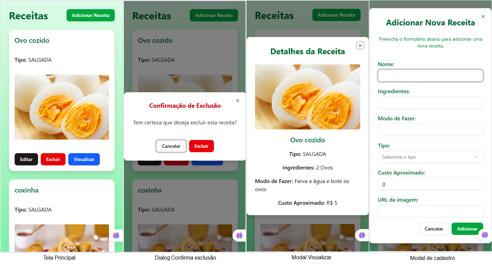

# Aula05 - Frameworks (Shadcn/UI) React
Nesta aula, vamos explorar o uso de frameworks de componentes para acelerar o desenvolvimento de interfaces de usuário. Vamos focar no Shadcn/UI, um conjunto de componentes React altamente personalizáveis e acessíveis.

## Ambiente de Desenvolvimento
- Git
- Node.js
- React
- Vite
- Shadcn/UI

## Demonstração
Vamos criar um projeto React com Vite e integrar o Shadcn/UI.

1. Em sua área de trabalho abra o terminal **gitbash**, crie um novo projeto React com Vite:
```bash
npm create vite@latest
```
- Escolha o nome do projeto (ex: `receitas-web`), selecione `React` e `TypeScript`.
```bash
cd receitas-web
npm install
code .
```
2. Abra o terminal do VsCode e instale o Tailwind CSS:
```bash
npm install tailwindcss @tailwindcss/vite
```
3. Limpe o arquivo `src/index.css` e insira o Tailwind CSS e as configurações iniciais em root:
```css
@import "tailwindcss";
```
4. Configure o arquivo `tsconfig.json` para reconhecer o alias `@`:
```json
{
  "files": [],
  "references": [
    {
      "path": "./tsconfig.app.json"
    },
    {
      "path": "./tsconfig.node.json"
    }
  ],
  "compilerOptions": {
    "baseUrl": ".",
    "paths": {
      "@/*": ["./src/*"]
    },
    "jsx": "react-jsx",
    "lib": [
      "DOM",
      "DOM.Iterable",
      "ES2015"
    ]
  }
}
```
- O arquivo `tsconfig.app.json` deve ficar assim:
```json
{
  "extends": "./tsconfig.json",
  "compilerOptions": {
    "outDir": "./dist/out-tsc",
    "types": ["vite/client"],
    "baseUrl": ".",
    "paths": {
      "@/*": [
        "./src/*"
      ]
    }
  },
  "include": ["src/**/*.ts", "src/**/*.d.ts", "src/**/*.tsx", "src/**/*.vue"],
}
```

5. Instale os tipos do Node.js:
```bash
npm install -D @types/node
```
6. Configure o arquivo `vite.config.ts` para usar o Tailwind CSS:
```ts
import path from "path"
import tailwindcss from "@tailwindcss/vite"
import react from "@vitejs/plugin-react"
import { defineConfig } from "vite"

// https://vite.dev/config/
export default defineConfig({
  plugins: [react(), tailwindcss()],
  resolve: {
    alias: {
      "@": path.resolve(__dirname, "./src"),
    },
  },
})
```

6. Execute o Cli do Shadcn/UI para configurar o projeto:
```bash
npx shadcn@latest init
```

- Escolha oa base de cores como **Neutral**.
7. Instale as dependências do Shadcn/UI:
```bash
npm install @shadcn/ui
npx shadcn@latest add button
npx shadcn@latest add card
npx shadcn@latest add scroll-area
npx shadcn@latest add input
npx shadcn@latest add select
npx shadcn@latest add dialog
```
8. Edite o `src/App.tsx` para usar o componente `Button` do Shadcn/UI:
```tsx
import { Button } from "@/components/ui/button"
import { Card } from "@/components/ui/card"
import { ScrollArea } from "@radix-ui/react-scroll-area"
import { Select, SelectContent, SelectItem, SelectTrigger, SelectValue } from "@/components/ui/select"
import { Input } from "@/components/ui/input"
import { Dialog, DialogContent, DialogHeader, DialogTitle, DialogDescription } from "@/components/ui/dialog"
import { useState, useEffect } from "react"
import axios from "axios"

const url = "https://receitasapi-b-2025.vercel.app/receitas"

function App() {
  const [visualizarOpen, setVisualizarOpen] = useState(false)
  const [receitaVisualizar, setReceitaVisualizar] = useState<any>(null)
  const [alertOpen, setAlertOpen] = useState(false)
  const [receitaExcluir, setReceitaExcluir] = useState<any>(null)
  const [alertMsg, setAlertMsg] = useState("")
  const [receitas, setReceitas] = useState<any[]>([])
  const [open, setOpen] = useState(false)
  const [nome, setNome] = useState("")
  const [ingredientes, setIngredientes] = useState("")
  const [modoFazer, setModoFazer] = useState("")
  const [tipo, setTipo] = useState("")
  const [img, setImg] = useState("")
  const [custoAproximado, setCustoAproximado] = useState(0)
  const [id, setId] = useState<number|null>(null)
  const [isEdit, setIsEdit] = useState(false)

  const fetchReceitas = async () => {
    try {
      const response = await axios.get(url)
      setReceitas(response.data)
    } catch (error) {
      console.error("Error fetching receitas:", error)
    }
  }

  useEffect(() => {
    fetchReceitas()
  }, [])

  const handleSubmit = async (e: React.FormEvent) => {
    e.preventDefault()
    if (!nome || !ingredientes || !modoFazer || !tipo || !img) {
      alert("Por favor, preencha os campos obrigatórios.")
      return
    }

    const jsonData = {
      nome,
      ingredientes,
      modoFazer,
      tipo,
      img,
      custoAproximado,
    }

    try {
      if (isEdit && id !== null) {
        await axios.put(`${url}/${id}`, jsonData)
      } else {
        const response = await axios.post(url, jsonData)
        setId(response.data.id)
      }
      setOpen(false)
      setIsEdit(false)
      fetchReceitas()
      setNome("")
      setIngredientes("")
      setModoFazer("")
      setTipo("")
      setImg("")
      setCustoAproximado(0)
      setId(null)
    } catch (error) {
      console.error("Error submitting receita:", error)
    }
  }

  return (
    <div className="min-h-screen bg-gradient-to-b from-green-100 to-green-300 p-6">
      <header className="mb-6 flex justify-between items-center">
        <h1 className="text-3xl font-bold text-green-800">Receitas</h1>
        <Button onClick={() => setOpen(true)} className="bg-green-600 hover:bg-green-700 text-white">
          Adicionar Receita
        </Button>
      </header>

      <ScrollArea className="h-[80vh]">
        <div className="grid grid-cols-1 md:grid-cols-2 lg:grid-cols-3 gap-6">
          {receitas.map((receita) => (
            <Card key={receita.id} className="p-4 shadow-lg">
              {receita.imagemUrl && (
                
              )}
              <h2 className="text-xl font-semibold mb-2 text-green-800">{receita.nome}</h2>
              <p className="mb-2">
                <span className="font-semibold">Tipo:</span> {receita.tipo}
              </p>
              
              <div>
                <Button onClick={() => {
                  setId(receita.id)
                  setNome(receita.nome)
                  setIngredientes(receita.ingredientes)
                  setModoFazer(receita.modoFazer)
                  setTipo(receita.tipo)
                  setImg(receita.img)
                  setCustoAproximado(receita.custoAproximado)
                  setIsEdit(true)
                  setOpen(true)
                }}>Editar</Button>
                <Button className="ml-2 bg-red-600 hover:bg-red-700 text-white" onClick={() => {
                  setReceitaExcluir(receita)
                  setAlertOpen(true)
                }}>Excluir</Button>
                <Button className="ml-2 bg-blue-600 hover:bg-blue-700 text-white" onClick={() => {
                  setReceitaVisualizar(receita)
                  setVisualizarOpen(true)
                }}>Visualizar</Button>
              </div>
            </Card>
          ))}
        </div>
      </ScrollArea>
      {/* Alert de confirmação de exclusão - fora do map dos cards */}
      {/* Modal de visualização de receita */}
      <Dialog open={visualizarOpen} onOpenChange={setVisualizarOpen}>
        <DialogContent className="max-w-lg">
          <DialogHeader>
            <DialogTitle className="text-2xl font-bold text-green-800 mb-2">Detalhes da Receita</DialogTitle>
          </DialogHeader>
          {receitaVisualizar && (
            <div className="flex flex-col gap-4 items-center">
              {receitaVisualizar.img && (
                
              )}
              <h2 className="text-xl font-semibold text-green-800">{receitaVisualizar.nome}</h2>
              <p><span className="font-semibold">Tipo:</span> {receitaVisualizar.tipo}</p>
              <p><span className="font-semibold">Ingredientes:</span> {receitaVisualizar.ingredientes}</p>
              <p><span className="font-semibold">Modo de Fazer:</span> {receitaVisualizar.modoFazer}</p>
              <p><span className="font-semibold">Custo Aproximado:</span> R$ {receitaVisualizar.custoAproximado}</p>
            </div>
          )}
        </DialogContent>
      </Dialog>
      <Dialog open={alertOpen} onOpenChange={setAlertOpen}>
        <DialogContent className="max-w-sm">
          <DialogHeader>
            <DialogTitle className="text-lg font-bold text-red-700 mb-2">Confirmação de Exclusão</DialogTitle>
          </DialogHeader>
          <span className="text-gray-800 text-center block mb-4">Tem certeza que deseja excluir esta receita?</span>
          <div className="flex gap-2 justify-center mt-2">
            <Button variant="outline" onClick={() => { setAlertOpen(false); setReceitaExcluir(null); }}>Cancelar</Button>
            <Button className="bg-red-600 hover:bg-red-700 text-white" onClick={async () => {
              try {
                await axios.delete(`${url}/${receitaExcluir.id}`)
                setAlertOpen(false)
                setReceitaExcluir(null)
                fetchReceitas()
              } catch (error) {
                setAlertMsg("Erro ao excluir a receita. Tente novamente.")
              }
            }}>Excluir</Button>
          </div>
          {alertMsg && <span className="text-red-700 text-sm text-center w-full mt-2">{alertMsg}</span>}
        </DialogContent>
      </Dialog>

      <Dialog open={open} onOpenChange={setOpen}>
        <DialogContent className="max-w-lg">
          <DialogHeader>
            <DialogTitle className="text-2xl font-bold text-green-800 mb-4">{isEdit ? "Editar Receita" : "Adicionar Nova Receita"}</DialogTitle>
            <DialogDescription className="mb-4 text-green-700">
              Preencha o formulário abaixo para {isEdit ? "editar" : "adicionar uma nova"} receita.
            </DialogDescription>
          </DialogHeader>
          <form onSubmit={handleSubmit} className="space-y-4">
            <div>
              <label className="block text-green-800 font-semibold mb-1">Nome:</label>
              <Input
                type="text"
                value={nome}
                onChange={(e) => setNome(e.target.value)}
                className="w-full"
                required
              />
            </div>
            <div>
              <label className="block text-green-800 font-semibold mb-1">Ingredientes:</label>
              <Input
                type="text"
                value={ingredientes}
                onChange={(e) => setIngredientes(e.target.value)}
                className="w-full"
                required
              />
            </div>
            <div>
              <label className="block text-green-800 font-semibold mb-1">Modo de Fazer:</label>
              <Input
                type="text"
                value={modoFazer}
                onChange={(e) => setModoFazer(e.target.value)}
                className="w-full"
                required
              />
            </div>
            <div>
              <label className="block text-green-800 font-semibold mb-1">Tipo:</label>
              <Select onValueChange={(value) => setTipo(value)} required>
                <SelectTrigger className="w-full">
                  <SelectValue placeholder="Selecione o tipo" />
                </SelectTrigger>
                <SelectContent>
                  <SelectItem value="DOCE">Doce</SelectItem>
                  <SelectItem value="SALGADA">Salgada</SelectItem>
                  <SelectItem value="BEBIDA">Bebida</SelectItem>
                </SelectContent>
              </Select>
            </div>
            <div>
              <label className="block text-green-800 font-semibold mb-1">Custo Aproximado:</label>
              <Input
                type="number"
                step="0.01"
                value={custoAproximado}
                onChange={(e) => setCustoAproximado(Number(e.target.value))}
                className="w-full"
              />
            </div>
            <div>
              <label className="block text-green-800 font-semibold mb-1">URL da imagem:</label>
              <Input
                type="text"
                value={img}
                onChange={(e) => setImg(e.target.value)}
                className="w-full"
                required
              />
            </div>
            <div className="flex justify-end space-x-2">
              <Button type="button" variant="outline" onClick={() => setOpen(false)}>
                Cancelar
              </Button>
              <Button type="submit" className="bg-green-600 hover:bg-green-700 text-white">
                {isEdit ? "Salvar Alterações" : "Adicionar"}
              </Button>
            </div>
          </form>
        </DialogContent>
      </Dialog>
    </div>
  )
}

export default App
```
9. Corrija o arquivo `src/main.tsx` para:
```tsx
import { StrictMode } from 'react'
import { createRoot } from 'react-dom/client'
import './index.css'
import App from './App'

createRoot(document.getElementById('root')!).render(
  <StrictMode>
    <App />
  </StrictMode>,
)
```
10. Instale a dependência `axios` com o comando:
```bash
npm i axios
```
11. Execute o projeto:
```bash
npm run dev
```
- Acesse `http://localhost:5173` para ver o resultado.




- O uso do **Shadcn/UI** facilita a criação de uma interface bonita e funcional com componentes pré-construídos e altamente personalizáveis. **Diminuindo a implementação de CSS customizado**.
## Referências
- [Shadcn/UI](https://ui.shadcn.com/)
- [Tailwind CSS](https://tailwindcss.com/)
- [Vite](https://vite.dev/)
