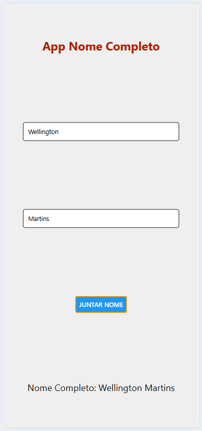

# Aula01

## Objetivo
- Revisar os conceitos de React Native e Expo.
- Desenvolver uma interface móvel simples utilizando os conhecimentos revisados.
- Aplicativo de nome completo, que leia o nome e sobrenome do usuário e exiba o nome completo na tela.

## React Native e Expo
- React Native é uma biblioteca/framework para construir aplicativos móveis usando JavaScript e React.
- Expo é uma plataforma que facilita o desenvolvimento de aplicativos React Native, fornecendo ferramentas e serviços para simplificar o processo.
---

### Passo a passo para iniciar um novo projeto React Native com expo

- 1 Navegue até a pasta onde deseja criar o projeto e abra com o VsCode: `code .`
- 2 Abra uma nova janela do terminal do VsCode **CTRL + '** ou **CTRL + SHIFT + `**
- 3 Certifique-se de que o Node.js, npm e expo estão instalados. Você pode verificar isso executando os seguintes comandos:
```bash
node -v
npm -v
```
- O expo pode ser instalado globalmente com o seguinte comando:
```bash
npm install -g expo-cli
```
- 4 Execute o comando para criar um novo projeto React Native:
```bash
npx create-expo-app@latest NomeDoSeuProjeto
```
 - 5 Após a criação do projeto, navegue até a pasta do projeto:
```bash
cd NomeDoSeuProjeto
```
- 6 Para executar o projeto, execute o comando:
```bash
npm start
```
- 7 Pode ser necessario instalar dependências adicionais para o React Native Web:
```bash
npm install -g expo-cli
npm install react-native-web --force
npm install react-dom -force
npx expo install @expo/metro-runtime
```
- 8 Para redefinir/limpar o projeto, execute o comando:
```bash
npm run reset-project
```
- 9 Agora você pode começar a desenvolver seu aplicativo React Native. Abra o arquivo `app/index.tsx` no diretório do seu projeto e comece a editar o código. As alterações serão refletidas automaticamente no emulador ou dispositivo conectado.

---

## Demonstração
- Crie um novo aplicativo React Native utilizando o Expo.
- Implemente uma tela que permita ao usuário inserir seu nome e sobrenome.
- index.tsx
```tsx
import { useState } from "react";
import { Text, View, Button } from "react-native";
import { StyleSheet } from "react-native";
import { TextInput } from "react-native-gesture-handler";

const styles = StyleSheet.create({
  container: {
    flex: 1,
    justifyContent: "space-around",
    alignItems: "center",
    backgroundColor: "#efefef",
  },
  title: {
    fontSize: 26,
    color: "#AA2200",
    fontWeight: "bold",
  },
  text: {
    fontSize: 20,
    color: "#121212",
  },
  input: {
    width: "80%",
    borderColor: "#000",
    borderWidth: 1,
    padding: 10,
    borderRadius: 5,
    backgroundColor: "#fff"
  }
});

export default function Index() {

  const [nome, setNome] = useState("");
  const [sobrenome, setSobrenome] = useState("");
  const [nomeCompleto, setNomeCompleto] = useState("");

  const juntarNome = () => {
    setNomeCompleto(nome + " " + sobrenome);
  }

  return (
    <View
      style={styles.container}
    >
      <Text style={styles.title}>App Nome Completo</Text>
      <TextInput
        placeholder="Digite primeiro nome"
        style={styles.input}
        value={nome}
        onChangeText={setNome}
      />
      <TextInput
        placeholder="Digite sobrenome"
        style={styles.input}
        value={sobrenome}
        onChangeText={setSobrenome}
      />
      <Button
        title="Juntar nome"
        onPress={juntarNome}
      />
      <Text style={styles.text}>Nome Completo: {nomeCompleto}</Text>
    </View>
  );
}
```
- Vamos remover a faixa de título no arquivo _layout.tsx
```tsx
import { Stack } from "expo-router";

export default function RootLayout() {
  return <Stack
    screenOptions={{
      headerShown: false,
    }}
  />;
}
```
|Resultados|
|:-:|
||