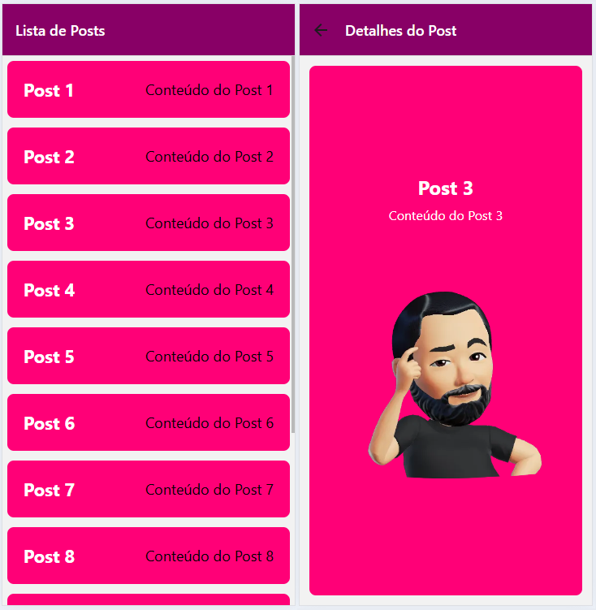

# Aula03 - Navegação entre telas - Expo-router

## Objetivos

- Compreender a importância da navegação em aplicativos móveis.
- Implementar a navegação entre diferentes telas em um aplicativo.

## Conteúdo

1. Introdução à navegação em aplicativos móveis
2. Tipos de navegação
   - Navegação em pilha
   - Navegação em abas
3. Implementação da navegação em um aplicativo
   - Configuração do ambiente
   - Criação de telas
   - Implementação da navegação

## Pilha de Navegação
Para começar, certifique-se de ter o Expo CLI instalado. Se ainda não o fez, você pode instalá-lo com o seguinte comando:

```bash
npm install -g expo-cli
```

Em seguida, crie um novo projeto React Native com o Expo, já na versão mais recente do Expo que possui o Expo-router integrado:

```bash
npx create-expo-app@latest listdets
cd listdets
npm run reset-project
```

#### Configuração do Expo-router
Acesse a pasta ./app do seu projeto e verá dois arquivos: `index.tsx` e `_layout.tsx`. O arquivo `_layout.tsx` é responsável por definir a estrutura de navegação do aplicativo.
- Vamos criar um layout básico com duas telas: uma para listar itens e outra para exibir detalhes.
- Edite o arquivo `_layout.tsx` para incluir as telas de lista e detalhes:

```tsx
import { Stack } from "expo-router";
import { StyleSheet } from "react-native";

const styles = StyleSheet.create({
  faixa: {
    backgroundColor: "#806",
  },
  texto: {
    color: "#fff",
  },
});

export default function Layout() {
  return <Stack
    screenOptions={{
      headerStyle: styles.faixa,
      headerTitleStyle: styles.texto,
    }}
  >
    <Stack.Screen name="index" options={{ title: "Lista de Posts" }} />
    <Stack.Screen name="detalhes" options={{ title: "Detalhes do Post" }} />

  </Stack>;
}

```
- Para dados de exemplo e simulação, crie um arquivo `assets/mockups/posts.ts` com o seguinte conteúdo:
```ts
export const posts = [
  { id: 1, title: 'Post 1', content: 'Conteúdo do Post 1', image: 'https://wellifabio.github.io/assets/avts/av1.webp' },
  { id: 2, title: 'Post 2', content: 'Conteúdo do Post 2', image: 'https://wellifabio.github.io/assets/avts/av2.webp' },
  { id: 3, title: 'Post 3', content: 'Conteúdo do Post 3', image: 'https://wellifabio.github.io/assets/avts/av3.webp' },
  { id: 4, title: 'Post 4', content: 'Conteúdo do Post 4', image: 'https://wellifabio.github.io/assets/avts/av4.webp' },
  { id: 5, title: 'Post 5', content: 'Conteúdo do Post 5', image: 'https://wellifabio.github.io/assets/avts/av5.webp' },
  { id: 6, title: 'Post 6', content: 'Conteúdo do Post 6', image: 'https://wellifabio.github.io/assets/avts/av6.webp' },
  { id: 7, title: 'Post 7', content: 'Conteúdo do Post 7', image: 'https://wellifabio.github.io/assets/avts/av1.webp' },
  { id: 8, title: 'Post 8', content: 'Conteúdo do Post 8', image: 'https://wellifabio.github.io/assets/avts/av2.webp' },
  { id: 9, title: 'Post 9', content: 'Conteúdo do Post 9', image: 'https://wellifabio.github.io/assets/avts/av3.webp' },
  { id: 10, title: 'Post 10', content: 'Conteúdo do Post 10', image: 'https://wellifabio.github.io/assets/avts/av4.webp' },
  { id: 11, title: 'Post 11', content: 'Conteúdo do Post 11', image: 'https://wellifabio.github.io/assets/avts/av5.webp' },
  { id: 12, title: 'Post 12', content: 'Conteúdo do Post 12', image: 'https://wellifabio.github.io/assets/avts/av6.webp' },
];
```

## Editando os arquivos de página
### Página de Lista (`app/index.tsx`)
```tsx
import { Text, View, FlatList, StyleSheet, TouchableOpacity } from "react-native";
import { posts } from "../assets/mockups/posts";
import { router } from "expo-router";

const styles = StyleSheet.create({
  container: {
    flex: 1,
    alignItems: "center",
    justifyContent: "center",
  },
  list: {
    width: "100%",
  },
  item: {
    flex: 1,
    flexDirection: "row",
    alignItems: "center",
    justifyContent: "space-between",
    padding: 20,
    margin: 6,
    borderRadius: 8,
    backgroundColor: "#f07",
  },
  title: {
    fontSize: 22,
    fontWeight: "bold",
    color: "#fff",
  },
  text: {
    fontSize: 18,
  },
});

export default function Index() {

  function abreDetalhes(id: number) {
    router.push(`/detalhes?id=${id}`);
  }

  return (
    <View style={styles.container}>
      <FlatList
        style={styles.list}
        data={posts}
        keyExtractor={(item) => item.id.toString()}
        renderItem={({ item }) => (
          <TouchableOpacity
            style={styles.item}
            onPress={() => abreDetalhes(item.id)}
          >
            <Text style={styles.title}>{item.title}</Text>
            <Text style={styles.text}>{item.content}</Text>
          </TouchableOpacity>
        )}
      />
    </View>
  );
}
```
### Página de Detalhes (`app/dets.tsx`)
```tsx
import { View, Text, Image, StyleSheet } from "react-native";
import { posts } from "../assets/mockups/posts";
import { useLocalSearchParams } from "expo-router";

const styles = StyleSheet.create({
    container: {
        flex: 1,
        padding: 16,
        backgroundColor: "#f07",
        borderRadius: 8,
        margin: 12,
        alignItems: "center",
        justifyContent: "center",
    },
    title: {
        fontSize: 24,
        fontWeight: "bold",
        marginBottom: 8,
        color: "#fff",
    },
    content: {
        fontSize: 16,
        marginBottom: 16,
        color: "#fff",
    },
    image: {
        width: "100%",
        height: "50%",
    },
});

export default function Detalhes() {
    const { id } = useLocalSearchParams();
    let index = posts.findIndex(
        (post) => post.id === Number(id));

    return (
        <View style={styles.container}>
            <Text style={styles.title}>{posts[index].title}</Text>
            <Text style={styles.content}>{posts[index].content}</Text>
            <Image
                source={{ uri: posts[index].image }}
                style={styles.image}
                resizeMode="cover"
            />
        </View>
    );
}

```

## Testando o Aplicativo na Web
Para testar o aplicativo na web, execute o seguinte comando no terminal:

```bash
npx expo start --web
```

## Atividades

- 1 **Lanches**
Crie um aplicativo de lista de lanches utilizando o Expo-router. O aplicativo deve ter uma tela inicial que exibe uma lista de lanches e, ao clicar em um lanche, deve navegar para uma tela de detalhes que exibe informações sobre o lanche selecionado.
    - Dados dos lanches, acrescente imagens de suculentos lanches nesta lista e exiba em detalhes:
    - Os ingredientes devem ser exibidos com flatlist

```tsx
export const lanches =[
    {
        "id": 1,
        "nome":"Hamburguer",
        "ingredientes": [
            "Pão",
            "Carne"
        ],
        "preco": 15.00
    },
    {
        "id": 2,
        "nome":"X-Burguer",
        "ingredientes":[
            "Pão",
            "Carne",
            "Queijo"
        ]
    },
    {
        "id": 3,
        "nome":"X-Salada",
        "ingredientes":[
            "Pão",
            "Carne",
            "Queijo",
            "Alface",
            "Tomate",
            "Cebola"
        ],
        "preco": 20.00
    },
    {
        "id": 4,
        "nome":"X-Bacon",
        "ingredientes":[
            "Pão",
            "Carne",
            "Queijo",
            "Bacon",
            "Alface",
            "Tomate"
        ],
        "preco": 25.00
    },
    {
        "id": 5,
        "nome":"X-Egg",
        "ingredientes":[
            "Pão",
            "Carne",
            "Queijo",
            "Alface",
            "Tomate",
            "Ovo"
        ],
        "preco": 30.00
    },
    {
        "id": 6,
        "nome":"X-Tudo",
        "ingredientes":[
            "Pão",
            "Carne",
            "Queijo",
            "Bacon",
            "Alface",
            "Tomate",
            "Ovo",
            "Cebola"
        ],
        "preco": 35.00
    }
]
```

## Entrega
Apenas mostre ao professor o aplicativo funcionando.