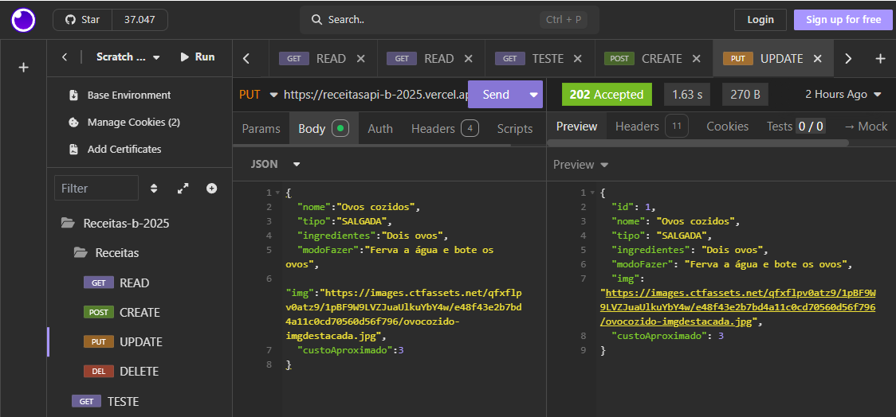
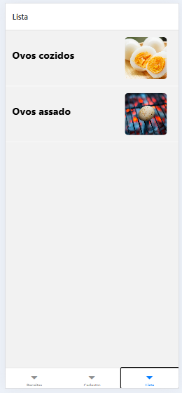

# Aula04 - Consumindo API
Consumir dados API local com Expo React Native e Axios.
## Demonstração
Vamos criar um App simples de livro de receitas com Expo
- Abrir uma nova pasta com o VsCode e digitar os comandos:
```bash
npm init -y
npm install express cors prisma dotenv
npx prisma init --datasource-provider mysql
```
## 1 Conrstuindo a API de receitas
Iniciar um projeto Node.js chamado **`receitasapi`** com **Prisma** para **MySQL** e criar um schema.prisma conforme abaixo:
```js
generator client {
  provider = "prisma-client-js"
}

datasource db {
  provider = "mysql"
  url      = env("DATABASE_URL")
}

enum Tipo {
  DOCE
  SALGADA
  BEBIDA
}

model Receita {
  id              Int     @id @default(autoincrement())
  nome            String
  tipo            Tipo
  ingredientes    String  @db.Text
  modoFazer       String @db.Text
  img             String?
  custoAproximado Float?
}
```
- Vamos usar a string de conexão com o Banco de dados `.env` a seguir:
```js
DATABASE_URL="mysql://root@localhost:3306/receitasapi?schema=public&timezone=UTC"
```
- Crie o arquivo `api/server.js` com o seguinte conteúdo:
```js
const express = require('express');
const cors = require('cors');
const routes = require('../src/routes');

const port = process.env.PORT || 3001;
const app = express();
app.use(express.json());
app.use(cors());
app.use(routes);

app.listen(port, (req, res) => {
    console.log('API respondendo em http://localhost:' + port)
});
```
- Implantar o Banco de dados e executar a API
```bash
npx prisma migrate dev --name init
npx prisma generate
npm run dev
```
- A execução vai apresentar erro pois faltam os arquivos de rota e controller.
- Criar o arquivo `src/routes.js` com o seguinte conteúdo:
```js
const express = require('express');
const router = express.Router();

router.get('/', async (req, res) => {
    const rotas = {
        receitasapi: '/',
        receitas: '/receitas',
    }
    res.json(rotas);
});

const Receita = require("./controllers/receita");

router.get('/receitas', Receita.getAll);
router.get('/receitas/:id', Receita.getById);
router.post('/receitas', Receita.post);
router.put('/receitas/:id', Receita.updateById);
router.delete('/receitas/:id', Receita.deleteById);

module.exports = router;
```
- Criar o controle de receitas `src/controllers/receita.js` com o seguinte conteúdo:
```js
const { PrismaClient } = require('@prisma/client');
const prisma = new PrismaClient();

const getAll = async (req, res) => {
    const receitas = await prisma.receita.findMany();
    res.json(receitas);
};

const getById = async (req, res) => {
    const { id } = req.params;
    const receita = await prisma.receita.findUnique({
        where: { id: Number(id) }
    });
    res.json(receita);
};

const post = async (req, res) => {
    try {
        const receita = await prisma.receita.create({
            data: req.body
        });
        res.status(201).json(receita);
    } catch (error) {
        console.error(error);
        res.status(400).json({ error: 'Verifique os dados enviados' });
    }
};


const updateById = async (req, res) => {
    try {
        const { id } = req.params;
        const receita = await prisma.receita.update({
            where: { id: Number(id) },
            data: req.body
        });
        res.status(202).json(receita);
    } catch (error) {
        console.error(error);
        res.status(400).json({ error: 'Verifique os dados enviados' });
    }
};

const deleteById = async (req, res) => {
    try {
        const { id } = req.params;
        await prisma.receita.delete({
            where: { id: Number(id) }
        });
        res.status(204).send();
    } catch (error) {
        console.error(error);
        res.status(400).json({ error: 'Verifique os dados enviados' });
    }
};

module.exports = {
    getAll,
    getById,
    post,
    updateById,
    deleteById
};
```
- Execute a API e faça os testes com **Insomnia** se quiser baixar os testes préconfigurados basta fazer download deste arquivo [insomnia.yaml](./Insomnia.yaml)
- 
- Após os testes locais implante a API em um serviço gratuito de sua escolha (ex: Vercel, Heroku etc)

## Implantando a API na Vercel

1. Crie um repositório no GitHub e faça o push do seu código.
2. Acesse o site da Vercel e crie uma conta (ou faça login).
3. Clique em "New Project" e importe seu repositório do GitHub.
4. Configure as variáveis de ambiente necessárias (como `DATABASE_URL`) nas configurações do projeto na Vercel.
5. Clique em "Deploy" e aguarde a Vercel construir e implantar sua API.
6. Após a implantação, você receberá uma URL onde sua API estará disponível.
    - Teste novamente com o Insomnia alterando as requisições para a nova URL da API.

#### Para a próxima atividade utilize sua API implantada ou [esta API](https://receitasapi-b-2025.vercel.app/) caso não tenha conseguido implantar a sua.


## Iniciando um novo aplicativo com Expo
Crie uma pasta e abra com **VS Code**.
1. Certifique-se de ter o Expo CLI instalado. Se não tiver, instale-o globalmente usando o seguinte comando:
```bash
npm install -g expo-cli
```
2. **Crie**, **acesse**, **limpe** e **execute**, um novo projeto Expo executando os seguintes comandos no terminal:
```bash
npx create-expo-app@latest receitasapp
cd receitasapp
npm run reset-project
npm start
```
5. Use o aplicativo **Expo Go** em seu dispositivo móvel para escanear o código QR exibido no terminal ou na **página da web**. Isso permitirá que você visualize seu aplicativo em seu dispositivo.
- Ou execute via Web pressionando **w**.

### Vamos criar três páginas
- Uma página principal de boas vindas
- Uma página para listar todas as receitas
- Uma página para criar uma nova receita

### Criar Componentes
Para acessar os dados da API, vamos criar um arquivo chamado `components/api.tsx` na pasta raiz com o seguinte conteúdo:
```js
//Variável typeScript com o endereço da API
const API_URL: string = "https://receitasapi-b-2025.vercel.app";

// Função para buscar receitas
export async function listarReceitas(): Promise<any> {
    const response = await fetch(`${API_URL}/receitas`);
    return response.json();
}

// Função para adicionar uma nova receita
export async function criarReceita(receita: any): Promise<any> {
    const response = await fetch(`${API_URL}/receitas`, {
        method: "POST",
        headers: {
            "Content-Type": "application/json",
        },
        body: JSON.stringify(receita),
    });
    return response.json();
}
```
- `styles.tsx`
```tsx
import { StyleSheet } from "react-native";

const styles = StyleSheet.create({
    container: {
        flex: 1,
        justifyContent: "center",
        alignItems: "center",
    },
    lista: {
        width: "100%",
    },
    title: {
        fontSize: 24,
        fontWeight: "bold",
        marginBottom: 16,
    },
    receitaItem: {
        flexDirection: "row",
        alignItems: "center",
        justifyContent: "space-between",
        padding: 16,
        borderBottomWidth: 1,
        borderBottomColor: "#fff",
    },
    thumbnail: {
        width: 100,
        height: 100,
        borderRadius: 8,
        marginRight: 12,
    },
});

export default styles;
```
- Na pasta `app`, crie os três arquivos index.tsx, lista.tsx e cadastro.tsx com o seguinte conteúdo:
    - lista.tsx
```tsx
import { Text, View, TouchableOpacity, Image, FlatList } from "react-native";
import React, { useEffect, useState } from "react";
import styles from "../components/styles";
import { listarReceitas } from "@/components/api";

export default function Index() {
  const [receitas, setReceitas] = useState<any[]>([]);

  useEffect(() => {
    listarReceitas().then((data) => setReceitas(data));
  }, []);

  return (
    <View style={styles.container}>
      <FlatList
        style={styles.lista}
        data={receitas}
        keyExtractor={(item) => item.id.toString()}
        renderItem={({ item }) => (
          <TouchableOpacity style={styles.receitaItem}>
            <Text style={styles.title}>{item.nome}</Text>
            <Image source={{ uri: item.img }} style={styles.thumbnail} />
          </TouchableOpacity>
        )}
      />
    </View>
  );
}
```
- Os outros dois arquivos deixe em branco por enquanto.
- Edite o arquivo `layout.tsx` para tabular as páginas.
```tsx
import { Tabs } from "expo-router";

export default function RootLayout() {
  return <Tabs>
    <Tabs.Screen name="index" options={{ title: "Receitas" }} />
    <Tabs.Screen name="cadastro" options={{ title: "Cadastro" }} />
    <Tabs.Screen name="lista" options={{ title: "Lista" }} />
  </Tabs>;
}
```
#### resultado parcial


### Atividade
- [ ] Implemente a página de cadastro de receitas.
- [ ] Coloque ícones nas abas de navegação.
- [ ] Implemente a página de detalhes da receita que mostre a foto maior, os ingredientes e modo de preparo, em **"stack"** (pilha) de navegação.

#### Entrega
Apenas mostre a um dos instrutores o resultado no seu notebook.
Após concluir, trabalhe em seu TCC preparando a API para produção e iniciando seu App.

#### [Solução](https://github.com/wellifabio/receitasapp-expo-2025.git)