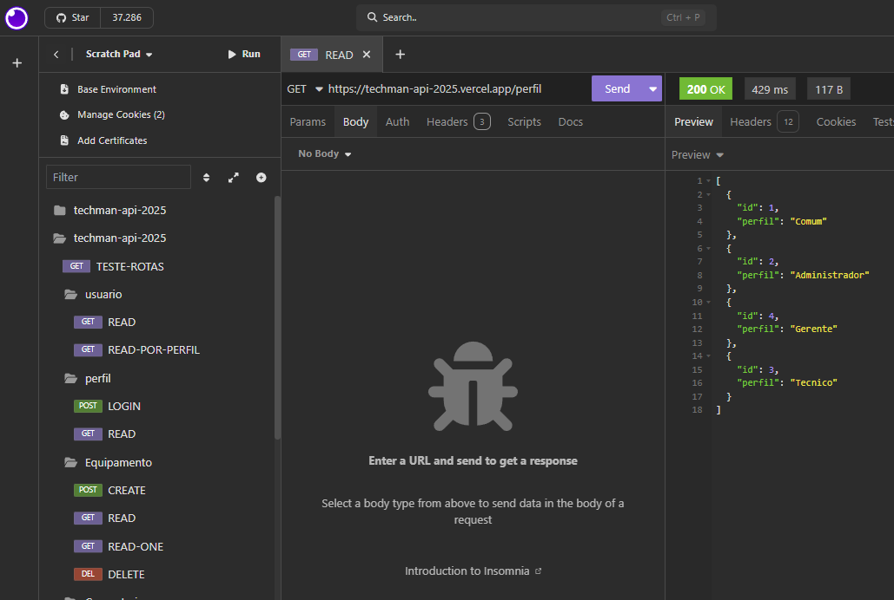
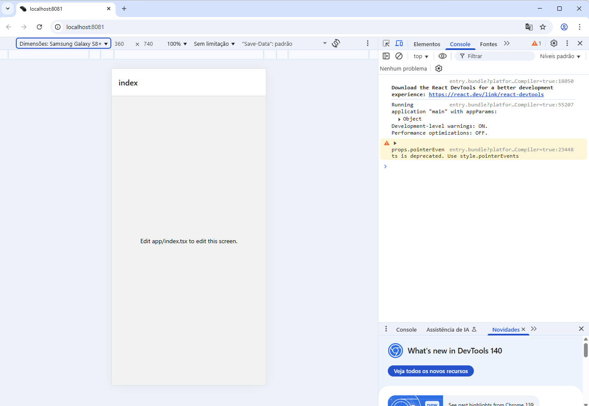
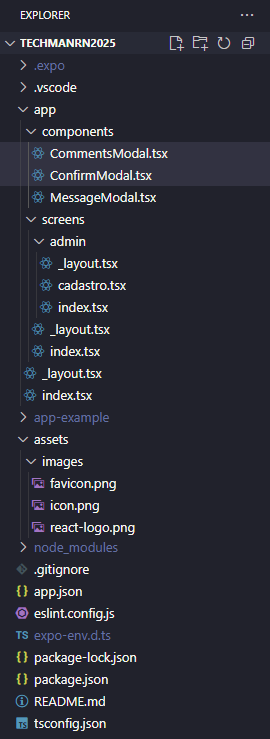
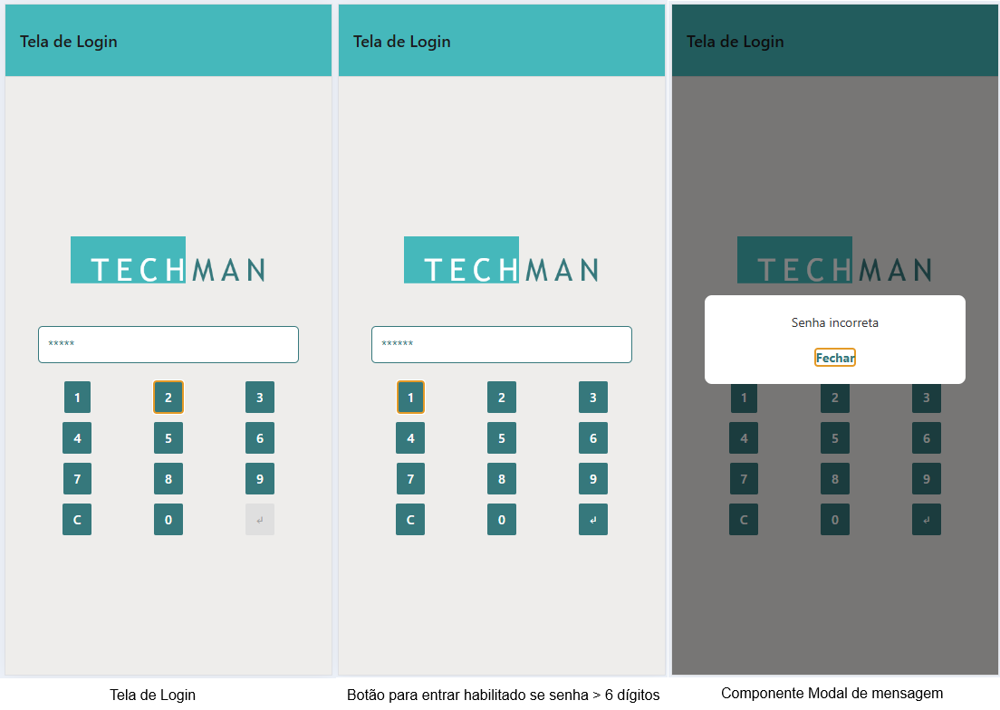
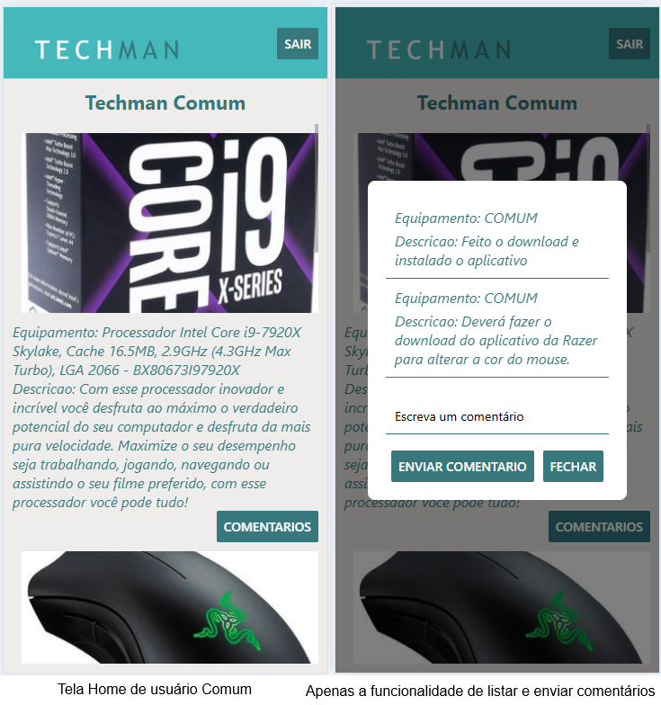
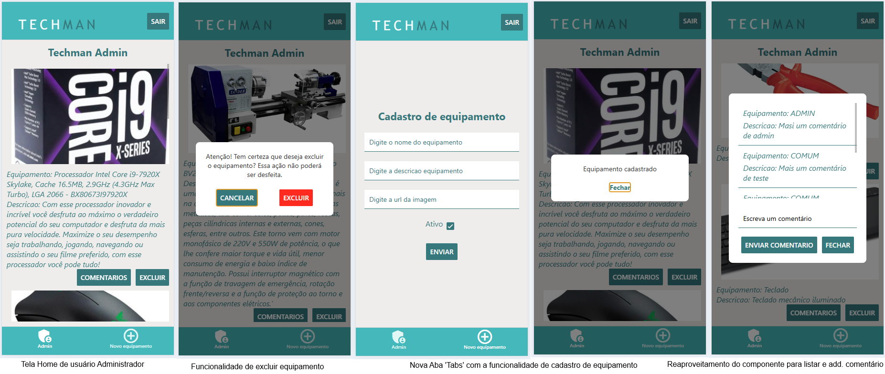

# Aula05 - Consumindo APIs e Componentização em React Native com Expo
## Expo e React Native
### Ambiente
- Node.js
- Expo CLI
- React Native
- Insomnia (ou Postman)
- VsCode
- git-bash

### Objetivo
Nesta aula, você aprenderá a consumir APIs em um aplicativo React Native usando o Expo. Você verá como fazer requisições HTTP para obter dados de uma API e exibi-los na interface do usuário e como criar componentes reutilizáveis para organizar melhor o código do seu aplicativo.

### Demonstração
- Antes de iniciar a implementação do App, importe no Insomnia a coleção `./insomnia.yaml` para testar as requisições da API que você irá consumir.
- 
- API: https://techman-api-2025.vercel.app/

### Passo a passo
- 0 Abra o **git-bash** em sua área de trabalho e dê os comandos a seguir para criar um novo projeto **React Native com Expo**: Certifique-se de ter o Expo CLI instalado. Se ainda não o fez, você pode instalá-lo com o seguinte comando:
```bash
npm install -g expo-cli
```
- 1 Crie um novo projeto React Native com o Expo, já na versão mais recente do Expo que possui o **Expo-router** integrado:
```bash
npx create-expo-app@latest techmanrn2025
cd techmanrn2025
npm run reset-project
code .
```
- 2 Após abrir com o **VsCode**, abra um terminal **CMD** ou **bash** e execute o projeto com:
```bash
npm start
```
Isso abrirá o Expo Dev Tools em seu navegador. Você pode escanear o código QR com o aplicativo Expo Go em seu dispositivo móvel ou usar um emulador para visualizar o aplicativo ou executar na web pressionando a tecla `w`.

- 3 Agora, vamos criar a estrutura de pastas para organizar melhor nosso projeto. No diretório `app` crie as seguintes subpastas:
  - `components`: para armazenar os componentes reutilizáveis.
  - `screens`: para armazenar as telas home do aplicativo.
  - `screens/admin`: para armazenar as telas home do admin do aplicativo.
- Fora da pasta `app`, na pasta `assets/images` exclua as imagens presentes do react e salve as que estão neste repositório.
    - `favicon.png`
    - `icon.png`
    - `react-logo.png`
- A estrutura do projeto deve ficar assim:
- 
- 4 Vamos criar o componente `MessageModal.tsx` na pasta `components`. Este componente será usado para exibir mensagens em um modal.
- Crie o arquivo `MessageModal.tsx` dentro da pasta `components` e adicione o seguinte código:
```tsx
import React from 'react';
import { Modal, Pressable, StyleSheet, Text, View } from 'react-native';

type Props = {
    visible: boolean;
    message: string | null;
    onClose: () => void;
    title?: string;
};

const styles = StyleSheet.create({
    modalOverlay: {
        flex: 1,
        backgroundColor: 'rgba(0,0,0,0.5)',
        justifyContent: 'center',
        alignItems: 'center',
    },
    modalBox: {
        width: '80%',
        backgroundColor: '#fff',
        padding: 20,
        borderRadius: 8,
        alignItems: 'center',
    },
    modalTitle: {
        fontSize: 18,
        fontWeight: 'bold',
        marginBottom: 8,
    },
    modalText: {
        marginBottom: 12,
        color: '#333',
    },
    modalClose: {
        marginTop: 8,
    }
});

export default function MessageModal({ visible, message, onClose, title }: Props) {
    return (
        <Modal
            visible={visible}
            transparent={true}
            animationType="fade"
            onRequestClose={onClose}
        >
            <View style={styles.modalOverlay}>
                <View style={styles.modalBox}>
                    {title ? <Text style={styles.modalTitle}>{title}</Text> : null}
                    <Text style={styles.modalText}>{message}</Text>
                    <Pressable style={styles.modalClose} onPress={onClose}>
                        <Text style={{ color: '#35797d', fontWeight: 'bold' }}>Fechar</Text>
                    </Pressable>
                </View>
            </View>
        </Modal>
    );
}
```
- 5 Vamos criar o componente modal de confirmação. Este componente será usado para exibir uma confirmação em um modal.
- Crie o arquivo `ConfirmModal.tsx` dentro da pasta `components` e adicione o seguinte código:
```tsx
import React from 'react';
import { Button, Modal, StyleSheet, Text, View } from 'react-native';

type Props = {
  visible: boolean;
  message: string;
  onConfirm: () => void;
  onCancel: () => void;
  confirmText?: string;
  cancelText?: string;
  confirmColor?: string;
};

const styles = StyleSheet.create({
  modalOverlay: {
    flex: 1,
    backgroundColor: 'rgba(0,0,0,0.5)',
    justifyContent: 'center',
    alignItems: 'center',
  },
  modalBox: {
    width: '80%',
    backgroundColor: '#fff',
    padding: 20,
    borderRadius: 8,
    alignItems: 'center',
  },
  modalText: {
    marginBottom: 12,
    color: '#333',
    textAlign: 'center',
  },
  botoes: {
    width: '100%',
    flexDirection: 'row',
    justifyContent: 'space-around',
    marginTop: 10,
  }
});

export default function ConfirmModal({ visible, message, onConfirm, onCancel, confirmText = 'Excluir', cancelText = 'Cancelar', confirmColor = '#ff0000' }: Props) {
  return (
    <Modal
      visible={visible}
      transparent={true}
      animationType="fade"
      onRequestClose={onCancel}
    >
      <View style={styles.modalOverlay}>
        <View style={styles.modalBox}>
          <Text style={styles.modalText}>{message}</Text>
          <View style={styles.botoes}>
            <Button color="#35797d" title={cancelText} onPress={onCancel} />
            <Button color={confirmColor} title={confirmText} onPress={onConfirm} />
          </View>
        </View>
      </View>
    </Modal>
  );
}
```
- 6 Por fim vamos criar um componente para listar e adicionar comentários que será usado na tela home do app tanto por usuários comuns quanto por administradores.
- Crie o arquivo `CommentsModal.tsx` dentro da pasta `components` e adicione o seguinte código:
```tsx
import React from 'react';
import { Button, FlatList, Modal, StyleSheet, Text, TextInput, View } from 'react-native';

type Comment = {
    id?: number;
    perfil?: number;
    comentario?: string;
};

type Props = {
    visible: boolean;
    comentarios: Comment[] | null;
    comentarioValue: string;
    onChangeComentario: (text: string) => void;
    onSend: () => void;
    onClose: () => void;
};

const styles = StyleSheet.create({
    modalOverlay: {
        flex: 1,
        backgroundColor: 'rgba(0,0,0,0.5)',
        justifyContent: 'center',
        alignItems: 'center',
    },
    modalBox: {
        width: '80%',
        backgroundColor: '#fff',
        padding: 20,
        borderRadius: 8,
        alignItems: 'center',
        gap: 10,
    },
    list: {
        width: '100%',
        maxHeight: 200,
        marginBottom: 12,
    },
    input: {
        width: '100%',
        borderBottomColor: '#35797d',
        borderBottomWidth: 1,
        padding: 10,
        backgroundColor: '#fff',
        color: '#000',
        marginBottom: 8,
    },
    texto: {
        fontSize: 16,
        fontStyle: 'italic',
        color: '#35797d',
    },
    descricao: {
        fontSize: 16,
        fontStyle: 'italic',
        color: '#35797d',
    }
});

export default function CommentsModal({ visible, comentarios, comentarioValue, onChangeComentario, onSend, onClose }: Props) {
    return (
        <Modal visible={visible} transparent animationType="fade" onRequestClose={onClose}>
            <View style={styles.modalOverlay}>
                <View style={styles.modalBox}>
                    <FlatList
                        style={styles.list}
                        data={comentarios}
                        keyExtractor={(item, index) => String(item?.id ?? index)}
                        renderItem={({ item }) => (
                            <View style={{borderBottomColor:'#35797d', borderBottomWidth:1, gap:5, padding:10}}>
                                <Text style={styles.texto}>Equipamento: {item?.perfil == 2 ? 'ADMIN' : 'COMUM'}</Text>
                                <Text style={styles.descricao}>Descricao: {item?.comentario}</Text>
                            </View>
                        )}
                    />
                    <TextInput
                        placeholder="Escreva um comentário"
                        style={styles.input}
                        value={comentarioValue}
                        onChangeText={onChangeComentario}
                    />
                    <View style={{flexDirection:'row', gap:10}}>
                        <Button color="#35797d" title="Enviar comentario" onPress={onSend} />
                        <Button color="#35797d" title="Fechar" onPress={onClose} />
                    </View>
                </View>
            </View>
        </Modal>
    );
}
```
- 7 Agora vamos criar a tela de login do aplicativo na pasta raíz `app`. Para isso edite o arquivo `app/_layout.tsx` para o seguinte código:
```tsx
import AsyncStorage from '@react-native-async-storage/async-storage';
import { Stack, router } from "expo-router";
import { Button, Image, StyleSheet, View } from "react-native";

const styles = StyleSheet.create({
  faixa: {
    backgroundColor: "#44babc",
    height: 80,
  },
  imagem: {
    width: 180,
    height: 50,
  },
});

export default function Layout() {

  function sair() {
    AsyncStorage.removeItem('perfil')
      .then(perf => router.replace('/'))
      .catch(err => console.error('error reading perfil from storage', err));
  }

  return <Stack
    screenOptions={{
      headerStyle: styles.faixa,
    }}
  >
    <Stack.Screen name="index" options={{ title: "Tela de Login" }} />
    <Stack.Screen name="screens" options={{
      headerTitle: () => (
        <Image style={styles.imagem} source={require('../assets/images/react-logo.png')} resizeMode="contain" />
      ),
      headerRight: () => (
        <View style={{ marginRight: 10 }}>
          <Button
            color="#35797d"
            title="Sair"
            onPress={sair}
          />
        </View>
      )
    }} />

  </Stack>;
}
```
- Isso cria uma **pilha de navegação** com uma barra de cabeçalho personalizada que inclui o **logotipo** do Aplicativo e um botão **"Sair"** que limpa o perfil armazenado e redireciona para a tela de login.
- Repare que será necessário instalar o AsyncStorage para armazenar o perfil do usuário. No terminal, execute:
```bash
npm i @react-native-async-storage/async-storage
# ou
npx expo install @react-native-async-storage/async-storage
```
- Em seguida, edite o arquivo `app/index.tsx` para o seguinte código:
```tsx
import AsyncStorage from "@react-native-async-storage/async-storage";
import { router } from "expo-router";
import { useEffect, useState } from "react";
import { Button, Image, StyleSheet, TextInput, View } from "react-native";
import MessageModal from './components/MessageModal';

const styles = StyleSheet.create({
  conteiner: {
    backgroundColor: "#eeedeb",
    flex: 1,
    alignItems: 'center',
    justifyContent: 'center',
    gap: 10,
  },
  imagem: {
    width: '60%',
    height: 100,
    margin: 10
  },
  input: {
    width: "80%",
    borderColor: "#35797d",
    borderWidth: 1,
    padding: 10,
    borderRadius: 5,
    backgroundColor: "#fff",
    color: "#35797d",
  },
  grade: {
    width: '80%',
    flexDirection: 'row',
    flexWrap: 'wrap',
    justifyContent: 'space-between',
    marginTop: 10,
  }
  ,
  cell: {
    width: '30%',
    marginBottom: 10,
    alignItems: 'center',
    justifyContent: 'center',
  }
  ,
  modalOverlay: {
    flex: 1,
    backgroundColor: 'rgba(0,0,0,0.5)',
    justifyContent: 'center',
    alignItems: 'center',
  },
  modalBox: {
    width: '80%',
    backgroundColor: '#fff',
    padding: 20,
    borderRadius: 8,
    alignItems: 'center',
  },
  modalText: {
    marginBottom: 12,
    color: '#333',
  },
  modalClose: {
    marginTop: 8,
  }
});

export default function Index() {
  const url = "https://techman-api-2025.vercel.app/login"
  const [senha, setSenha] = useState("");
  const [asteriscos, setAsteriscos] = useState("");
  const [modalVisible, setModalVisible] = useState(false);
  const [modalMessage, setModalMessage] = useState("");

  useEffect(() => {
    AsyncStorage.getItem('perfil')
      .then((perf) => {
        if (perf != null) {
          const perfil = isNaN(Number(perf)) ? perf : Number(perf);
          if (perfil == 2) {
            router.replace('/screens/admin');
          } else
            router.replace('/screens');
        } else {
          console.log('perfil não encontrado');
        }
      })
      .catch(err => console.error('error reading perfil from storage', err));
  }, []);

  function press(val: String) {
    if (val == 'C') {
      setSenha("");
      setAsteriscos("");
    } else {
      setSenha(senha + val);
      setAsteriscos(asteriscos + '*');
    }
  }

  function login() {
    const options = {
      method: 'POST',
      headers: { 'Content-Type': 'application/json' },
      body: JSON.stringify({ senha })
    };

    fetch(url, options)
      .then(response => response.json())
      .then(response => {
        if (response != 'Senha incorreta') {
          AsyncStorage.setItem('perfil', String(response.perfil)).catch(err => console.error(err));
          if (response.perfil == 2) {
            router.replace('/screens/admin');
          } else
            router.replace('/screens');
        } else {
          setModalMessage(response);
          setModalVisible(true);
        }
      })
  }

  return (
    <View
      style={styles.conteiner}
    >
      <Image style={styles.imagem} source={require('../assets/images/react-logo.png')} resizeMode="contain" />
      <TextInput
        placeholder="Digite a senha"
        style={styles.input}
        editable={false}
        value={asteriscos}
      />
      <View style={styles.grade}>
        <View style={styles.cell}><Button color="#35797d" title=" 1 " onPress={() => press('1')} /></View>
        <View style={styles.cell}><Button color="#35797d" title=" 2 " onPress={() => press('2')} /></View>
        <View style={styles.cell}><Button color="#35797d" title=" 3 " onPress={() => press('3')} /></View>
        <View style={styles.cell}><Button color="#35797d" title=" 4 " onPress={() => press('4')} /></View>
        <View style={styles.cell}><Button color="#35797d" title=" 5 " onPress={() => press('5')} /></View>
        <View style={styles.cell}><Button color="#35797d" title=" 6 " onPress={() => press('6')} /></View>
        <View style={styles.cell}><Button color="#35797d" title=" 7 " onPress={() => press('7')} /></View>
        <View style={styles.cell}><Button color="#35797d" title=" 8 " onPress={() => press('8')} /></View>
        <View style={styles.cell}><Button color="#35797d" title=" 9 " onPress={() => press('9')} /></View>
        <View style={styles.cell}><Button color="#35797d" title=" C " onPress={() => press('C')} /></View>
        <View style={styles.cell}><Button color="#35797d" title=" 0 " onPress={() => press('0')} /></View>
        <View style={styles.cell}>
          <Button color="#35797d" title=" ↵ " onPress={() => login()} disabled={senha.length < 6} />
        </View>
      </View>
      <MessageModal
        visible={modalVisible}
        message={modalMessage}
        onClose={() => setModalVisible(false)}
      />
    </View>
  );
}
```
- Esta tela de login apresenta um teclado numérico para o usuário inserir a senha. Quando a senha é inserida, ela é armazenada no estado `senha`, e a versão com asteriscos é armazenada no estado `asteriscos` para exibição. Ao pressionar o botão de login, uma requisição POST é feita para a API de login. Se a resposta indicar sucesso, o perfil do usuário é armazenado no **AsyncStorage** e o usuário é redirecionado para a tela apropriada com base em seu perfil. Se a senha estiver incorreta, uma mensagem de erro é exibida em um modal.
- 
- *Caso queira testar a tela de login, comente e altere para `console.log()` as linhas que estão apresentando erro pois não criamos as telas ainda. um usuário comum tem a senha `111111` e um administrador tem a senha `212121`. Não esqueça de descomentar e remover os console.log() para prosseguir.*
- 8 Agora vamos criar a tela home do aplicativo para usuários comuns. Crie o arquivo `_layout.tsx` dentro da pasta `screens` e adicione o seguinte código:
```tsx
import { Stack } from "expo-router";

export default function Layout() {
  return <Stack
    screenOptions={{
      headerShown: false
    }}>
    <Stack.Screen name="index" />
    <Stack.Screen name="admin" />
  </Stack>;
}
```
- Em seguida, crie o arquivo `index.tsx` dentro da pasta `screens` e adicione o seguinte código:
```tsx
import AsyncStorage from "@react-native-async-storage/async-storage";
import { router } from "expo-router";
import { useEffect, useState } from "react";
import { Button, FlatList, Image, StyleSheet, Text, View } from "react-native";
import CommentsModal from '../components/CommentsModal';

const styles = StyleSheet.create({
  conteiner: {
    backgroundColor: "#eeedeb",
    flex: 1,
    alignItems: 'center',
    justifyContent: 'center',
    gap: 10,
    padding: 10,
  },
  titulo: {
    fontSize: 22,
    fontWeight: 'bold',
    color: "#35797d",
  },
  texto: {
    fontSize: 16,
    fontStyle: 'italic',
    color: "#35797d",
  },
  descricao: {
    fontSize: 16,
    fontStyle: 'italic',
    color: "#35797d",
  },
  list: {
    flex: 1,
    width: "100%",
    gap: 10,
  },
  item: {
    flex: 1,
    flexDirection: "row",
    alignItems: "center",
    justifyContent: "space-between",
    margin: 6,
    padding: 20,
    backgroundColor: "#f9c",
    borderRadius: 8,
    marginBottom: 10,
  },
  imagem: {
    width: "100%",
    height: 200,
    margin: 10,
  },
  botoes: {
    width: "100%",
    flex: 1,
    flexDirection: "row",
    justifyContent: 'flex-end',
    gap: 10
  },
  modalOverlay: {
    flex: 1,
    backgroundColor: 'rgba(0,0,0,0.5)',
    justifyContent: 'center',
    alignItems: 'center',
  },
  modalBox: {
    width: '80%',
    backgroundColor: '#fff',
    padding: 20,
    borderRadius: 8,
    alignItems: 'center',
  },
  modalText: {
    marginBottom: 12,
    color: '#333',
  },
  modalClose: {
    marginTop: 8,
  },
  input: {
    width: "80%",
    borderColor: "#35797d",
    borderWidth: 1,
    padding: 10,
    borderRadius: 5,
    backgroundColor: "#fff",
    color: "#35797d",
  },
});

export default function Index() {
  const url = "https://techman-api-2025.vercel.app/"
  const [equipamentos, setEquipamentos] = useState(null);
  const [equipamento, setEquipamento] = useState(0);
  const [modalVisible, setModalVisible] = useState(false);
  const [comentarios, setComentarios] = useState(null);
  const [comentario, setComentario] = useState("");
  const [perfil, setPerfil] = useState(0);

  useEffect(() => {
    AsyncStorage.getItem('perfil')
      .then((perf) => {
        if (perf != null) {
          setPerfil(isNaN(Number(perf)) ? 0 : Number(perf));
        } else {
          router.replace('/');
        }
      })
      .catch(err => console.error('error reading perfil from storage', err));
    loadEquipamentos();
  }, []);

  function loadEquipamentos() {
    fetch(url + "equipamento")
      .then(response => response.json())
      .then(response => setEquipamentos(response))
      .catch(err => console.error(err));
  }

  function exibirComentario(equip: number) {
    setEquipamento(equip);
    fetch(url + "comentario/equipamento/" + equip)
      .then(response => response.json())
      .then(response => {
        setComentarios(response);
        setModalVisible(true);
      })
      .catch(err => console.error(err));
  }

  function enviarComentario() {
    if (comentario.length > 0) {
      const options = {
        method: 'POST',
        headers: { 'Content-Type': 'application/json' },
        body: `{"equipamento":${equipamento},"comentario":"${comentario}","perfil":${perfil}}`
      };
      fetch(url + 'comentario', options)
        .then(response => response.status)
        .then(response => {
          if (response == 201) {
            setModalVisible(false);
            setComentario("");
          } else console.log(response);
        })
        .catch(err => console.error(err));
    }
  }

  return (
    <View
      style={styles.conteiner}
    >
      <Text style={styles.titulo}>Techman Comum</Text>
      <FlatList
        style={styles.list}
        data={equipamentos}
        renderItem={({ item }) => (<View>
          <Image style={styles.imagem} source={item.imagem.slice(0, 3) == 'htt' ? item.imagem : 'https://github.com/wellifabio/techman-web-2025/blob/main/assets/' + item.imagem + '?raw=true'} />
          <Text style={styles.texto}>Equipamento: {item.equipamento}</Text>
          <Text style={styles.descricao}>Descricao: {item.descricao}</Text>
          <View style={styles.botoes}>
            <Button color="#35797d" title="Comentarios" onPress={() => exibirComentario(item.id)} />
          </View>
        </View>)}
      />
      <CommentsModal
        visible={modalVisible}
        comentarios={comentarios}
        comentarioValue={comentario}
        onChangeComentario={setComentario}
        onSend={enviarComentario}
        onClose={() => setModalVisible(false)}
      />
    </View>
  );
}
```
- Esta tela exibe uma lista de equipamentos obtidos da API. Cada equipamento tem um botão "Comentários" que, quando pressionado, abre um modal exibindo os comentários associados a esse equipamento. Os usuários podem adicionar novos comentários através do modal.
- 
- 9 Agora vamos criar a tela home do aplicativo para administradores. Crie o arquivo `_layout.tsx` dentro da pasta `screens/admin` e adicione o seguinte código:
```tsx
import { MaterialIcons } from '@expo/vector-icons';
import { Tabs } from "expo-router";
import { StyleSheet } from "react-native";

const styles = StyleSheet.create({
  faixa: {    
    backgroundColor: "#44babc",
    height: 60,
  },
});

export default function Layout() {
  return <Tabs
    screenOptions={{
      headerShown: false,
      tabBarStyle: styles.faixa,
      tabBarActiveTintColor: '#fff',
      tabBarInactiveTintColor: '#e0f7f6',
    }}>
    <Tabs.Screen name="index" options={{ title: "Admin", tabBarIcon: ({ color }) => (<MaterialIcons name="admin-panel-settings" size={36} color={color} />) }} />
    <Tabs.Screen name="cadastro" options={{ title: "Novo equipamento", tabBarIcon: ({ color }) => (<MaterialIcons name="add-circle-outline" size={36} color={color} />) }} />
  </Tabs>;
}
```
- Este código cria uma navegação por abas com duas abas: "Admin" e "Novo equipamento". Cada aba tem um ícone correspondente.
- Em seguida, crie o arquivo `index.tsx` dentro da pasta `screens/admin` e adicione o seguinte código:
```tsx
import AsyncStorage from "@react-native-async-storage/async-storage";
import { useFocusEffect } from '@react-navigation/native';
import { router } from "expo-router";
import { useCallback, useEffect, useState } from "react";
import { Button, FlatList, Image, StyleSheet, Text, View } from "react-native";
import CommentsModal from '../../../app/components/CommentsModal';
import ConfirmModal from '../../../app/components/ConfirmModal';

const styles = StyleSheet.create({
  conteiner: {
    backgroundColor: "#eeedeb",
    flex: 1,
    alignItems: 'center',
    justifyContent: 'center',
    gap: 10,
    padding: 10,
  },
  titulo: {
    fontSize: 22,
    fontWeight: 'bold',
    color: "#35797d",
  },
  texto: {
    fontSize: 16,
    fontStyle: 'italic',
    color: "#35797d",
  },
  descricao: {
    fontSize: 16,
    fontStyle: 'italic',
    color: "#35797d",
  },
  list: {
    flex: 1,
    width: "100%",
    gap: 10,
  },
  item: {
    flex: 1,
    flexDirection: "row",
    alignItems: "center",
    justifyContent: "space-between",
    margin: 6,
    padding: 20,
    backgroundColor: "#f9c",
    borderRadius: 8,
    marginBottom: 10,
  },
  imagem: {
    width: "100%",
    height: 200,
    margin: 10,
  },
  botoes: {
    width: "100%",
    flex: 1,
    flexDirection: "row",
    justifyContent: 'flex-end',
    gap: 10
  },
  modalOverlay: {
    flex: 1,
    backgroundColor: 'rgba(0,0,0,0.5)',
    justifyContent: 'center',
    alignItems: 'center',
  },
  modalBox: {
    width: '80%',
    backgroundColor: '#fff',
    padding: 20,
    borderRadius: 8,
    alignItems: 'center',
  },
  modalText: {
    marginBottom: 12,
    color: '#333',
  },
  modalClose: {
    marginTop: 8,
  },
  input: {
    width: "80%",
    borderColor: "#35797d",
    borderWidth: 1,
    padding: 10,
    borderRadius: 5,
    backgroundColor: "#fff",
    color: "#35797d",
  },
});

export default function Admin() {
  const url = "https://techman-api-2025.vercel.app/"
  const [equipamentos, setEquipamentos] = useState(null);
  const [equipamento, setEquipamento] = useState(0);
  const [modalVisible, setModalVisible] = useState(false);
  const [comentarios, setComentarios] = useState(null);
  const [comentario, setComentario] = useState("");
  const [modalExcluirVisible, setModalExcluirVisible] = useState(false);
  const [idEquip, setIdEquip] = useState(0);
  const [perfil, setPerfil] = useState(0);

  useFocusEffect(
    useCallback(() => {
      loadEquipamentos(); // sua função que faz fetch e atualiza estado
    }, [])
  );

  useEffect(() => {
    AsyncStorage.getItem('perfil')
      .then((perf) => {
        if (perf != null) {
          const p = isNaN(Number(perf)) ? 0 : Number(perf);
          setPerfil(p);
          if (p != 2) {
            router.replace('/');
          }
        } else {
          router.replace('/');
        }
      })
      .catch(err => console.error('error reading perfil from storage', err));
    loadEquipamentos();
  }, []);

  function loadEquipamentos() {
    fetch(url + "equipamento")
      .then(response => response.json())
      .then(response => setEquipamentos(response))
      .catch(err => console.error(err));
  }

  function exibirComentario(equip: number) {
    setEquipamento(equip);
    fetch(url + "comentario/equipamento/" + equip)
      .then(response => response.json())
      .then(response => {
        setComentarios(response);
        setModalVisible(true);
      })
      .catch(err => console.error(err));
  }

  function enviarComentario() {
    if (comentario.length > 0) {
      const options = {
        method: 'POST',
        headers: { 'Content-Type': 'application/json' },
        body: `{"equipamento":${equipamento},"comentario":"${comentario}","perfil":${perfil}}`
      };
      fetch(url + 'comentario', options)
        .then(response => response.status)
        .then(response => {
          if (response == 201) {
            setModalVisible(false);
            setComentario("");
          } else console.log(response);
        })
        .catch(err => console.error(err));
    }
  }

  function excluir() {
    const options = { method: 'DELETE' };

    fetch(url + 'equipamento/' + idEquip, options)
      .then(response => response.status)
      .then(response => {
        if (response == 200)
          loadEquipamentos();
        else
          console.log(response)
      })
      .catch(err => console.error(err));
  }

  return (
    <View
      style={styles.conteiner}
    >
      <Text style={styles.titulo}>Techman Admin</Text>
      <FlatList
        style={styles.list}
        data={equipamentos}
        renderItem={({ item }) => (<View>
          <Image style={styles.imagem} source={item.imagem.slice(0, 3) == 'htt' ? item.imagem : 'https://github.com/wellifabio/techman-web-2025/blob/main/assets/' + item.imagem + '?raw=true'} />
          <Text style={styles.texto}>Equipamento: {item.equipamento}</Text>
          <Text style={styles.descricao}>Descricao: {item.descricao}</Text>
          <View style={styles.botoes}>
            <Button color="#35797d" title="Comentarios" onPress={() => exibirComentario(item.id)} />
            <Button color="#35797d" title="Excluir" onPress={() => { setIdEquip(item.id); setModalExcluirVisible(true) }} />
          </View>
        </View>)}
      />
      <CommentsModal
        visible={modalVisible}
        comentarios={comentarios}
        comentarioValue={comentario}
        onChangeComentario={setComentario}
        onSend={enviarComentario}
        onClose={() => setModalVisible(false)}
      />
      <ConfirmModal
        visible={modalExcluirVisible}
        message={'Atenção! Tem certeza que deseja excluir o equipamento? Essa ação não poderá ser desfeita.'}
        onCancel={() => setModalExcluirVisible(false)}
        onConfirm={() => { setModalExcluirVisible(false); excluir(); }}
        confirmText={'Excluir'}
        cancelText={'Cancelar'}
      />
    </View>
  );
}
```
- Esta tela é semelhante à tela de usuário comum, mas inclui um botão "Excluir" para cada equipamento. Quando o botão é pressionado, um modal de confirmação é exibido. Se o administrador confirmar a exclusão, uma requisição DELETE é feita para a API para remover o equipamento.
- 10 Por fim, crie o arquivo `cadastro.tsx` dentro da pasta `screens/admin` e adicione o seguinte código:
```tsx
import AsyncStorage from "@react-native-async-storage/async-storage";
import { Checkbox } from 'expo-checkbox';
import { router } from "expo-router";
import { useEffect, useState } from "react";
import { Button, StyleSheet, Text, TextInput, View } from "react-native";
import MessageModal from '../../components/MessageModal';

const styles = StyleSheet.create({
  conteiner: {
    backgroundColor: '#eeedeb',
    flex: 1,
    alignItems: 'center',
    justifyContent: 'center',
  },
  titulo: {
    fontSize: 22,
    fontWeight: 'bold',
    color: "#35797d"
  },
  texto: {
    fontSize: 16,
    color: "#35797d"
  },
  coluna: {
    width: "90%",
    alignItems: 'center',
    justifyContent: 'center',
    alignSelf: 'center',
    gap: 20,
  },
  linha: {
    flexDirection: 'row',
    justifyContent: 'center',
  },
  imagem: {
    width: '60%',
    height: 100,
    margin: 10
  },
  input: {
    width: "100%",
    borderBottomColor: "#35797d",
    borderBottomWidth: 1,
    padding: 10,
    backgroundColor: "#fff",
    color: "#35797d",
  },
  checkbox: {
    margin: 8,
  },
  modalOverlay: {
    flex: 1,
    backgroundColor: 'rgba(0,0,0,0.5)',
    justifyContent: 'center',
    alignItems: 'center',
  },
  modalBox: {
    width: '80%',
    backgroundColor: '#fff',
    padding: 20,
    borderRadius: 8,
    alignItems: 'center',
  },
  modalText: {
    marginBottom: 12,
    color: '#333',
  },
  modalClose: {
    marginTop: 8,
  }
});

export default function Cadastro() {
  const url = "https://techman-api-2025.vercel.app/"
  const [equipamento, setEquipamento] = useState("");
  const [imagem, setImagem] = useState("");
  const [descricao, setDescricao] = useState("");
  const [ativo, setAtivo] = useState(true);
  const [modalVisible, setModalVisible] = useState(false);
  const [modalMessage, setModalMessage] = useState("");

  useEffect(() => {
    AsyncStorage.getItem('perfil')
      .then((perf) => {
        if (perf != null) {
          const perfil = isNaN(Number(perf)) ? perf : Number(perf);
          if (perfil == 2) {
            router.replace('/screens/admin');
          } else
            router.replace('/screens');
        } else {
          console.log('perfil não encontrado');
        }
      })
      .catch(err => console.error('error reading perfil from storage', err));
  }, []);

  function enviarFormulario() {
    if (equipamento.length > 0 && descricao.length > 0) {
      const options = {
        method: 'POST',
        headers: { 'Content-Type': 'application/json' },
        body: `{"equipamento":"${equipamento}","imagem":"${imagem}","descricao":"${descricao}","ativo":${ativo ? 1 : 0}}`
      };

      fetch(url + 'equipamento', options)
        .then(response => response.status)
        .then(response => {
          if (response == 201) {
            setEquipamento("");
            setImagem("");
            setDescricao("");
            setModalMessage("Equipamento cadastrado");
            setModalVisible(true);
            router.replace('/screens/admin');
          } else {
            setModalMessage("Erro ao cadastrar equipamento");
            setModalVisible(true);
          }
        })
        .catch(err => {
          setModalMessage(err);
          setModalVisible(true);
        });
    } else {
      setModalMessage("Preencha todos os campos obrigatórios");
      setModalVisible(true);
    }
  }

  return (
    <View
      style={styles.conteiner}
    >
      <View style={styles.coluna}>
        <Text style={styles.titulo}>Cadastro de equipamento</Text>
        <TextInput
          placeholder="Digite o nome do equipamento"
          style={styles.input}
          value={equipamento}
          onChangeText={setEquipamento}
        />
        <TextInput
          placeholder="Digite a descricao equipamento"
          style={styles.input}
          value={descricao}
          onChangeText={setDescricao}
        />
        <TextInput
          placeholder="Digite a url da imagem"
          style={styles.input}
          value={imagem}
          onChangeText={setImagem}
        />
        <View style={styles.linha}>
          <Text style={styles.texto}>Ativo</Text>
          <Checkbox
            style={styles.checkbox}
            value={ativo}
            onValueChange={setAtivo}
            color={ativo ? '#35797d' : undefined}
          />
        </View>
        <Button color="#35797d" title="Enviar" onPress={() => enviarFormulario()} />
      </View>
      <MessageModal
        visible={modalVisible}
        message={modalMessage}
        onClose={() => setModalVisible(false)}
      />
    </View>
  );
}
```
- Esta tela permite que o administrador cadastre um novo equipamento, fornecendo o nome, descrição, URL da imagem e status ativo/inativo. Ao enviar o formulário, uma requisição POST é feita para a API para criar o novo equipamento. Mensagens de sucesso ou erro são exibidas em um modal e a tela é redirecionada de volta para a lista de equipamentos.
- 
- Ainda é necessário instalar as dependências do Expo Checkbox e Expo Router. No terminal, execute:
```bash
npm install expo-router expo-checkbox
```
- Caso apresente algum erro basta fechar o VsCode e abrir novamente.
- Com isso, concluímos a criação do aplicativo Techman com autenticação, gerenciamento de equipamentos e comentários. Teste todas as funcionalidades para garantir que tudo esteja funcionando conforme o esperado. Se desejar, você pode personalizar ainda mais o aplicativo adicionando estilos adicionais, validações de formulário e outras melhorias conforme necessário.

## Revisão dos conceitos abordados
- Criação de um projeto React Native com Expo
- Navegação entre telas usando Expo Router
- Gerenciamento de estado com React Hooks (useState, useEffect, useCallback)
- Armazenamento local com AsyncStorage
- Consumo de APIs RESTful com fetch
- Criação de componentes reutilizáveis (modais, listas, formulários)

## Este app está disponível no GitHub
- [Techman React App - GitHub](https://github.com/wellifabio/techmanrn2025.git)