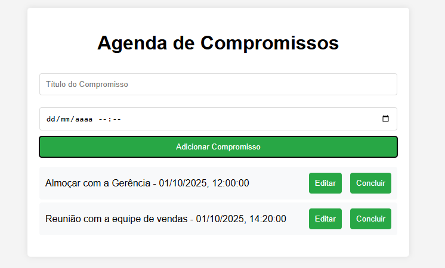

# Agenda de compromissos

Aplicação simples para gerenciar compromissos, permitindo adicionar, visualizar e remover compromissos de forma local.
## Tecnologias Utilizadas
- HTML 5
- CSS 3
- JavaScript (ES6+)
- LocalStorage (para armazenamento local dos compromissos)
- VsCode (Editor de código)

## Funcionalidades
- Adicionar Compromissos: Permite ao usuário adicionar novos compromissos com detalhes como título, data e hora.
- Visualizar Compromissos: Exibe uma lista de compromissos agendados, ordenados por data e hora.
- Remover Compromissos: Permite ao usuário remover compromissos da lista.
- Atualizar compromissos: Permite ao usuário editar compromissos existentes.
- Armazenamento Local: Utiliza o LocalStorage do navegador para salvar os compromissos, garantindo que eles persistam mesmo após o fechamento do navegador.

## Como Usar
1. Clone o repositório ou baixe os arquivos.
2. Abra o arquivo `index.html` em um navegador da sua escolha, ou com o Live Server do **VsCode**.
3. Utilize as funcionalidades da aplicação para gerenciar seus compromissos.
