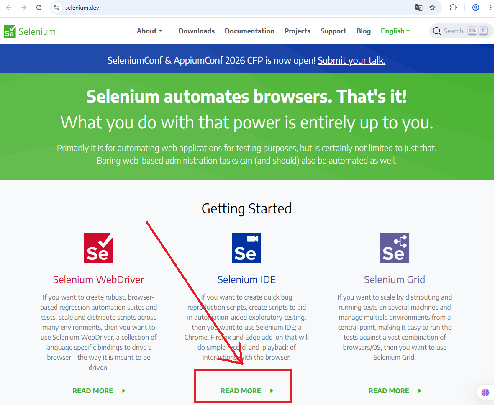
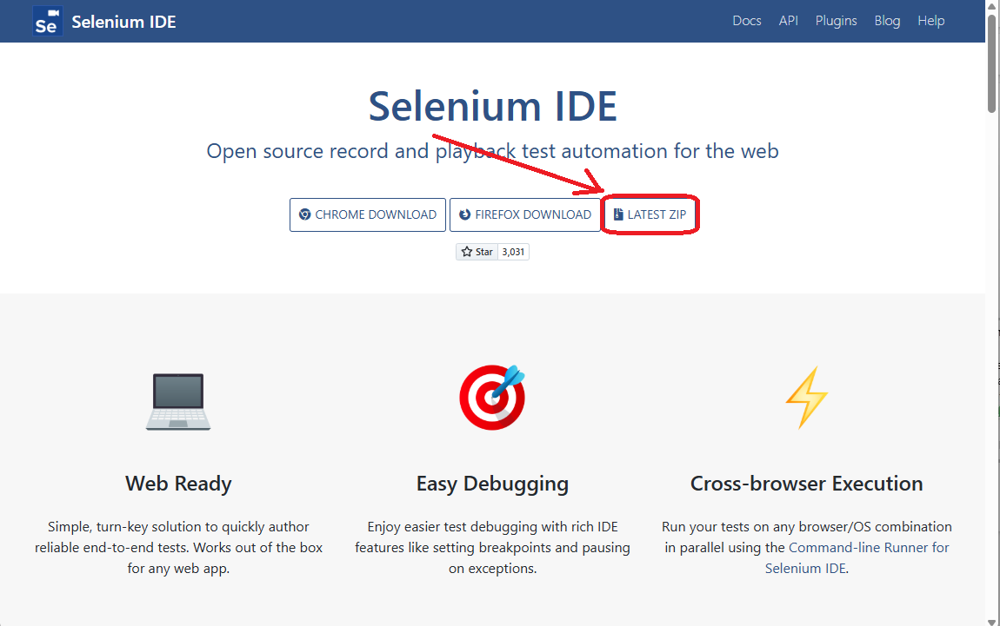
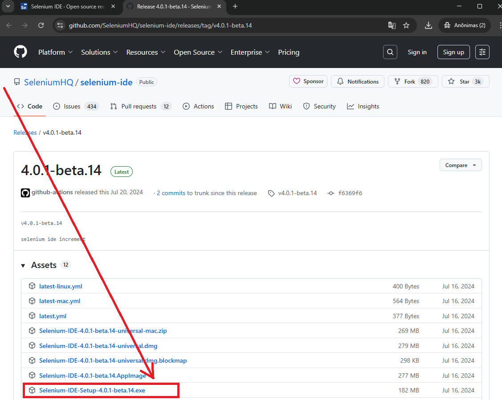
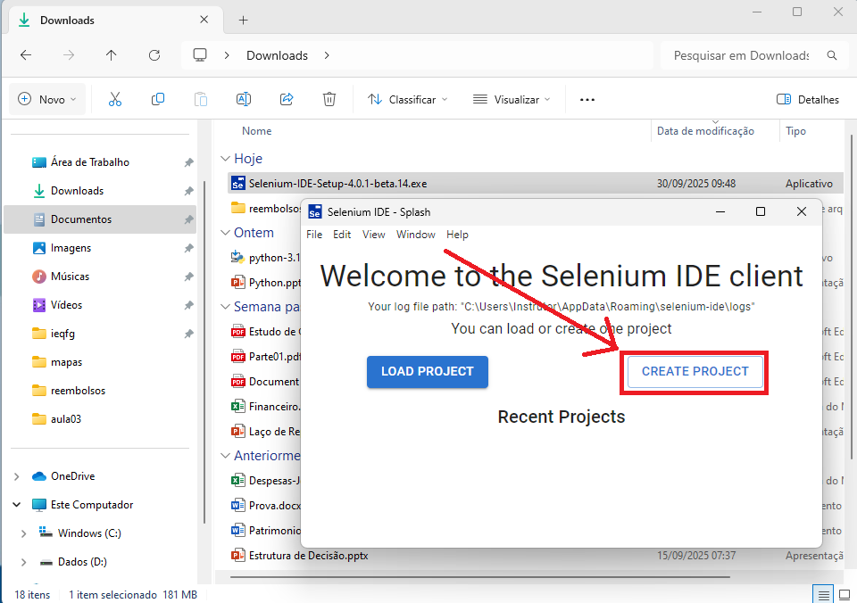
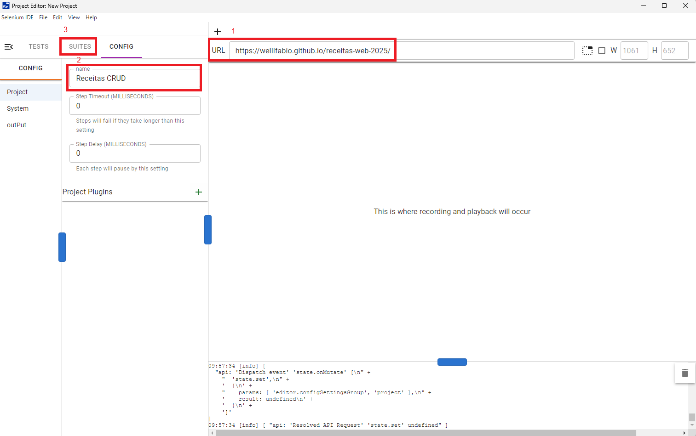
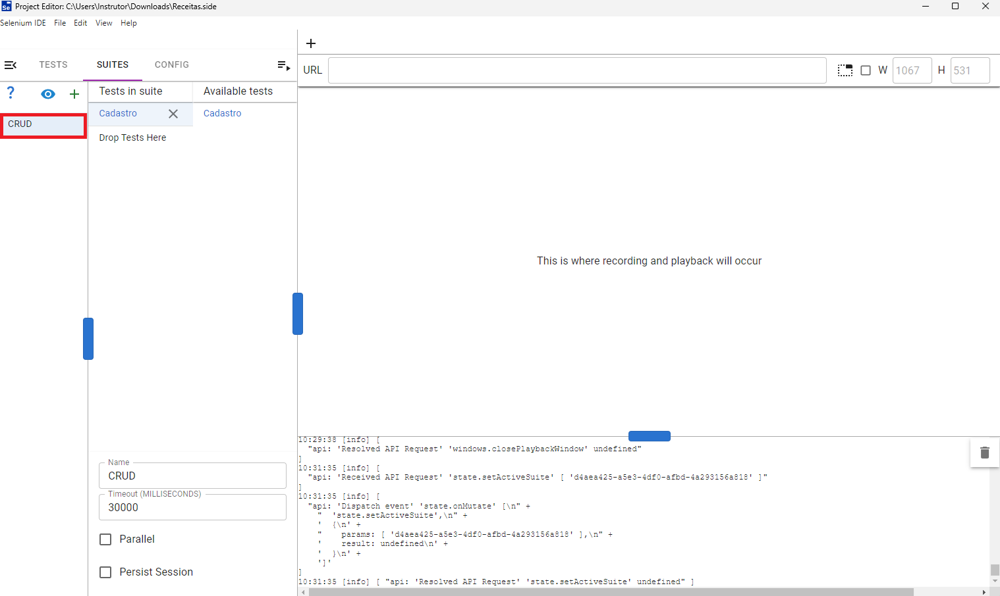
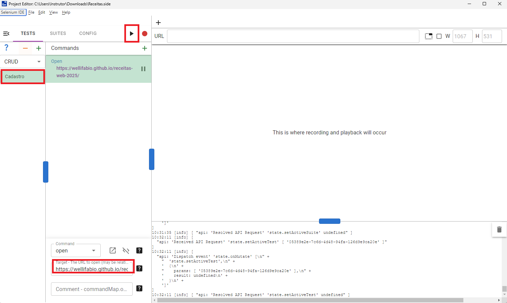
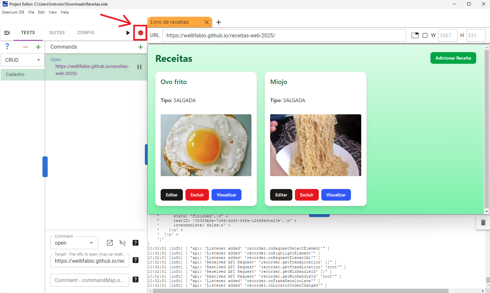
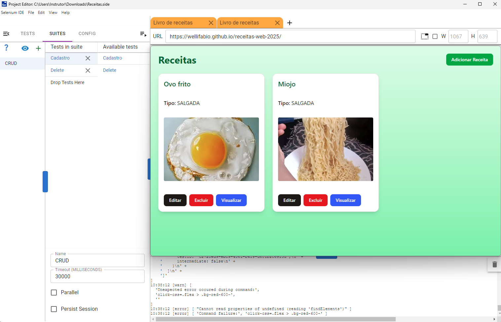

# Selenium IDE
## Demonstração de Testes Automatizados com Selenium
A UI que vamos testar é o [livro de receitas implantado no gitpages com a sua API implantada na vercel](https://wellifabio.github.io/receitas-web-2025/).
- Para isso vamos acessar o site do [Selenium](https://www.selenium.dev/) e baixar o Selenium IDE instalavel.
## Passos para instalar o Selenium IDE
- 1 Acesse o site do [Selenium](https://www.selenium.dev/) e clique em **leia mais** no Selenium IDE.
.
- 2 Clique em **LATEST ZIP**.
.
- 3 Clique em **Escolha o arquivo executável .exe** para instalar no Windows.
.
- 4 Após baixar, instale normalmente.
- 5 Após instalar, abra o programa Selenium IDE e crie um novo projeto.
.
- 6 Crie um novo projeto de testes e nomeie como `Receitas CRUD`.
.
- 7 Agora vamos criar uma suite de testes e nomeie como `CRUD` apenas.
.
- 8 Agora vamos criar um novo teste e nomeie como `Cadastro`, copie a URL do site que vai testar e cole no campo URL com o comando **Open**.
.
- 9 Agora vamos gravar um teste, clique no botão vermelho de gravação.
.
- 10 A partir de agora você deve seguir com as ações para cadastrar uma nova receita, clique no botão **Adicionar Receita**, preenchendo o formulário e clicando em **Enviar Receita**, até concluir a gravação.
- 11 Após concluir a gravação, clique no botão vermelho novamente para parar a gravação.
- 12 Crie também um teste para excluir uma receita, clicando no botão **Excluir Receita** seguindo o mesmo procedimento.
- 14 Agora vamos executar os testes, clicando no botão de play.
- 15 Veja que o Selenium IDE vai executar os testes automaticamente.
- 17 Vamos montar a suite de testes com os testes que criamos.
- 18 Agora vamos executar a suite de testes.
.
- 19 Veja que o Selenium IDE vai executar os testes automaticamente.
- 20 Salve o projeto de testes para usar depois.
- 21 Agora você pode explorar mais o Selenium IDE, como adicionar comandos, validar elementos, etc.
- 22 Você também pode exportar os testes para outras linguagens, como Java, C#, Python, etc.

## Conclusão
- O Selenium IDE é uma ferramenta poderosa para automatizar testes de UI.
- Com ele, você pode criar testes rapidamente e executá-los automaticamente.
