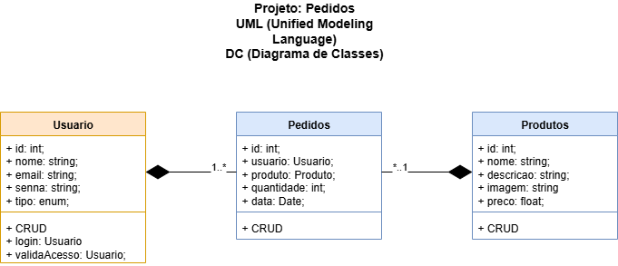
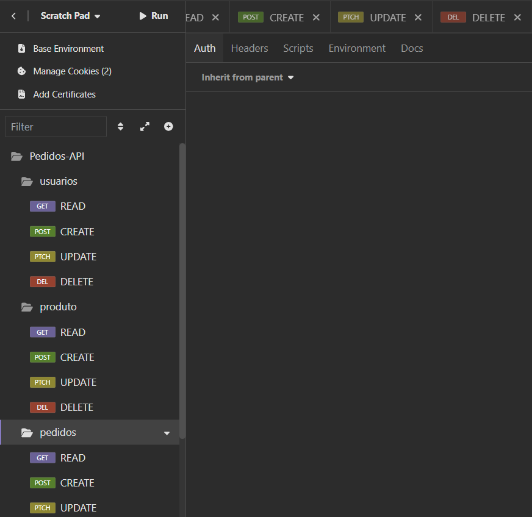
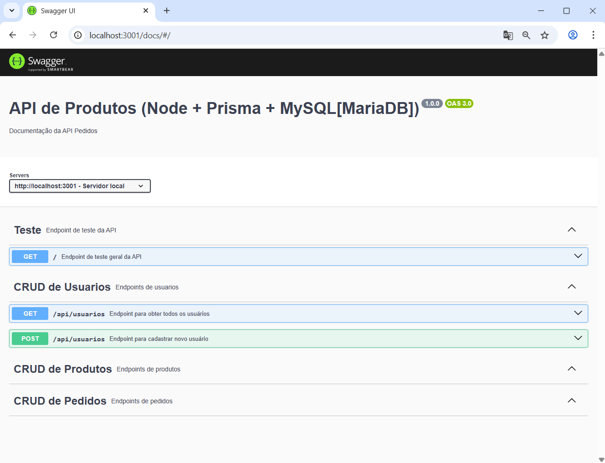

# Aula01 - Recursos Avançados para Desenvolvimento de Software

## Criação de API e documentação
Utilizaremos o [Swagger](https://swagger.io/) para criar e documentar uma API RESTful. O Swagger é uma ferramenta poderosa que permite descrever a estrutura da API de forma clara e interativa.

### Capacidades Técnicas
- 1 Definir a sequência das atividades para desenvolvimento dos componentes, de acordo com os requisitos do sistema
- 2 Definir a infraestrutura física a ser utilizada no desenvolvimento dos componentes  
- 3 Projetar os componentes do sistema considerando as plataformas computacionais  
- 7 Definir os softwares a serem utilizados no desenvolvimento do sistema  
- 8 Definir as dependências de software considerando os componentes do sistema, para a sua implantação 
- 9 Elaborar documentação técnica do sistema 
- 10 Implementar as funcionalidades de acordo com os requisitos definidos  

### Capacidades Socioemocionais
- 1 Demonstrar autogestão
- 2 Demonstrar pensamento analítico

## Conhecimentos
- 1 Qualidade de software
  - 1.1. Definição
  - 1.2. Ferramentas
  - 1.3. Processos de trabalho
- 3 Metodologia de gerenciamento de projeto
  - 3.1. Escopo
  - 3.5. Recursos

## Demonstração
Para demonstrar a criação de uma API com Swagger, vamos criar um exemplo simples de uma API com controle de acessos e produtos. A API terá os seguintes endpoints:
- `/api/login`: Endpoint para autenticação de usuários.
- `/api/usuarios`: Endpoint para gerenciamento de acessos.
  - **GET**: Listar todos os acessos.
  - **POST**: Criar um novo acesso.
  - **PATCH**: Atualizar um acesso existente.
  - **DELETE**: Excluir um acesso.
- `/api/produtos`: Endpoint para gerenciamento de produtos.
  - **GET**: Listar todos os produtos.
  - **POST**: Criar um novo produto.
  - **PATCH**: Atualizar um produto existente.
  - **DELETE**: Excluir um produto.
- `/api/pedidos`: Endpoint para gerenciamento de pedidos.
  - **GET**: Listar todos os pedidos.
  - **POST**: Criar um novo pedido.
  - **PATCH**: Atualizar um pedido existente.
  - **DELETE**: Excluir um pedido.

  ## UML DC 
  Vamos seguir o modelo de Diagrama de Classes (DC) para representar a estrutura da API. O diagrama incluirá as classes `Usuario`, `Produto` e `Pedido`, com seus respectivos atributos e métodos.

  

  - Iniciaremos um projeto com Node.js, Prisma, MySQL e Swagger.
### Passo a passo:
- 1 Crie uma pasta chamada pedidos-api e abra com o Visual Studio Code.
- 2 Abra o terminal `cmd` ou `bash` do Visual Studio Code e execute o comando `npm init -y` para criar um arquivo package.json.
- 3 Instale as dependências basicas do projeto, instale o prisma com suporte ao MySQL.
```bash
npm install express cors dotenv
npm install prisma -g
npx prisma init --datasource-provider mysql
```
- 4 Configure o arquivo `.env` com as credenciais do banco de dados MySQL.
```js
DATABASE_URL="mysql://root@localhost:3306/pedidos-api?schema=public&timezone=UTC"
```
- 5 Edite o Shema do Prisma no arquivo `prisma/schema.prisma` para definir as tabelas `Usuario`, `Produto` e `Pedido`.
```js
generator client {
  provider = "prisma-client-js"
}

datasource db {
  provider = "mysql"
  url      = env("DATABASE_URL")
}

model Usuario {
  id        Int      @id @default(autoincrement())
  email     String   @unique
  nome      String
  senha     String
  tipo      Tipo
  pedidos   Pedido[]
}

enum Tipo {
  ADMIN
  CLIENTE
}

model Produto {
  id        Int      @id @default(autoincrement())
  nome      String
  descricao String
  imagem    String
  preco     Float
  pedidos   Pedido[]
}

model Pedido {
  id        Int      @id @default(autoincrement())
  usuarioId Int
  produtoId Int
  quantidade Int
  data      DateTime @default(now())
  usuario   Usuario  @relation(fields: [usuarioId], references: [id])
  produto   Produto  @relation(fields: [produtoId], references: [id])
}
```
- 6 Crie e edite o arquivo `server.js` somente com o básico por enquanto, e `router.js` para definir as rotas da API.
```js
const express = require('express');
const cors = require('cors');
const routes = require('./src/router');

const app = express();
app.use(express.json());
app.use(cors());
app.use(routes);

app.listen(3001, (req,res) =>{
    console.log('API respondendo em http://localhost:3001') 
});
```
- 7 Crie a pasta `src` e dentro dela crie o arquivo `router.js` para definir as rotas da API.
```js
const express = require('express');
const routes = express.Router();

routes.get('/', (req, res) => {
    res.send('API Pedidos respondendo');
});

module.exports = routes;
```
- 8 Execute o comando `npx prisma migrate dev --name init` para criar as tabelas no banco de dados MySQL.
- 9 Execute a API e teste a rota inicial no navegador ou Insomnia.
```bash
npx nodemon
```
- 10 Crie e edite os arquivos de controle para gerenciar os usuários, produtos e pedidos.
- /sr/controllers/usuario.js
```js
const { PrismaClient } = require('@prisma/client');
const prisma = new PrismaClient();

const read = async (req, res) => {
    try {
        const usuarios = await prisma.usuario.findMany();
        res.json(usuarios);
    } catch (error) {
        res.status(500).json({ error: 'Erro ao buscar usuarios' });
    }
}

const create = async (req, res) => {
    try {
        const usuario = await prisma.usuario.create({
            data: req.body
        });
        res.status(201).json(usuario);
    } catch (error) {
        res.status(500).json({ error: 'Erro ao criar usuario' });
    }
}

const update = async (req, res) => {
    const { id } = req.params;
    try {
        const usuario = await prisma.usuario.update({
            where: { id: Number(id) },
            data: req.body
        });
        res.status(202).json(usuario);
    } catch (error) {
        res.status(500).json({ error: 'Erro ao atualizar usuario' });
    }
}

const del = async (req, res) => {
    const { id } = req.params;
    try {
        await prisma.usuario.delete({
            where: { id: Number(id) }
        });
        res.status(204).send();
    } catch (error) {
        res.status(500).json({ error: 'Erro ao deletar usuario' });
    }
}

module.exports = {
    read,
    create,
    update,
    del
};
```
- /sr/controllers/produto.js
```js
const { PrismaClient } = require('@prisma/client');
const prisma = new PrismaClient();

const read = async (req, res) => {
    try {
        const produtos = await prisma.produto.findMany();
        res.json(produtos);
    } catch (error) {
        res.status(500).json({ error: 'Erro ao buscar produtos' });
    }
}

const create = async (req, res) => {
    try {
        const produto = await prisma.produto.create({
            data: req.body
        });
        res.status(201).json(produto);
    } catch (error) {
        res.status(500).json({ error: 'Erro ao criar produto' });
    }
}

const update = async (req, res) => {
    const { id } = req.params;
    try {
        const produto = await prisma.produto.update({
            where: { id: Number(id) },
            data: req.body
        });
        res.status(202).json(produto);
    } catch (error) {
        res.status(500).json({ error: 'Erro ao atualizar produto' });
    }
}

const del = async (req, res) => {
    const { id } = req.params;
    try {
        await prisma.produto.delete({
            where: { id: Number(id) }
        });
        res.status(204).send();
    } catch (error) {
        res.status(500).json({ error: 'Erro ao deletar produto' });
    }
}

module.exports = {
    read,
    create,
    update,
    del
};
```
- /sr/controllers/pedido.js
```js
const { PrismaClient } = require('@prisma/client');
const prisma = new PrismaClient();

const read = async (req, res) => {
    try {
        const pedidos = await prisma.pedido.findMany();
        res.json(pedidos);
    } catch (error) {
        res.status(500).json({ error: 'Erro ao buscar pedidos' });
    }
}

const create = async (req, res) => {
    try {
        const pedido = await prisma.pedido.create({
            data: req.body
        });
        res.status(201).json(pedido);
    } catch (error) {
        res.status(500).json({ error: 'Erro ao criar pedido' });
    }
}

const update = async (req, res) => {
    const { id } = req.params;
    try {
        const pedido = await prisma.pedido.update({
            where: { id: Number(id) },
            data: req.body
        });
        res.status(202).json(pedido);
    } catch (error) {
        res.status(500).json({ error: 'Erro ao atualizar pedido' });
    }
}

const del = async (req, res) => {
    const { id } = req.params;
    try {
        await prisma.pedido.delete({
            where: { id: Number(id) }
        });
        res.status(204).send();
    } catch (error) {
        res.status(500).json({ error: 'Erro ao deletar pedido' });
    }
}

module.exports = {
    read,
    create,
    update,
    del
};
```
- 11 Importe os controladores no arquivo `router.js` e defina as rotas para cada recurso.
```js
const express = require('express');
const routes = express.Router();

const Usuario = require('./controllers/usuario');
const Produto = require('./controllers/produto');
const Pedido = require('./controllers/pedido');

routes.get('/', (req, res) => {
    res.json({ titulo: 'API Pedidos respondendo' });
});

routes.get('/api/usuarios', Usuario.read);
routes.post('/api/usuarios', Usuario.create);
routes.patch('/api/usuarios/:id', Usuario.update);
routes.delete('/api/usuarios/:id', Usuario.del);

routes.get('/api/produtos', Produto.read);
routes.post('/api/produtos', Produto.create);
routes.patch('/api/produtos/:id', Produto.update);
routes.delete('/api/produtos/:id', Produto.del);

routes.get('/api/pedidos', Pedido.read);
routes.post('/api/pedidos', Pedido.create);
routes.patch('/api/pedidos/:id', Pedido.update);
routes.delete('/api/pedidos/:id', Pedido.del);

module.exports = routes;
```
A seguir segue os testes com Insomnia ou Postman:
<br>
- 12 Instale o Swagger para documentar a API.
```bash
npm install swagger-jsdoc
npm install swagger-ui-express
```
- 13 Altere o arquivo `server.js` para incluir a documentação do Swagger.
```js
const express = require('express');
const cors = require('cors');
const swaggerUi = require('swagger-ui-express');

const swaggerDoc = require('./swagger.json');
const routes = require('./src/router');

const app = express();
app.use(express.json());
app.use(cors());

app.use('/docs', swaggerUi.serve, swaggerUi.setup(swaggerDoc));

app.use(routes);

app.listen(3001, (req,res) =>{
    console.log('API respondendo em http://localhost:3001');
    console.log('Documentação em http://localhost:3001/docs');
});
```
- 14 Crie o arquivo `swagger.json` na pasta raiz para configurar o Swagger.
```json
{
    "openapi": "3.0.0",
    "info": {
        "title": "API de Produtos (Node + Prisma + MySQL[MariaDB])",
        "version": "1.0.0",
        "description": "Documentação da API Pedidos"
    },
    "servers": [
        {
            "url": "http://localhost:3001",
            "description": "Servidor local"
        }
    ],
    "tags": [
        {
            "name": "Teste",
            "description": "Endpoint de teste da API"
        },
        {
            "name": "CRUD de Usuarios",
            "description": "Endpoints de usuarios"
        },
        {
            "name": "CRUD de Produtos",
            "description": "Endpoints de produtos"
        },
        {
            "name": "CRUD de Pedidos",
            "description": "Endpoints de pedidos"
        }
    ],
    "paths": {
        "/": {
            "get": {
                "tags": [
                    "Teste"
                ],
                "summary": "Endpoint de teste geral da API",
                "responses": {
                    "200": {
                        "description": "Retorna uma mensagem de teste"
                    },
                    "500": {
                        "description": "Erro ao processar a requisição"
                    }
                }
            }
        },
        "/api/usuarios": {
            "get": {
                "tags": [
                    "CRUD de Usuarios"
                ],
                "summary": "Endpoint para obter todos os usuários",
                "responses": {
                    "200": {
                        "description": "Lista de usuários cadastrados"
                    }
                }
            },
            "post": {
                "tags": [
                    "CRUD de Usuarios"
                ],
                "summary": "Endpoint para cadastrar novo usuário",
                "requestBody": {
                    "description": "Dados de login",
                    "content": {
                        "application/json": {
                            "schema": {
                                "type": "object",
                                "properties": {
                                    "nome": {
                                        "type": "string",
                                        "default": "Ana Silva"
                                    },
                                    "email": {
                                        "type": "string",
                                        "default": "ana.silva@email.com"
                                    },
                                    "senha": {
                                        "type": "string",
                                        "default": "senha123"
                                    },
                                    "tipo": {
                                        "type": "string",
                                        "default": "CLIENTE"
                                    }
                                }
                            }
                        }
                    }
                },
                "responses": {
                    "201": {
                        "description": "Novo usuário"
                    },
                    "400": {
                        "description": "Erro ao cadastrar usuário, envie nome, email, senha e tipo [ADMIN, CLIENTE]"
                    }
                }
            }
        }
    }
}
```
- 15 Execute a API novamente e acesse a documentação.


## Atividades
Edite o arquivo `swagger.json` para incluir os endpoints restantes usuarios, produtos e pedidos, seguindo o modelo dos usuários.

- `/api/usuarios`: Endpoint para gerenciamento de acessos.
  - **GET**: Listar todos os acessos. (Criado)
  - **POST**: Criar um novo acesso. (Criado)
  - **PATCH**: Atualizar um acesso existente. (Criar)
  - **DELETE**: Excluir um acesso.(Criar)
- `/api/produtos`: Endpoint para gerenciamento de produtos.
  - **GET**: Listar todos os produtos.(Criar)
  - **POST**: Criar um novo produto.(Criar)
  - **PATCH**: Atualizar um produto existente.
  - **DELETE**: Excluir um produto.(Criar)
- `/api/pedidos`: Endpoint para gerenciamento de pedidos.
  - **GET**: Listar todos os pedidos.(Criar)
  - **POST**: Criar um novo pedido.(Criar)
  - **PATCH**: Atualizar um pedido existente.(Criar)
  - **DELETE**: Excluir um pedido.(Criar)


## Referências
- [Documentação do Swagger](https://swagger.io/docs/)
- [Documentação do Prisma](https://www.prisma.io/docs/)
- [Projeto de exemplo no GitHub](https://github.com/wellifabio/edu-api-jserver-swagger/tree/master)

## Entrega
Demonstre ao professor a API criada, incluindo a documentação do Swagger. Certifique-se de que todos os endpoints estão funcionando corretamente e que a documentação está completa.