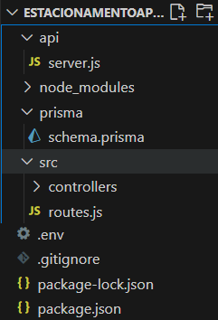
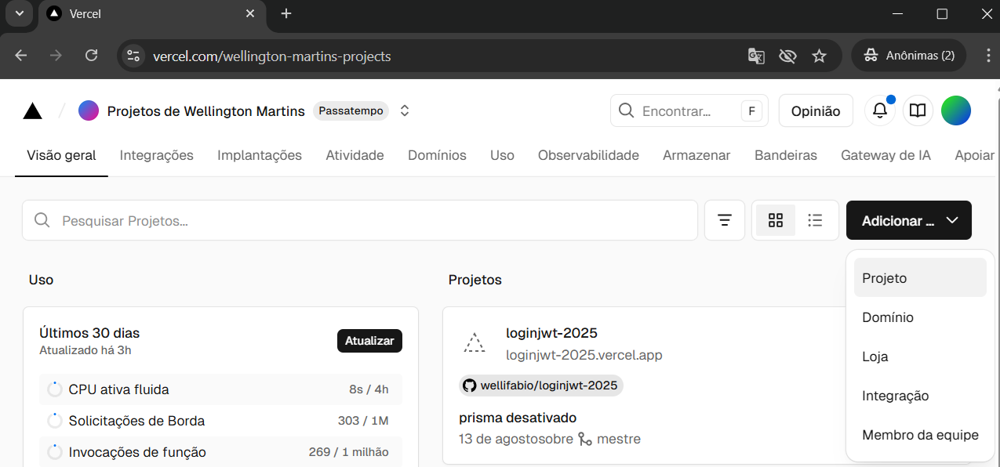
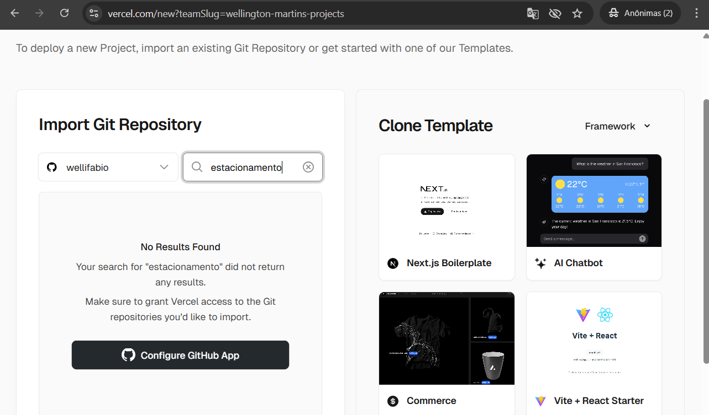
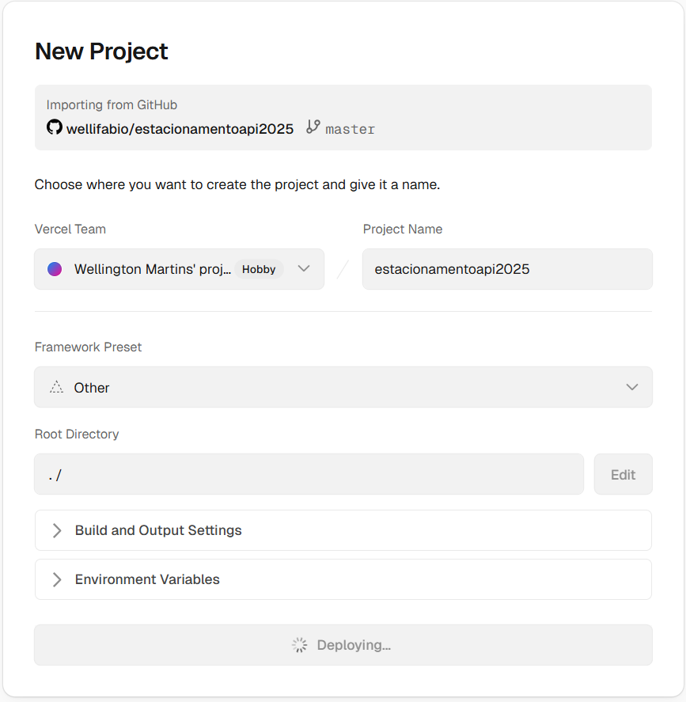
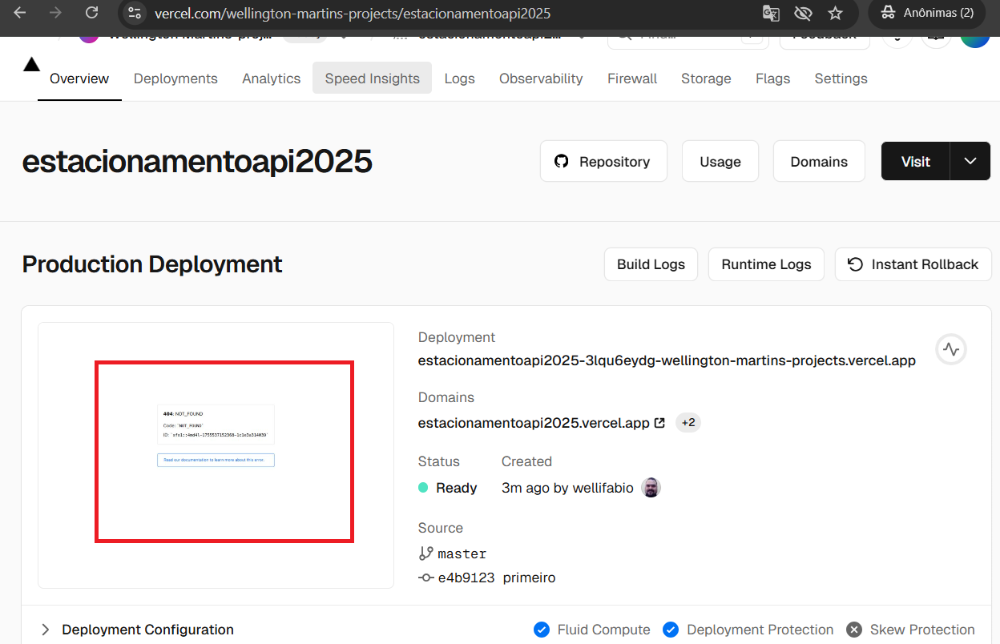
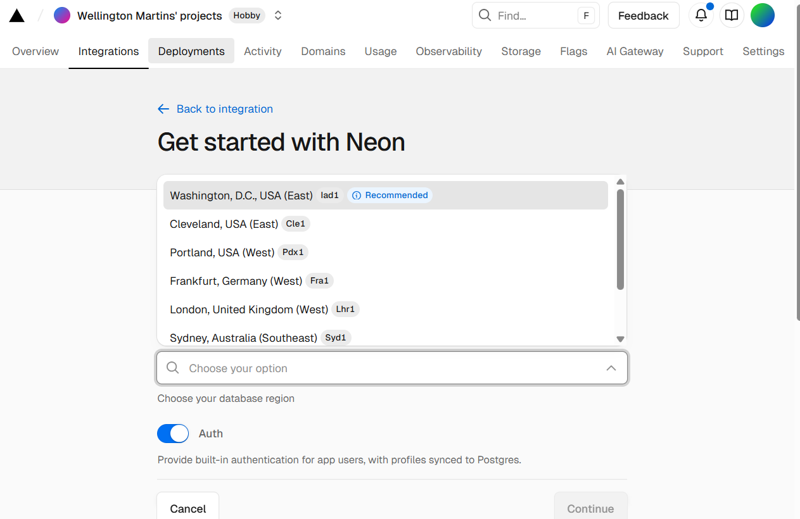
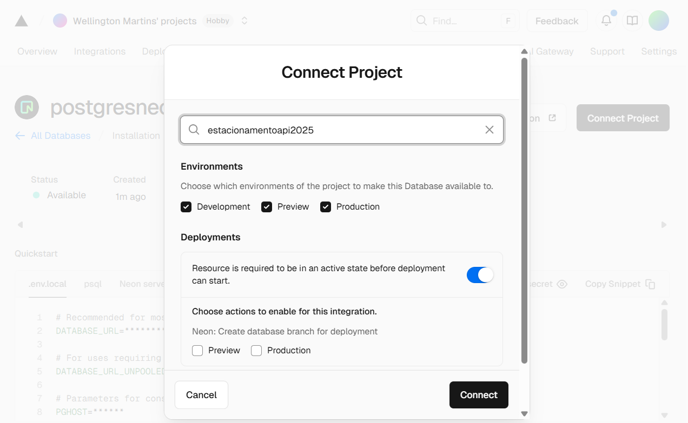

# Aula04 - Deploy (Implantação)
- Implantação de Aplicações Web (API Back-end) com a Vercel
- Para implantar front-end até o momento utilizamos o próprio github pages. Porem para o back-end utilizaremos a Vercel que possui suporte para Node.js e Prisma com banco de dados Postgres.
- Este serviço é gratuito até um limite de uso específico.
### Ambiente
- [VsCode](https://code.visualstudio.com/)
- [Node.js](https://nodejs.org/)
- [Prisma](https://www.prisma.io/)
- [Postgres](https://www.postgresql.org/)
- [Vercel](https://vercel.com/)

### Contas necessárias
- [GitHub](https://github.com/)
- [Vercel](https://vercel.com/)

## 1 Criando um novo projeto Node.Js + Prisma

A seguir temos um projeto de um simples estacionamento pronto para ser utilizado como base. basta criar a estrutura de pastas e copiar o conteúdo dos arquivos para o seu novo projeto.<br>

- A. crie uma pasta com o nome `estacionamentoSeuNome` e abra com o **VsCode**.
- B. Abra um terminal `CMD` ou `bash` e inicie um novo projeto Node.JS
```bash
npm init -y
```
Será criado o arquivo `package.json`, com um conteúdo semelhante ao abaixo, altere os caminhos do main, scripts, author e outros conforme necessário.
```json
{
  "name": "estacionamentoapi",
  "version": "1.0.0",
  "main": "api/server.js",
  "scripts": {
    "dev": "npx nodemon api/server.js"
  },
  "keywords": [],
  "author": "wellifabio",
  "license": "ISC",
  "description": "Projeto de Estacionamento API, para aulas de Node.js"
}
```
- C. Instale as principais dependências do projeto
```bash
npm install express cors dotenv prisma
```
- D. Inicie um projeto prisma com o SGBD postgres
```bash
npx prisma init --datasource-provider postgresql
```
- E. Edite o arquivo `prisma/schema.prisma` para definir o modelo de dados desejado.
```js
generator client {
  provider = "prisma-client-js"
}

datasource db {
  provider = "postgresql"
  url      = env("DATABASE_URL")
}

model Veiculo {
  placa        String    @id
  tipo         Tipo
  proprietario String
  modelo       String
  marca        String
  cor          String?
  ano          Int?
  telefone     String
  estadias     Estadia[]
}

enum Tipo {
  CARRO
  MOTO
  VAN
  CAMINHAO
  ONIBUS
}

model Estadia {
  id         Int       @id @default(autoincrement())
  placa      String?
  entrada    DateTime  @default(now())
  saida      DateTime?
  valorHora  Float
  valorTotal Float?
  automovel  Veiculo?  @relation(fields: [placa], references: [placa], onUpdate: Cascade, onDelete: SetNull)
}
```
- F. Crie a estrutura de pastas e arquivos conforme abaixo:<br> e cole o conteúdo dos arquivos nas respectivas pastas.
- `api/server.js`
```js
const express = require('express');
const cors = require('cors');
const routes = require('../src/routes');

const port = process.env.PORT || 3001;
const app = express();
app.use(express.json());
app.use(cors());
app.use(routes);

app.listen(port, (req, res) => {
    console.log('API respondendo em http://localhost:' + port)
});
```
- `src/routes.js`
```js
const express = require('express');
const routes = express.Router();

const Veiculo = require('./controllers/veiculo');
const Estadia = require('./controllers/estadia');

routes.get('/', (req, res) => {
    const api = {
        titulo: 'API Estacionamento',
        versao: '1.0.0',
        rotas: [
            { metodo: 'GET', caminho: '/veiculos' },
            { metodo: 'GET', caminho: '/veiculos/:placa' },
            { metodo: 'POST', caminho: '/veiculos' },
            { metodo: 'PATCH', caminho: '/veiculos/:placa' },
            { metodo: 'DELETE', caminho: '/veiculos/:placa' },
            { metodo: 'GET', caminho: '/estadias' },
            { metodo: 'GET', caminho: '/estadias/:placa' },
            { metodo: 'POST', caminho: '/estadias' },
            { metodo: 'PATCH', caminho: '/estadias/:id' },
            { metodo: 'DELETE', caminho: '/estadias/:id' }
        ]
    }
    res.json(api);
});

routes.get('/veiculos', Veiculo.read);
routes.get('/veiculos/:placa', Veiculo.read);
routes.post('/veiculos', Veiculo.create);
routes.patch('/veiculos/:placa', Veiculo.update);
routes.delete('/veiculos/:placa', Veiculo.del);

routes.get('/estadias', Estadia.read);
routes.get('/estadias/:placa', Estadia.read);
routes.post('/estadias', Estadia.create);
routes.patch('/estadias/:id', Estadia.update);
routes.delete('/estadias/:id', Estadia.del);

module.exports = routes;
```
- `src/controllers/veiculos.js`
```js
const { PrismaClient } = require('@prisma/client');
const prisma = new PrismaClient();

const read = async (req, res) => {
    try {
        if (req.params.placa) {
            const veiculo = await prisma.veiculo.findUnique({
                where: { placa: req.params.placa },
                include: { estadias: true }
            });
            res.json(veiculo).end();
        }
        else {
            const veiculos = await prisma.veiculo.findMany();
            res.json(veiculos).end();
        }
    } catch (error) {
        res.status(500).json({ error: 'Erro ao buscar veiculos' });
    }
}

const create = async (req, res) => {
    try {
        const veiculo = await prisma.veiculo.create({
            data: req.body
        });
        res.status(201).json(veiculo).end();
    } catch (error) {
        res.status(400).json({ erro: 'Erro ao criar veiculo, verifique se a placa não está duplicada', error: error.message }).end();
    }
}

const update = async (req, res) => {
    const { placa } = req.params;
    try {
        const veiculo = await prisma.veiculo.update({
            where: { placa: placa },
            data: req.body
        });
        res.status(202).json(veiculo);
    } catch (error) {
        res.status(400).json({ erro: 'Erro ao atualizar veiculo', error: error.message });
    }
}

const del = async (req, res) => {
    const { placa } = req.params;
    try {
        await prisma.veiculo.delete({
            where: { placa: placa }
        });
        res.status(204).send();
    } catch (error) {
        //Se o veiculo não for encontrado retornar erro 404
        if (error.code === 'P2025') {
            return res.status(404).json({ erro: 'Veiculo não encontrado', error: error.message });
        } else {
            //Para outros erros, retornar erro 400
            res.status(400).json({ erro: 'Erro ao deletar veiculo', error: error.message });
        }
    }
}

module.exports = {
    read,
    create,
    update,
    del
};
```
- `src/controllers/estadia.js`
```js
const { PrismaClient } = require('@prisma/client');
const prisma = new PrismaClient();

const read = async (req, res) => {
    try {
        if (req.params.placa) {
            const estadias = await prisma.estadia.findMany({
                where: { placa: req.params.placa }
            });
            res.json(estadias).end();
        }
        else {
            const estadias = await prisma.estadia.findMany();
            res.json(estadias).end();
        }
    } catch (error) {
        res.status(500).json({ error: 'Erro ao buscar estadias' });
    }
}

const create = async (req, res) => {
    try {
        const estadia = await prisma.estadia.create({
            data: req.body
        });
        res.status(201).json(estadia).end();
    } catch (error) {
        res.status(400).json({ erro: 'Erro ao criar estadia, verifique se a placa não está duplicada', error: error.message }).end();
    }
}

const update = async (req, res) => {
    const { id } = req.params;
    try {
        const estadia = await prisma.estadia.update({
            where: { id: Number(id) },
            data: req.body
        });
        res.status(202).json(estadia);
    } catch (error) {
        res.status(400).json({ erro: 'Erro ao atualizar estadia', error: error.message });
    }
}

const del = async (req, res) => {
    const { id } = req.params;
    try {
        await prisma.estadia.delete({
            where: { id: Number(id) }
        });
        res.status(204).send();
    } catch (error) {
        //Se o estadia não for encontrado retornar erro 404
        if (error.code === 'P2025') {
            return res.status(404).json({ erro: 'estadia não encontrado', error: error.message });
        } else {
            //Para outros erros, retornar erro 400
            res.status(400).json({ erro: 'Erro ao deletar estadia', error: error.message });
        }
    }
}

module.exports = {
    read,
    create,
    update,
    del
};
```
- F. Para testar localmente basta alterar o banco de dados no `prisma/schema.prisma` para o Banco de dados MySQL
```js
datasource db {
  provider = "mysql"
  url      = env("DATABASE_URL")
}
```
- Alterar o .env para o endereço local
```js
DATABASE_URL="mysql://root@localhost:3306/estacionamentoapi?schema=public&timezone=UTC"
```
- Abrir o XAMPP, dar start no MySQL rodar a migração e executar o projeto.
```bash
npm install @prisma/client
npx prisma migrate dev --name init
npm run dev
```
- Caso queira abrir o **prisma studio** para testar diretamente.
```bash
npx prisma studio
```
- G. por fim voltar para o SGBD PostgreSQL, alterando o arquivo `prisma/schema.prisma` para o Banco de dados PostgreSQL, 
```js
datasource db {
  provider = "postgresql"
  url      = env("DATABASE_URL")
}
```
- H. Criar um repositório no github e enviar o projeto, não esqueça do arquivo `.gitignore` contendo:
```
node_modules
.env
/generated/prisma
/prisma/migrations
```

## 2 Criando o projeto na Vercel
Após criar uma conta na Vercel, acesse e crie um novo projeto, **importando** o seu projeto do **github**.
- 
- 
- 
- 
- 
- Seu projeto ainda não vai funcionar, para isso é necessário criar o serviço de banco de dados com Prisma e algumas configurações adicionais.

## 3 Criando o serviço de banco de dados com Prisma
Ainda na **Vercel**, crie um novo serviço de banco de dados com Prisma. Clique em **Storage** procure por **Neon** e clique em **Create**.
- 
- Escolha uma região e de um nome ao servidor de banco de dados, depois conecte seu projeto back-end com o **Neon**.
- 
- Todas as variáveis de ambiente necessárias serão criadas automaticamente.

## 4 Configurar o projeto para Deploy com a Vercel
Volte ao seu **projeto Node.js** no VsCode abra um terminal **CTRL + '** tipo **CMD** e instale o interpretador de comandos vercel
```bash
npm i -g vercel@latest
```
- Link o seu projeto com a vercel e baixe as variáveis de ambiente
```bash
vercel link
vercel env pull .env
```
- Altere o `package.json` para incluir o script p`"postinstall": "prisma migrate dev --name init && prisma generate"` e o prisma como devDependencies:
```json
{
  "name": "estacionamentoapi",
  "version": "1.0.0",
  "main": "api/server.js",
  "scripts": {
    "dev": "npx nodemon api/server.js",
    "postinstall": "prisma migrate dev --name init && prisma generate"
  },
  "keywords": [],
  "author": "wellifabio",
  "license": "ISC",
  "description": "Projeto de Estacionamento API, para aulas de Node.js",
  "dependencies": {
    "@prisma/client": "^6.14.0",
    "cors": "^2.8.5",
    "dotenv": "^17.2.1",
    "express": "^5.1.0",
    "prisma": "^6.14.0"
  },
  "devDependencies": {
    "prisma": "^6.14.0"
  }
}
```
- Acrescente o arquivo `vercel.json` na raiz do projeto, apontando para o `api/server.js`
```js
{
    "version": 2,
    "rewrites": [
        {
            "source": "/(.*)",
            "destination": "/api/server.js"
        }
    ]
}
```

- Para **fazer deploy**, com o ambiente configurado corretamente, basta **fazer commit das alterações** e executar o comando:
```bash
vercel --prod
```

## Pronto API Back-end implantado com sucesso

# Atividades
Em grupos, de preferência os mesmos do TCC, elegam um **DevOps** (Profissional responsável por implantações) e execute o tutorial acima implantanto a API de estacionamento na **Vercel**.
- Outro integrante do grupo **Prog. Front-End** deve ficar responsável por desenvolver uma **UI** (Interface do Usuário) para interagir com a API.
- A UI deve ser implantada no **GitHub Pages**.
### wireframes
Segue os wireframes da UI para ter como base para o desenvolvimento:


## [Formulário de Entregas](https://docs.google.com/forms/d/e/1FAIpQLSdV24fB9faivuHKaluB1J8EgxOYZCR63u1IIQQ72q7mWm0rGg/viewform?usp=dialog)
O formulário deve conter:
- Links da API implantada na Vercel
- Links da UI implantada no GitHub Pages

# Atualizando aplicação implantada na VERCEL

- Basta fazer **commit** que um novo deploy é feito automaticamente.
## Caso seja alterado o banco de dados schema.prisma
- 1 Não esquecer de voltar o **SGBD** para `postresql`
- 2 Dar **drop** em todas as tabelas no **NEON** (Excluir todas)
- 3 Dar o comando para resetar o banco e dados no script `postinstall` no aruqivo `package.json` conforme abaixo:
```json
  "scripts": {
    "dev": "npx nodemon api/server.js",
    "postinstall": "prisma migrate reset --force && prisma generate"
  },
```
- 4 Dar **commit** e en seguida implantar o banco novamente
```json
  "scripts": {
    "dev": "npx nodemon api/server.js",
    "postinstall": "prisma migrate dev --name init && prisma generate"
  },
```
- 5 Confira se as tabelas foram criadas novamente no NEON
- 6 Se tiver arquivo com dados para semente: `prisma/seed.js` e dar **commit**
```json
  "scripts": {
    "dev": "npx nodemon api/server.js",
    "postinstall": "prisma db seed && prisma generate"
  },
```
- 7 e por fim apenas `prisma generate`
```json
  "scripts": {
    "dev": "npx nodemon api/server.js",
    "postinstall": "prisma generate"
  },
```