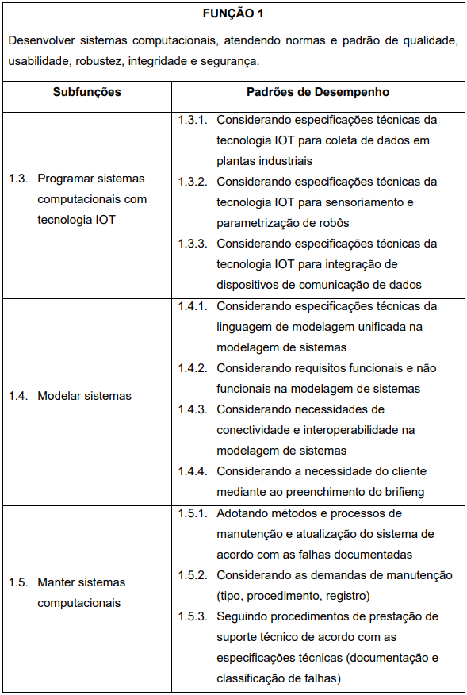
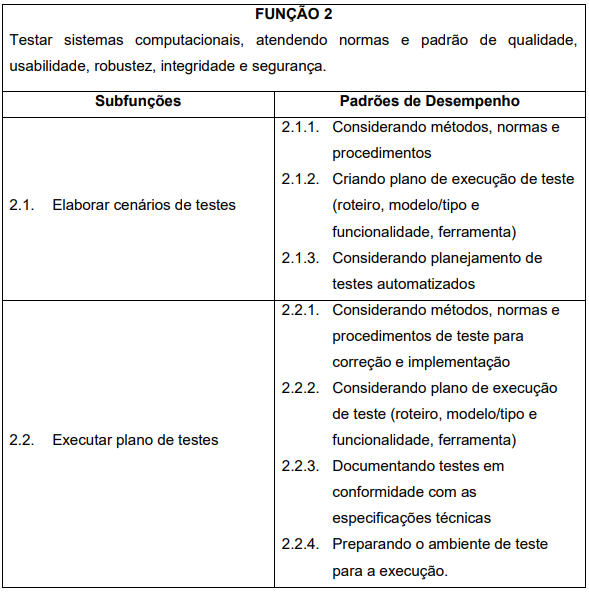

# Técnico em Desenvolvimento de Sistemas
## 5º Itinerário: Formação Técnica e Profissional
Esse itinerário específico é voltado para a Formação Técnica e Profissional dos estudantes em parceria SEDUC (Secretaria de Educação do Estado de São Paulo) e SESI (Serviço Social da Indústria) e SENAI (Serviço Nacional de Aprendizagem Industrial).
## [Plano de Curso](https://github.com/wellifabio/sesi2024/blob/main/PlanoCurso.pdf)
## Semestres
- [1º Semestre](./1des/README.md)
    - Lógica de Programação e Algoritmos (75/100)
    - Sistemas Operacionais (90/120)
    - Levantamento de Requisitos (60/80)
    - Arquitetura de Redes com IoT (75/100)
- [2º Semestre](./2des/README.md)
    - Bancos de Dados (75/100)
    - Linguagem de Marcação (75/100)
    - Programção Back-End 1(105/140)
    - Projetos de Software (45/60)
- [3º Semestre](./3des/README.md)
    - Programação Front-End 1 (75/100)
    - Programção Back-End 2(120/160)
    - Programação Para Dispositivos Móveis (60/80)
    - Projetos de Software 02 (45/60)
- [4º Semestre](./4des/README.md)
    - Internet das Coisas (75/100)
    - Programação Front-End 2 (75/100)
    - Programação Para Dispositivos Móveis (60/80)
    - Testes de Software (45/60)
    - Projetos de Software 03 (45/60)
## Destaque do Plano de Curso
- 
- 
- 
- 
- 
## Competências transversais - Cursos autoinstitucionais
- 1 Acessar o portal **[EAD](https://ead.sp.senai.br)**
- 2 Verificar se está matriculado em algum curso e completar todos Os que estiver matriculado.
- Cursos sugeridos
    - Economia Circular
    - LGPD
    - Desvendando o 5G
    - Segurança no Trabalho
- 3 Caso já tenha concluído algum dos cursos escolha mais cursos sugeridos no Site do **[SENAI Jaguariúna](https://jaguariuna.sp.senai.br/cursos/13/899/formacao-inicial-e-continuada?Parent=898)**
- 4 Se tiver dificuldades de acesso, senha, clique **[Tutorial de como acessar o Portal EAD](https://ead.sp.senai.br/tutorial/comoacessar/)**
- 5 Enviar os certificados (Print ou PDF) neste formulário **[FORMS](https://forms.gle/STMxikkU8qVfLuEb8)**

