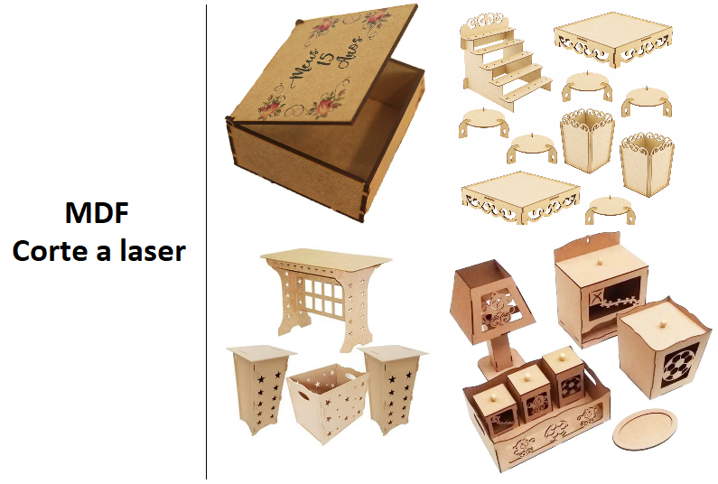
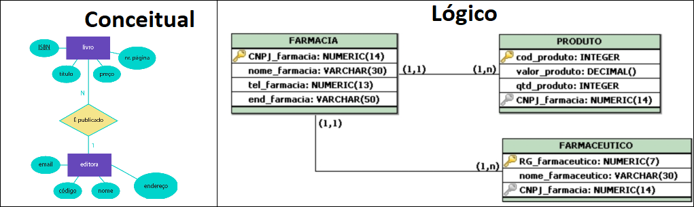

# Avaliação de Preparação do SAEP
## Objetivo:
Espera-se de um téncnico as capacidades de **planejar, desenvolver, testar e documentar** um sistema de informação simples, aplicando boas práticas de desenvolvimento de software. O objetivo desta avaliação é avaliar a capacidade técnica dos alunos para o desenvolvimento de um sistema Web Full Stack, contemplando desde a **análise de requisitos**, **modelagem**,  **implementação** e executar e documentar **testes** do sistema.

# Sistema Just in Time (Gestão da Produção)
## Contextualização
Um fabricante local de produtos em MDF (Medium Density Fiberboard) enfrenta desafios críticos na gestão de **produção** devido à falta de um sistema informatizado para controlar as os pedidos, a fábrica pretende trabalhar no sistema just in time (estoque mínimo), ou seja, produzir conforme a demanda dos clientes/revendedores, evitando desperdícios e otimizando o uso de matéria-prima. Atualmente, o processo de pedidos é manual, o que resulta em atrasos na produção, erros de produção e dificuldades na análise de pedidos. O fabricante possui uma carteira de clientes diversificada, incluindo revendedores e consumidores finais, o que torna essencial a implementação de um sistema eficiente para gerenciar os pedidos de forma integrada.
 

## Desafio
Desenvolver um sistema Web Full-stack para gerenciar a produção de produtos em MDF, integrando funcionalidades de controle de acesso, cadastro de produtos armazenando nome, descrição, custo, quantidade em estoque e qual o mínimo o estoque deve conter, processamento de pedidos com quantidade de produtos (Saídas do estoque) e registro de produção com quantidade fabricado (Entrada no estoque). O sistema deve permitir que o comerciante registre e acompanhe o status da produção de produtos registrando as datas e quantidades de pedidos e quantidade produzida além de qual usuário realizou cada ação, contemplando as seguintes funcionalidades:

## Resultados e entregas esperadas
|Nº|Nome da Entrega|Tipo de Entrega|Tempo Estimado (minutos)|
|:-:|-|-|:-:|
|1|Lista de requisitos funcionais|Documentação de requisitos|10|
|2|Diagrama entidade relacionamento (DER)|Modelagem do banco de dados|10|
|3|Script de criação e população do banco de dados|Desenvolvimento do banco de dados|10|
|4|Interface de autenticação de usuários (login)|Desenvolvimento do sistema|20|
|5|Interface principal do sistema|Desenvolvimento do sistema|20|
|6|Interface cadastro de produto|Desenvolvimento do sistema|45|
|7|Interface gestão de produção (Just in time)|Desenvolvimento do sistema|45|
|8|Descritivo de Casos de Teste de Software|Documentação de testes|10|
|9|Lista de requisitos de infraestrutura|Documentação do sistema|10|

### 1 - Lista de requisitos funcionais
- 1.1 Descrever os requisitos funcionais do sistema.
- 1.2 Entrega consiste em preencher o item ENTREGA 01 – Preencha uma lista de Requisitos Funcionais numerados conforme o exemplo a seguir:
    - [RF01] Interface de autenticação
        - [RF01.1] Solicitar email e senha
        - [RF01.2] Validar as credenciais do usuário
        - [RF01.3] Redirecionar para a interface principal do sistema
    - [RF02] Interface principal do sistema
        - [RF02.1] Exibir menu de navegação
        - [RF02.2] Mostrar resumo dos pedidos recentes
        - ...
### 2 - Diagrama entidade relacionamento (DER)
- 2.1 Entregar o DER (Conceitual ou Lógico) em formato de imagem (.png, .jpeg) ou PDF.
 Exemplos:
 

### 3 - Script de criação e população do banco de dados
- 3.1 Nomear o banco de dados com o nome “preparacao_db”.
- 3.2 No script devem existir pelo menos **três registros** para todas as tabelas criadas, respeitando os tipos de dados, chaves primárias e estrangeiras.
- 3.3 Entregar o script no formato .sql ou num formato previamente acordado com o avaliador ({criação: prisma/shema.prisma, população: prisma/seed.js} - Se utilizou ORM Prisma).

### 4 - Interface de autenticação de usuários (login)
Não é necessário implementar o cadastro de usuários, apenas a autenticação.
- 4.1 A interface deve solicitar email e senha do usuário.
- 4.1 Em caso de falha de autenticação, informar ao usuário o motivo da falha e posteriormente redirecionar novamente à tela de autenticação.
- 4.2 Design e layout da interface ficam à sua escolha.

### 5 - Interface principal do sistema
- 5.1 Esta interface deve atender aos seguintes requisitos:
    - 5.1.1 Exibir nome do usuário logado.
    - 5.1.2 Desenvolver um meio para o usuário fazer logout, redirecionando à tela de login desenvolvida no item 4.
    - 5.1.3 Desenvolver um meio de acessar a interface de "Cadastro de Produto", a qual será implementada no item 6.
    - 5.1.4 Desenvolver um meio para acessar a interface "Gestão de Produção (Just in time)", a qual será implementada no item 7.
    - 5.1.5 Design e layout da interface ficam à sua escolha.

### 6 - Interface cadastro de produto
- 6.1 Esta interface deve atender aos seguintes requisitos:
    - 6.1.1 Listar os produtos cadastrados no banco de dados conforme item 3.2. Esta listagem deve ser realizada em uma tabela e os dados devem ser carregados automaticamente ao acessar a interface de cadastro de produto.
    - 6.1.2 Implementar um campo de busca para que o usuário possa inserir o termo de busca, o qual, após inserção e confirmação, deverá gerar a atualização da listagem dos valores da tabela com os registros que correspondem ao termo.
    - 6.1.3 Desenvolver um meio para o usuário inserir os dados de um novo produto no banco de dados.
    - 6.1.4 Desenvolver um meio para o usuário realizar a edição de um produto existente no banco de dados.
    - 6.1.5 Desenvolver um meio para o usuário realizar a exclusão de um produto existente no banco de dados.
    - 6.1.6 Realizar validações dos dados inseridos nos campos para a criação de um novo produto ou a alteração de um existente, exibindo alertas ao usuário nos casos de ausência de inserção ou inserção inválida de dados.
    - 6.1.7 Desenvolver um meio para o usuário retornar para a interface principal do sistema, desenvolvida no item 5.
    - 6.1.8 Design e layout da interface ficam à sua escolha.

### 7 - Interface gestão de produção
- 7.1 Esta interface deve atender aos seguintes requisitos:
    - 7.1.1 Listar os produtos cadastrados no banco de dados conforme item 3.2. em ordem alfabética. Utilizar um algoritmo de ordenação para tal, ficando a seu critério qual algoritmo aplicar.
    - 7.1.2 Desenvolver um meio de selecionar o produto que terá movimentação de estoque, habilitando a opção de escolha por parte do usuário, se será uma movimentação de "fabricado" que gera um aumento da quantidade de produtos ou "pedido" que diminui a quantidade de produtos.
    - 7.1.3 Desenvolver um meio do usuário inserir a data da movimentação que ele está realizando, seja de **fabricado** ou **pedido**.
    - 7.1.4 Implementar uma verificação automática a cada movimentação de saída de estoque, gerando um **alerta** em caso de estoque **abaixo do mínimo** configurado.
    - 7.1.5 Design e layout da interface ficam à sua escolha.

### 8 - Descritivo de teste de software
- 8.1 Descrever ferramentas, ambiente e os **casos de teste** de software para cada requisito funcional.
- 8.2 Entrega consiste em preencher o item 8.1 (Casos de Teste) e item 8.2 (Ferramentas e Ambientes de Teste) – documentacao.docx,  ou .md (Markdown).
- `Sugestão de modelo para os casos de teste`:
    - Caso de Teste ID: CT01
    - Requisito Funcional: RF01.1
    - Descrição: Verificar se a interface de autenticação solicita email e senha.
    - Pré-condições: O sistema deve estar acessível.
    - Passos:
        1. Acessar a interface de autenticação.
        2. Verificar se os campos de email e senha estão presentes.
    - Resultado Esperado: Os campos de email e senha devem estar visíveis na interface de autenticação.
- Ferramentas sugeridas para testes:
    - Testes manuais: Insomnia, Navegadores web (Google Chrome, Mozilla Firefox, etc.)
    - Testes automatizados: Selenium, Cypress, etc.

### 9 - Lista de requisitos de infraestrutura
- 9.1 A lista de requisitos de infraestrutura deve conter os seguintes itens:
    - 9.1.1 O SGBD utilizado e sua respectiva versão.
    - 9.1.2 A linguagem de programação e versão utilizada no desenvolvimento do sistema.
    - 9.1.3 O sistema operacional utilizado e sua versão no desenvolvimento do sistema.
- 9.2 Entrega consiste em preencher o item ENTREGA 9 – Lista de requisitos de infraestrutura - documentacao.docx, ou .md (Markdown).

---

# Correção da Avaliação
A correção da avaliação será realizada com base nas evidências entregues para cada atividade, conforme descrito na seção "Resultados e entregas esperadas". Cada atividade possui critérios específicos que serão avaliados para determinar se os requisitos foram atendidos de acordo com as especificações fornecidas.
## LISTA DE VERIFICAÇÃO POR ATIVIDADE
### ATIVIDADE:ATIVIDADE 1 - DOCUMENTAÇÃO DE REQUISITOS
| Evidência observável | Capacidade | Peso | Sim | Não|
|-|-|-|:-:|-|
| Desenvolveu o sistema conforme análise de requisitos? |C6|2|||
| Modelou os requisitos funcionais mínimos conforme descrito |C6|2|||

### ATIVIDADE:ATIVIDADE 2: DER
| Evidência observável | Capacidade | Peso | Sim | Não|
|-|-|-|:-:|-|
| Atribui às relações de chaves estrangeiras de acordo com a modelagem do diagrama entidade relacionamento (DER)?|C4|2|||
|Atribui às relações entre as tabelas (ex: 1:N) no diagrama entidade relacionamento físico (DER)?|C4|2|||
|Atribuiu os tipos (ex: DATE) Se utilizou o modelo **Lógico**, no modelo **Conceitual** é dispensável|C4|2|||
|Modelou no mínimo as entidades **Usuário**, **Produto** e **Producao***?|C4|1|||

### ATIVIDADE:ATIVIDADE 3: SCRIPT BANCO DE DADOS
| Evidência observável | Capacidade | Peso | Sim | Não|
|-|-|-|:-:|-|
|Criou o banco de dados com o nome especificado no caderno de prova?|C4|1|||
|Criou todas as tabelas modeladas no diagrama entidade relacionamento respeitando a chave estrangeira (NOT NULL) de cada relacionamento?|C4|2|||
|Inseriu pelo menos três registros em cada uma das tabelas criadas no banco de dados?|C4|2|||

### ATIVIDADE:ATIVIDADE 4: INTERFACE AUTENT. DE USUÁRIO
| Evidência observável | Capacidade | Peso | Sim | Não|
|-|-|-|:-:|-|
|Criou uma sessão para o usuário autenticado?|C7|2|||
|Desenvolveu a autenticação do usuário redirecionando-o para a interface principal da aplicação ao inserir login e senha registrado no banco de dados?|C7|3|||
|Desenvolveu os campos de login,senha e botão entrar?|C7|2|||
|Realizou o tratamento de falha de autenticação no login, informando o motivo da falha?|C7|3|||

### ATIVIDADE:ATIVIDADE 5: INTERFACE PRINCIPAL
| Evidência observável | Capacidade | Peso | Sim | Não|
|-|-|-|:-:|-|
|Desenvolveu um meio de acessar a interface cadastro de produto?|C7|1|||
|Desenvolveu um meio de acessar a interface gestão de produção (Just in time)?|C7|1|||
|Desenvolveu um meio para sair do sistema, direcionando à interface de login?|C7|1|||
|Recuperou e exibiu o nome do usuário autenticado?|C7|2|||

### ATIVIDADE:ATIVIDADE 6: INTERFACE CADASTRO DE PRODUTO
| Evidência observável | Capacidade | Peso | Sim | Não|
|-|-|-|:-:|-|
|Desenvolveu a programação de listar os produtos cadastrados ao carregar a interface cadastro de produto?|C7|2|||
|Desenvolveu a programação para a inserção de um novo produto no banco de dados?|C7|2|||
|Desenvolveu a programação para editar um produto já existente no banco de dados?|C7|3|||
|Desenvolveu a programação para excluir um produto já existente no banco de dados?|C7|2|||
|Desenvolveu a programação para para validar os dados no cadastro e na atualização do produto?|C7|3|||
|Desenvolveu um meio de o usuário retornar a interface principal?|C7|1|||
|Implementou um campo de busca onde usuário insere o dado e a listagem de produtos é atualizada conforme termo inserido?|C7|3|||

### ATIVIDADE:ATIVIDADE 7: INTERFACE GESTÃO DE PRODUÇÃO (JUST IN TIME)
| Evidência observável | Capacidade | Peso | Sim | Não|
|-|-|-|:-:|-|
|Desenvolveu a programação para o usuário selecionar o produto e selecionar se o produto foi pedido (entrar) ou produzido (sair) no estoque? (Atualizando o campo quantidade na tabela de produtos)|C7|2|||
|Desenvolveu a programação que o usuário possa inserir data de movimentação de entrada ou saída?|C7|3|||
|Desenvolveu a programação, para que a lista gerada seja em ordem alfabética?|C7|3|||
|Implementou a verificação automática gerando o alerta de estoque abaixo do mínimo configurado?|C7|3|||

### ATIVIDADE:ATIVIDADE 8: CASOS DE TESTES
| Evidência observável | Capacidade | Peso | Sim | Não|
|-|-|-|:-:|-|
|Descreveu ferramentas e ambiente de testes?|C8|2|||
|Descreveu os casos de testes para cada requisito funcional?|C8|2|||
|Executou testes em cada requisito funcional conforme casos de teste?|C8|2|||

### ATIVIDADE:ATIVIDADE 9: DOCUMENTAÇÃO DE INFRAESTRUTURA
| Evidência observável | Capacidade | Peso | Sim | Não|
|-|-|-|:-:|-|
|Identificou a linguagem de programação e a versão no desenvolvimento do sistema?|C1|1|||
|Identificou o SGBD (sistema gerenciador de banco de dados?) utilizado e sua respectiva versão para a criação do banco de dados no servidor?|C1|1|||
|Identificou Sistema operacional e sua versão para o desenvolvimento da aplicação?|C1|1|||